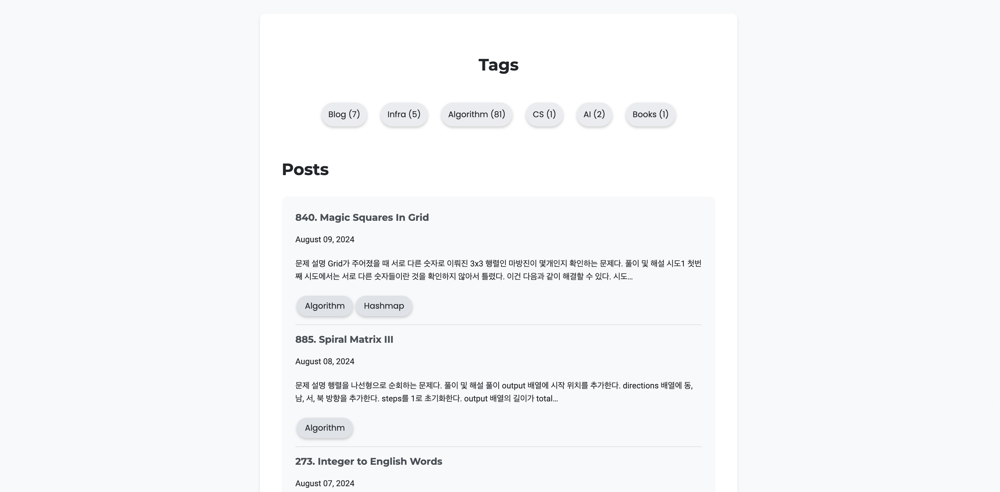
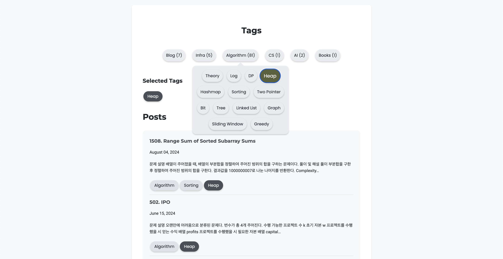
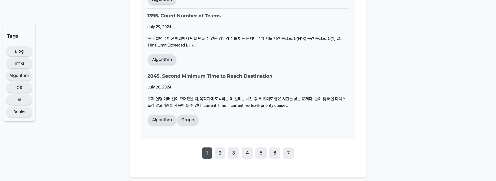

# devblog

In this devblog, I write documentation about my studies, thoughts, and ideas regarding software development. I use this blog to document my learning journey and share my knowledge with others.

## Table of Contents
- [Design](#design)
- [Structure](#structure)

## Design

### frontpage
**2024-08-09**


Currently, this is the frontpage of my blog. The frontpage is a simple list of posts with a title, date, and a short description. The posts are sorted by date, with the most recent post at the top, with 10 posts in every page.

### sub-buttons and selected tags


By selecting tags, all posts with the selected tags will be displayed. The tags are displayed as buttons, and the selected tags are highlighted. The selected tags can be removed by clicking the button anywhere.

### footer


This would be the bottom of the page, showing all the pages available. On the left, the side menu can also be seen which shows the main tags available. These tags also work as buttons that serve to filter the posts.

## Structure
```
└── 📁sunghj1118.github.io
    └── 📁src
        └── 📁components
            └── Container.js
            └── Footer.js
            └── header.js
            └── index.module.css
            └── layout.css
            └── layout.js
            └── post-link.js
            └── projectCard.js
            └── seo.js
        └── 📁images
        └── 📁pages
            └── 404.js
            └── index.js
            └── page-2.js
            └── using-ssr.js
            └── using-typescript.tsx
        └── 📁posts
            └── 📁AI
            └── 📁algorithm
                └── 📁LEET
                └── 📁LIS
                └── 📁log
                └── 📁theory
            └── 📁blog
            └── 📁books
            └── 📁CS
            └── 📁docker
            └── 📁kubernetes
        └── 📁templates
            └── blog-post.js
            └── tag.js
            └── using-dsg.js
    └── .gitignore
    └── gatsby-config.js
    └── gatsby-node.js
    └── package-lock.json
    └── package.json
    └── questions.md
    └── README.md
```