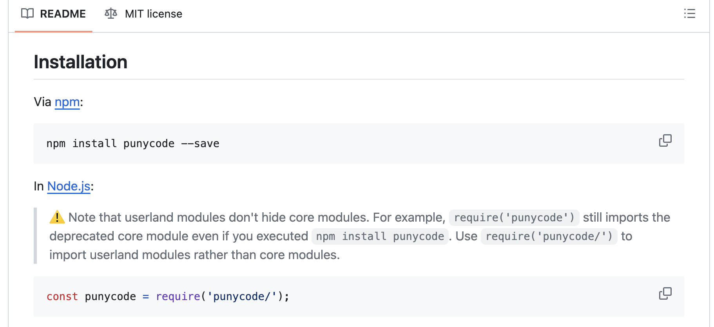
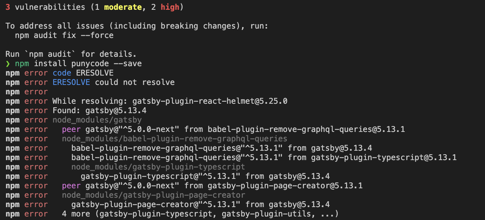

# [DEP0040] DeprecationWarning: The `punycode` module is deprecated.

## Background
I was trying to set up my blog while following the instructions in the Gatsby documentation. However, I encountered a `DeprecationWarning` for the `punycode` module.

## Problem
```
(node:98880) [DEP0040] DeprecationWarning: The `punycode` module is deprecated. Please use a userland alternative instead.
(Use `node --trace-deprecation ...` to show where the warning was created)
```
## Solution Flow
- Searching for solutions on the internet

["[DEP0040] The punycode module is deprecated" with Node.js 21.x
](https://github.com/yarnpkg/yarn/issues/9005)


I am using npm so everything else regarding yarn is irrelevant.

- Checking the Punycode documentation

[Punycode Documentation](https://github.com/mathiasbynens/punycode.js#installation)



I tried installing the `punycode` module using the command `npm install punycode` but it did not work. Instead, I found out that the problem might be a compatibility issue between the `gatsby-transformer-remark` and `gatsby`.



Downgrading my `gatsby-transformer-remark` version to `^4.0.0` resolved the issue.


