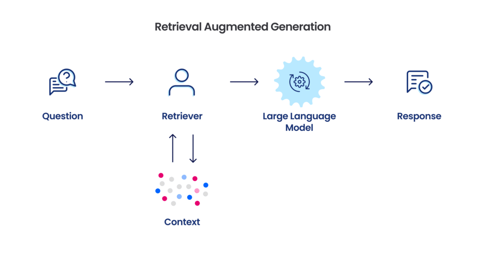
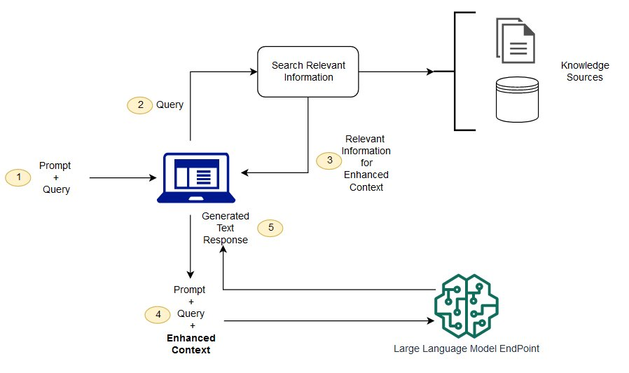

# What even is RAG?
RAG, or Retrieval-Augmented Generation, is the process of optimizing the output text of an LLM by retrieving relevant information from a knowledge base outside of its training data.

LLMs are trained upon a large corpus of text data which makes them powerful at generating text. RAG strengthens this ability by retrieving data from external sources according to the relevant domain. This enables the model to generate more accurate text without the need for additional retraining. This makes it both powerful and cost-effective.

# Why is RAG important?
RAG is important because it proposes solutions for the limitations of LLMs.

Some current shortcomings of LLMs include:
- **Data Efficiency**: LLMs require a large amount of data to be trained effectively.
- **Knowledge**: LLMs lack the ability to access external knowledge.
- **Consistency**: LLMs can generate inconsistent text due varying vocabulary.
- **Out of Date Information**: LLMs can generate text based on outdated information.

In particular one funny and accurate comparison from AWS is that LLMs are like **"an over-enthusiastic new employee who refuses to stay informed with current events but will always answer every question with absolute confidence."**

Another comparison that can be made is that LLMs are like a student who has memorized a textbook but has no access to the internet, while RAG is like a student who has memorized a textbook but also has access to the internet.

# Benefits of RAG
RAG has several benefits:
- **Cost-effective implementation**: Chatbots are typically developed based on Foundation Models which are API-accessible LLMs trained on a large and unorganized corpus of data. Training a FM from scratch is expensive and time-consuming. RAG can overcome these limitations by proposing a solution that is cost-effective and efficient.
- **Relevant Information**: RAG can retrieve information from a knowledge base that is relevant to the current time context. This ensures that the information generated by the model is up-to-date.
- **Accuracy**: RAG can return more accurate information by retrieving data and providing sources for the information generated by the model.
- **Control**: RAG allows for more control over the information generated by the model. This is because the model can be trained to retrieve information from a specific knowledge base.

# How does RAG work?
In classic LLMs, the model generates text based on its training data. In RAG, relevant information is retrieved from a new knowledge base and used to generate text. Then the retrieved information and user query are both given to the LLM. The LLM then uses both the new knowledge and its training data to generate a response.

The diagram below shows the process of RAG (source: AWS):

- **Create External Data**: The new data outside of the LLM's original training data set is called external data. It can be from multiple sources and can exist in various formats. Embedding Language Models, a method that converts data into numerical representations and stores it into a vector DB, create a knowledge library that the AI can understand.
- **Retrieve**: The query is converted into a vector representation which is compared to the vector DB to create a relevancy search. 
- **Augment Prompt**: The retrieved information is added to the prompt. The prompt is the input given to the LLM.
- **Update Data**: To maintain current information, we can update the external data by asynchronously updating the documents through either real-time automation or periodic batch processing.

# Possible Applications of RAG
The biggest possible application of RAG in my opinion is the efficient tuning of LLMs for specific domains. This can be expected even more so in the case of chatbots specific to particular companies or domains. For example, the medical and judicial sectors often face challenges when creating chatbots due to strict regulations and consequences regarding the generation of false or incorrect information. LLMs can often provide false or outdated information, which can be detrimental in these sectors. This problem can also be seen in company-specific chatbots where the chatbot might not be able to provide the correct answers relevant to the company, such as the company's policies or procedures. RAG can help overcome these challenges by providing the chatbot with the correct information from a knowledge base that is relevant to the domain. This in turn can help the chatbot generate more accurate and relevant information.

### Sources:  
https://aws.amazon.com/what-is/retrieval-augmented-generation/