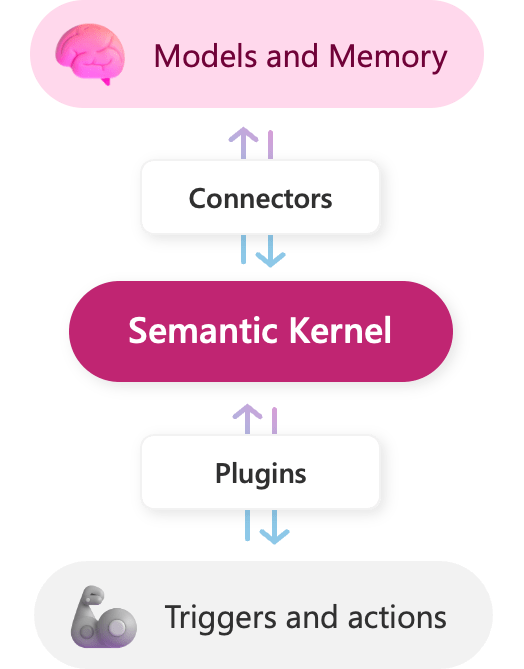

# What is the Semantic Kernel?
The Semantic Kernel is an open-source SDK that lets you easily build agents that can call your existing code. In layman's terms, it is an intermediary between your plugins/copilots and the AI models/Foundation Models. It allows the user to orchestrate plugins such as your existing code with other AI models. This enables the user to create more sophisticated AI pipelines in an easier manner.  


# Lightbulb Example
Say you have a lightbulb plugin that can turn on and off a lightbulb. You can use the Semantic Kernel to create an agent that can call this plugin. This agent can then be used to control the lightbulb using an AI model.


The relevant C# code for this example would look like this:
```csharp
// Create chat history
var history = new ChatHistory();

// Get chat completion service
var chatCompletionService = kernel.GetRequiredService<IChatCompletionService>();

// Start the conversation
Console.Write("User > ");
string? userInput;
while ((userInput = Console.ReadLine()) != null)
{
    // Add user input
    history.AddUserMessage(userInput);

    // Enable auto function calling
    OpenAIPromptExecutionSettings openAIPromptExecutionSettings = new()
    {
        ToolCallBehavior = ToolCallBehavior.AutoInvokeKernelFunctions
    };

    // Get the response from the AI
    var result = await chatCompletionService.GetChatMessageContentAsync(
        history,
        executionSettings: openAIPromptExecutionSettings,
        kernel: kernel);

    // Print the results
    Console.WriteLine("Assistant > " + result);

    // Add the message from the agent to the chat history
    history.AddMessage(result.Role, result.Content ?? string.Empty);

    // Get user input again
    Console.Write("User > ");
}
```

# Benefits of the Semantic Kernel
The Semantic Kernel has several benefits:
- **Ease of Use**: The Semantic Kernel makes it easy to build agents that can call your existing code.
- **Interoperability**: The Semantic Kernel allows you to orchestrate plugins with other AI models, enabling you to create more sophisticated AI pipelines. For example, if you built a plugin based on ChatGPT, you could use the Semantic Kernel to call this plugin from other providers like Azure or Huggingface.
- **Flexibility**: The Semantic Kernel is open-source, so you can customize it to suit your needs. You can add new plugins, modify existing ones, or create entirely new agents.




# Differences between LangChain, PromptFlow, and Semantic Kernel?
The tools, libraries and/or frameworks that ease the process of creating LLM application by streamlining any repetitive process through automation. Some of the AI orchestrators include:
- **Semantic Kernel**: an open-source SDK that allows you to orchestrate your existing code and more with AI.
- **LangChain**: a framework to build LLM-applications easily and gives you insights on how the application works
- **PromptFlow**: this is a set of developer tools that helps you build an end-to-end LLM Applications. Using PromptFlow, you can take your application from an idea to production. However, its static nature might require additional use of LangChain or Semantic Kernel to have it implement dynamic orchestration.


### Example of Dynamic Orchestration
**Without Dynamic Orchestration:**

    Customer: "I'm having issues with my product warranty claim."  

    Response: "Here's our warranty policy [link]. Please follow the steps mentioned for claims."

**With Dynamic Orchestration (LangChain/Semantic Kernel):**

    Customer: "I'm having issues with my product warranty claim."

    AI System: Analyses the query, identifies the product and customer account from the database, checks the status of the warranty claim.

    Response: "We see that your claim for [Product Name] is currently under review. It was submitted on [Date], and the average processing time is [X] days. You'll receive an update by [Estimated Date]."

# Possible Uses of the 3 Tools
## Automated Customer Support
**Scenario**: A company wants to automate its customer support system to handle common inquiries and issues.

- **Prompt Flow**: The company designs a series of prompts to guide the AI in handling common customer issues, such as password resets or troubleshooting service outages. However, the static nature of prompt flow might limit the AI's ability to handle unexpected or complex queries without manual intervention or reprogramming.

- **LangChain**: By utilising LangChain, the company chains together different tasks like understanding the customer's issue, searching the knowledge base for solutions, and generating human-like responses. LangChain's modularity allows the AI to adapt to a wide range of inquiries by dynamically selecting the appropriate chain of tasks for each situation. This flexibility makes the customer support system more robust and capable of handling complex issues without human intervention.

- **Semantic Kernel**: The company uses SK to build an AI agent that can interact with both the customer and the company's systems. SK's event handling and automatic decision-making capabilities allow the AI to understand the context of customer inquiries, decide the best course of action, and even perform tasks like resetting passwords or initiating service diagnostics. The integration with .NET and support for various LLMs make SK an ideal choice for companies already invested in Microsoft technologies.

 

## Digital Marketing
**Scenario**: A digital marketing agency wants to automate the creation of content for various platforms, requiring nuanced tone and style adjustments.


- **Prompt Flow**: The agency uses a detailed prompt flow to guide the AI in generating content that aligns with different brand voices and marketing goals. However, the need for extensive and detailed prompt flows for each brand voice and style can become labour-intensive.

- **LangChain**: The agency leverages LangChain to chain together tasks for analysing the target audience, generating content ideas, and writing drafts in specified tones and styles. LangChain's ability to integrate different LLM capabilities and plugins allows for more **dynamic content generation**, making it easier to adapt to various brands and marketing strategies without extensive manual input.

- **Semantic Kernel**: By utilising SK, the agency creates an AI agent capable of understanding the nuances of different brand voices and marketing objectives. The Kernel's event handling and Planner's decision-making processes enable the AI to automatically adjust its writing style and content focus based on the brand's guidelines and the campaign's goals. SK's clean prompt implementation and plugin system allow for seamless integration into the agency's existing workflows.


# Summary
Each of the three tools, Prompt Flow, LangChain, and Semantic Kernel, offers unique strengths and capabilities for AI development.
- Prompt Flow is good for simple and predictable scenarios due to its static nature.
- LangChain is ideal for dynamic and complex scenarios that require flexibility and integration of multiple tasks or data sources.
- Semantic Kernel excels in applications requiring robust event handling and decision-making capabilities, making it suitable for scenarios that demand integration with existing systems and nuanced control over AI behavior.

Choosing between Prompt Flow, LangChain, and Semantic Kernel depends on the specific needs and challenges of your project. Whether it's the flexibility and orchestration capabilities of LangChain, the integration and streamlined management offered by Semantic Kernel, or the coherent and controlled environment facilitated by Prompt Flow, each tool has its place in the AI development toolkit.


### Sources:  
- https://learn.microsoft.com/en-us/semantic-kernel/  
- https://learn.microsoft.com/en-us/semantic-kernel/overview/?tabs=Csharp  
- https://techcommunity.microsoft.com/t5/educator-developer-blog/llm-based-development-tools-promptflow-vs-langchain-vs-semantic/ba-p/4149252#:~:text=Semantic%20Kernel%3A%20an%20open%2Dsource,on%20how%20the%20application%20works   
- https://www.advancinganalytics.co.uk/blog/2024/3/25/comparison-of-prompt-flow-semantic-kernel-and-langchain-for-ai-development  
