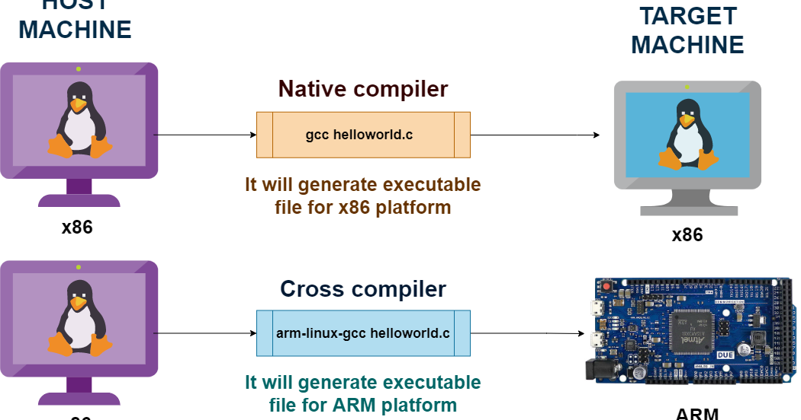

  
## 서론
컴파일러 설계 수업을 듣다가 Cross Compiler이라는 개념을 접하게 되었다. 그런데 이때 일반적인 컴파일러와는 차이가 무엇인지 정리하고 컴파일러에 대해서도 한번 정리해보려고 한다.

## 컴파일러 vs Cross Compiler
일단, 크로스 컴파일러는 컴파일러의 일종으로 소스 코드로부터 다른 아키텍처에서 실행 가능한 코드로 변환해주는 역할을 맡고 있다. 보통의 경우에 HLL (High-Level Language; 예: 파이썬, C) 등을 어셈블리와 같은 머신코드로 변환하여 코드를 짜는 것을 더욱 쉽게 해준다. 이때 그러면 크로스 컴파일러라는 개념이 왜 존재하고 그 대척점에 있는 Native Compiler는 무엇일까?

### Native Compiler
Native Compiler는 컴파일러의 일종으로 컴파일하는 환경과 같은 환경 속에서 실행되는 컴파일러를 의미한다. 즉, 컴파일러가 실행되는 환경과 컴파일러가 생성하는 코드가 동일한 환경에서 실행되는 것을 의미한다. 예를 들어, Windows에서 Visual Studio를 사용하여 C++ 코드를 컴파일하고, 그 코드를 Windows에서 실행하는 것이다.

### Cross Compiler
반면에, Cross Compiler는 컴파일러의 일종으로 컴파일하는 환경과 다른 환경에서 실행되는 컴파일러를 의미한다. 즉, 컴파일러가 실행되는 환경과 컴파일러가 생성하는 코드가 다른 환경에서 실행되는 것을 의미한다. 예를 들어, Windows에서 ARM 프로세서를 위한 코드를 컴파일하고, 그 코드를 ARM 프로세서가 탑재된 임베디드 시스템에서 실행하는 것이다.

## 장단점
크로스 컴파일러의 장점은 다양한 환경에서 코드를 컴파일 할 수 있으며, 소프트웨어를 공유하는 작업을 용이하게 해준다. 그러나, 네이티브 컴파일러보다 메모리 사용량이 더 많고, 느리다는 단점이 있다. 또한, 설정이 더 복잡하고, 특정 플렛폼 최적화가 어렵다는 단점이 있다. 그럼에도 불구하고 임베디드 시스템, 모바일 디바이스, IoT 디바이스 등에서 크로스 컴파일러는 많이 사용된다.

# Reference
- [Difference between Native compiler and Cross compiler](https://www.geeksforgeeks.org/difference-between-native-compiler-and-cross-compiler/)