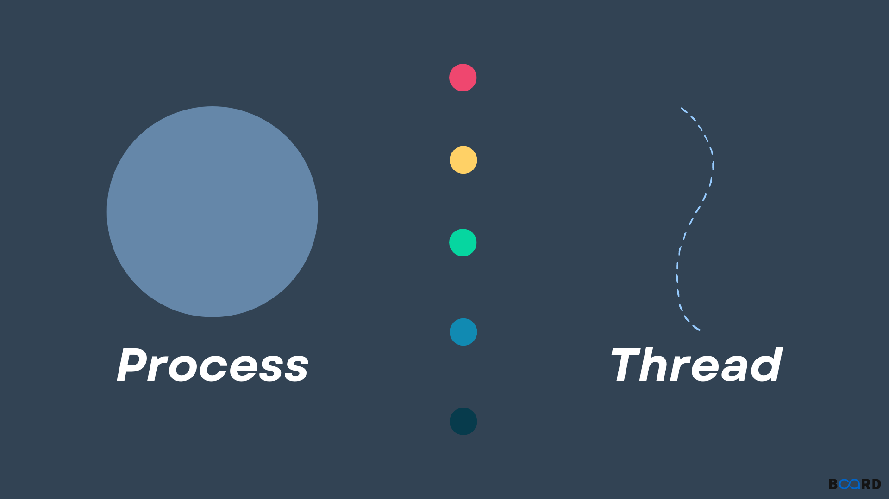
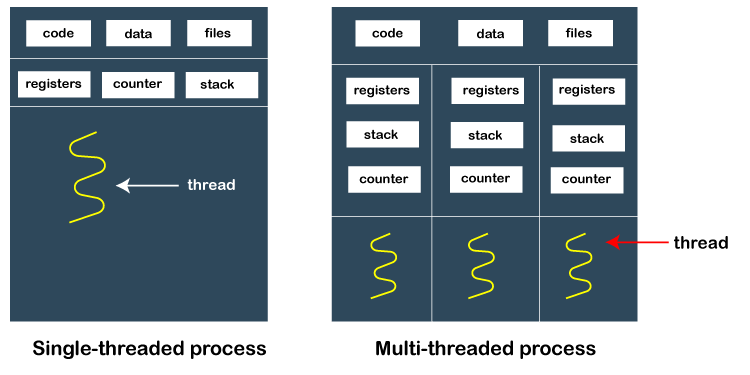
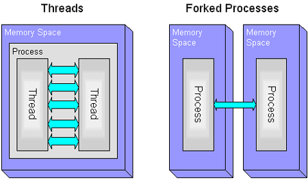

## 서론
"프로세스는 무엇이고 쓰레드는 무엇인가? 둘의 차이점은 무엇인가?" 이는 기술 면접에서 정말 자주 등장하기로 유명한 질문이다. 이번 학기 시스템 프로그래밍을 배우기에 앞서, 이번 기회에 정리하고 공부해보려고 한다.

# 프로세스(Process)
강의안을 기준으로 보면 프로세스란 'An instance of a running program'다. 즉, 프로그램이 실행되는 한 인스턴스를 의미한다. 이때, 프로세스가 포함하는 것은 다음과 같다.
- Images: 프로그램의 코드와 데이터
    - Code: 프로그램의 코드
    - Data: 프로그램의 전역 변수
    - Stack: 함수 호출과 관련된 정보
    - Heap: 동적으로 할당된 메모리
- Process Context
    - Program context: 프로그램 카운터, 레지스터 등
    - Kernel context: pid, uid, gid 등

# 쓰레드(Thread)
반면에 쓰레드는 프로세스 내에서 실행되는 흐름의 단위다. 쓰레드는 하나의 프로세스에 종속된다. 일반적인 경우에 하나의 프로세스는 하나의 쓰레드를 갖고 있지만, 하나의 프로세스가 여러 개의 쓰레드를 가질 수도 있다. 이런 경우에는 멀티쓰레드라고 한다. 가장 큰 특징으로는 다음과 같다.
- 프로세스에서 실행단위를 분리 시킨 개념이다.
- 쓰레드는 프로세스 내의 자원을 공유한다.

# 프로세스와 쓰레드의 차이점
주요 차이점으로는 동일한 프로세스 내의 쓰레드는 공유 메모리 공간에서 실행되지만, 프로세스는 별도의 메모리 공간에서 실행된다는 점입니다.

# 프로세스의 단점과 쓰레드의 탄생 배경
프로세스의 단점들을 살펴보면 쓰레드가 왜 탄생하게 되었는지 알 수 있게 된다. 프로세스는 초기에 다음 문제들을 가지고 있었다.
1. 프로세스 간의 통신이 어렵다.
    - 많은 어플리케이션은 스스로 많은 카피를 제작하여 동시다발적으로 실행되어야 한다. (예를 들어, 웹 서버)
    - 프로세스 모델의 경우 이게 어렵다.
2. 멀티프로세싱
    - 프로세스는 한번에 하나의 프로세스만 사용할 수 있기 때문에 멀티프로세서 아키텍처의 장점을 살리지 못하며, 병렬처리가 불가능하다.

이를 해결하기 위해 쓰레드의 개념이 자연스럽게 등장한다. 하나의 프로세스에 여러 쓰레드를 실행함으로써, 프로세스 간의 통신이 쉬워지고, 멀티프로세싱이 가능해진다.

# 비유
마무리하며, 흔하게 드는 몇가지 비유로 프로세스와 쓰레드의 관계를 설명해보려 한다.

1. 손과 손가락 
흔히 드는 비유 중 하나로, 프로세스는 하나의 손과 같다. 기능이 하나며, 한번에 한 가지 기능만 가능하다. 반면에, 쓰레드는 손가락과 같다. 여러 손가락이 하나의 손을 가지고 있어, 여러 가지 일을 동시에 할 수 있다.

2. 집과 방
또다른 비유로는 집과 방이 존재한다. 이때 프로세스는 집이고, 쓰레드는 방이라고 할 수 있다. 집은 독립적인 공간을 가지고 있으며, 방은 집의 일부분이다. 이때, 집은 프로세스이고, 방은 쓰레드이다.

3. 레스토랑과 요리사
마지막으로 레스토랑과 요리사가 존재한다. 프로세스는 마치 레스토랑과 같다. 각 레스토랑은 개별적인 주방, 식재료, 조리기구를 갖고 있다. 서로 독립적이며, 서로의 도구를 사용 못한다. 그러나 요리사는 다르다. 한 레스토랑(프로세스)에 여러 요리사(쓰레드)가 있으며, 같은 주방과 도구를 공유하며 혐력하여 일한다. 

# Reference
- [[geeksforgeeks] Thread in Operating System](https://www.geeksforgeeks.org/thread-in-operating-system/)
- [[OS] 스레드(Thread) 개념과 특징, 프로세스 vs 스레드, 멀티 스레드(Multithreaded Programming)](https://dev-minjeong.tistory.com/36)
- 