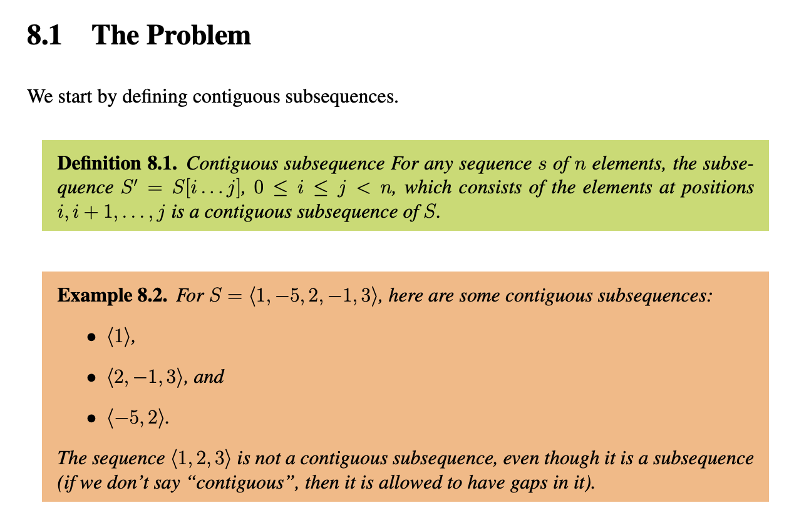

# Contiguous Subsequence?
Contiguous이란 단어를 처음 볼때 consecutive이랑 무슨 차이인지 잘 이해가 안됐다. 어째서 30, −10, 40, 5, 45은 contiguous할까? 중간에 -10가 있어서 연속적으로 증가하지 않는데. 그래서 contiguous의 정확한 의미를 찾아보았다.

### Formal Definition

**GM-RKB:**

    A Contiguous Subsequence is a subsequence (of a sequence) where sequence deletion operations are not allowed in between members of the original sequence.

    AKA: Strict Subsequence, Sequence Segment.
    
    Context:
    It can be a Maximal Contiguous Subsequence.

    It can range from being an Infinite Contiguous Subsequence (e.g. a line segment) to being a Finite Contiguous Subsequence (e.g. contiguous substring).
    It can range from being an Abstract Contiguous Subsequence to being a Contiguous Subsequence Structure (which cannot be infinitely long).
    
    Example(s):
    <2,3,4> from <1,2,3,4,5>.
    <...,1,2,3,4> from <...,1,2,3,4,5,...>
    a Real Number Interval, such as (0,1].

**CMU**:

## 의문과 답
그렇다면, sequence 0, 100, -50, -60, 30, -10, 40, 5, 45, -21에서 어째서 [30, -10, 40, 5, 45]가 contiguous subsequence인걸까? 이유는 각 요소 사이에 다른 요소가 없기 때문이다. 즉, 연달아 나열되어 있기 때문이다. 반면에, 0, -50은 사이 100이라는 요소가 있기 때문에 contiguous subsequence가 아니다.

# Reference
- [[GM-RKB] Contiguous Subsequence](https://www.gabormelli.com/RKB/Contiguous_Subsequence)
- [[Carnegie Mellon University] Contiguous Subsequence](https://www.cs.cmu.edu/afs/cs/academic/class/15210-s15/www/lectures/mcs-notes.pdf)