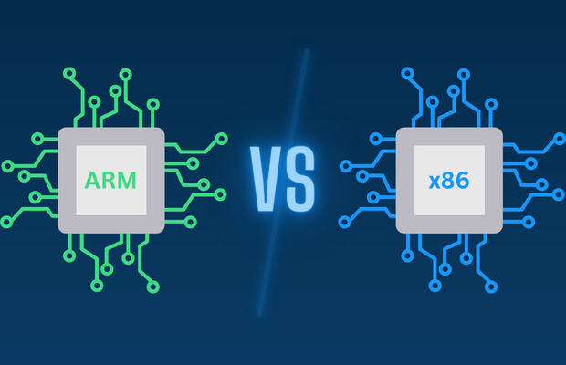

## 서론
이번에 정보보호 수업에서 과제를 하면서 x86_64와 ARM 때문에 많은 난항을 겪게 되었다. 교수님께서 Sandboxing의 개념을 설명해주시기 위해 우리는 프로세스와 프로세스 간의 통신을 통제해야 했다. 

특히 해당 프로그램은 하나의 파일에서 requests.txt를 읽고, 그 파일 안에 있는 이미지 분류 요청을 처리하는 유형의 프로그램이었다. 예를 들어, dog.jpg를 분류하라고 요청하면, 해당 이미지를 분류하고, 그 결과를 results.txt에 저장하는 형식의 프로그램이었다.

그러나, 교수님은 편의를 위해 분류 프로그램은 직접 안 돌리고 적당히 흉내만 낼 수 있게 darknet이라는 프로그램을 사용하라고 주셨다. 그러나, 이 darknet은 x86_64에서만 돌아가는 프로그램이었다. 그래서, ARM에서는 컴파일조차 되지 않는 문제가 발생했다.

그래서 결과적으로 AWS에 Linux환경의 EC2를 사용해서 x86_64 환경을 설정하여, darknet을 성공적으로 사용하게 되었다.

분명 과거에 컴퓨터 아키텍처 수업에서 배웠던 기억이 있어서 자주 접하고 해결은 할 수는 있는데 정확한 개념과 차이가 헷갈려서 이번 기회에 정리하고 공부해보려고 한다.

# x86_64, ARM
둘의 차이점을 알기에 앞서서, 둘의 정체를 먼저 알아보자.

# x86_64
x86_64는 1999년도에 출시된 x86 instruction set architecture(명령어 집합)을 64bit로 만든 ISA이다. 64bit로 만들어지고 paging 기능을 통해서 기존에 존재하던 32bit 프로세서보다 많은 양의 데이터를 가상 메모리와 물리 메모리에 저장할 수 있고, 더 빠른 연산을 수행할 수 있다.

16bit와 호환성을 가지고 있어서, 16bit, 32bit 프로그램을 실행할 수 있고, 64bit 프로그램을 실행할 수 있다. 그래서, 현재까지도 많은 프로그램이 x86_64로 작성되어 있다.

최초의 x86_64 프로세서는 AMD사가 2003년에 출시한 Opteron이었고, Intel사는 x86_64를 따라 도입하기 위해 2004년에 출시된 Xeon이었다. 특이한 부분으로는, 보통 AMD가 Intel을 따라가는것이 일반적이었는데, x86_64의 경우에는 반대였다. 현재는 대부분의 데스크탑, 서버, 노트북, 모바일 디바이스에서 사용되고 있다.

### CPU vs ISA
프로세서 (CPU)는 프로그램의 명령어를 실제로 실행하는 물리적 하드웨어 구성 요소다. 계산을 수행하고, 데이터를 저장하고, 프로그램의 명령어를 실행하는 역할을 한다. 프로세서에는 Arithmetic Logic Unit (ALU/산술논리연산 장치), Control Unit (CU/제어장치), Register (레지스터), Memory Unit (메모리 장치) 등이 있다. 컴퓨터 아키텍처 때 대표적으로 배운 MIPS, ARM, x86 등이 프로세서에 해당한다. 특히, 5단계 파이프라인, 슈퍼스칼라, 멀티코어 등이 프로세서의 성능을 향상시키는 기술이며, 수업 과제로는 5단계 파이프라인을 구현하는 것이 있었다.

ISA (Instruction Set Architecture)는 프로세서가 이해하고 수행할 수 있는 명령어 집합을 정의한다. ISA는 소프트웨어와 하드웨어 간의 다리 역할을 하며, 소프트웨어가 하드웨어에 작업을 수행하도록 지시하는 방법을 정의합니다.

### CPU와 ISA의 관계
프로세서는 ISA를 구현합니다. ISA는 설계도나 규칙 세트와 같고, 프로세서는 그 설계도의 물리적 구현입니다. 서로 다른 프로세서는 동일한 ISA를 따를 수 있습니다. 예를 들어, 인텔과 AMD 프로세서는 모두 x86 ISA의 버전을 구현하여, 서로 다른 하드웨어임에도 불구하고 동일한 소프트웨어를 실행할 수 있습니다.

**이해를 위한 비교**: 
- **언어 (ISA)**: ISA를 영어와 같은 언어. 모든 사람이 따라야 하는 규칙(문법,어휘)을 정의.
- **책 (프로세서)**: 프로세서를 그 언어로 작성된 책. 서로 다른 책이 영어의 규칙을 따라 작성될 수 있지만, 각 책은 고유한 구현물입니다(이야기, 글쓰기 스타일 등).

## Intel64와 AMD64의 차이?
Intel64와 AMD64 모두 x86_64 ISA의 다른 이름입니다. AMD가 x86_64를 처음으로 도입했지만, Intel은 이를 따라서 도입했기 때문에, Intel64와 AMD64는 동일한 ISA를 가리킵니다. 그러나, Intel은 이를 Intel64로 부르고, AMD는 이를 AMD64로 부릅니다.

기존에 AMD가 x86_64를 도입하여, 이후 AMD64라고 도입했으며, Intel은 처음에 고유의 64bit ISA인 IA-64를 도입했지만, 이는 x86_64와 호환성이 없어서 실패했습니다. 따라서, 이후에 AMD64를 따라서 Intel64로 도입했습니다.

기본적인 뼈대가 같지만, 이후 각 회사에서 추가적인 기능을 추가하여, Intel64와 AMD64가 약간의 차이를 보일 수 있습니다. 대표적으로는 Intel64의 AVX, TSX, AMD64의 XOP 등이 있습니다.

# ARM
그렇다면 ARM은 도대체 뭘까? ARM은 1985년도에 설립된 ARM Holdings사에서 개발한 RISC(Reduced Instruction Set Computing) ISA들이다. 저렴하고 저전력 소비, 높은 성능을 가지고 있어서, 모바일 디바이스, 임베디드 시스템, IoT 디바이스 등에서 많이 사용되고 있다.

## 그렇다면 ARM은 프로세서일까 ISA일까? 
ARM은 회사이며, 프로세서와 ISA 모두 지칭하기도 한다. 정확히는 ISA이긴 하지만, ARM 프로세서라고 말하면 ARM ISA를 따르는 프로세서를 의미한다. 

ARM 사에서 ARM ISA들을 아직 개발하기는 하지만 보통 이를 구동하는 ARM 프로세서들은 퀄컴, 애플, 삼성 등의 회사에서 라이센스를 제공하여 제작하고 있다. 그래서, ARM 프로세서라고 하면 ARM ISA를 따르는 프로세서를 의미한다. 퀄컴에서는 Snapdragon, 애플에서는 A시리즈, 삼성에서는 Exynos 등이 있다.

## RISC (Reduced Instruction Set Computing)는 뭘까?
그렇다면 여기서 등장하는 RISC는 뭘까? 컴퓨터 아키텍처라고는 하지만 정확히는 ARM ISA들이 따르는 디자인 철학이다. RISC는 명령어 집합을 간소화하여, 더 빠른 명령어 수행을 위해 설계된 컴퓨터 아키텍처이다. 각각의 단일 명령어가 더욱 간결하고 간단해서 같은 태스크를 수행하는 데 CISC(Complex Instruction Set Computing)보다 더 길어질 수 있다. 각각의 명령어가 짧아짐으로서, 더 많은 명령어를 수행하는 시간을 더 줄이는 목적을 가지고 있다.

## x86_64와 ARM은 아키텍처인가 ISA인가?
둘 다 해당하며 사용되지만, 차이를 알고 사용하면 좋다. 아키텍처라고 표현하면 x86_64를 사용하는 프로세서들을 모두 지칭하는 것이고, ISA로는 x86_64 ISA 그 자체를 지칭하는 것이다. ARM도 마찬가지로, 아키텍처로는 ARM 프로세서들을 지칭하고, ISA로는 ARM ISA를 지칭한다.

# x86_64 vs ARM
그렇다면 이제 드디어 x86_64와 AMD의 차이점을 알아볼 수 있게 되었다. 일단 앞서 살펴봤듯이 x86_64은 64bit로 만들어진 x86 ISA이다. 반면에 ARM은 RISC ISA이다. 그래서, 둘의 가장 큰 차이점은 ISA의 차이이다. 즉, 서로 다른 명령어 집합을 가지고 있기 때문에, x86_64 프로그램은 ARM에서 실행할 수 없고, ARM 프로그램은 x86_64에서 실행할 수 없다. 이게 정보보호 수업에서 교수님이 X86_64 환경에서 컴파일해준 executable 프로그램이 내 M2 맥북에서 실행이 안된 이유다.

## AARCH64는 또 뭐야?
Aarch64는 ARMv8의 하나의 종류로 64bit ARM ISA이다. 맥북 M2는 AARCH64 ISA를 사용하고 있기 때문에, x86_64 프로그램은 실행이 안되는 것이다. 그래서, 이를 해결하기 위해서는 x86_64 프로그램을 AARCH64로 컴파일해야 한다.

## 맥북에서 도커로 x86_64 이미지 실행했는데 왜 x86_64 프로그램이 실행이  안되는 걸까?
맥북에서 도커로 x86_64 이미지를 실행하면, 해당 이미지는 x86_64 프로그램을 실행하기 위한 환경을 제공한다. 그러나, 맥북 M2는 AARCH64 ISA를 사용하기 때문에, x86_64 프로그램은 실행이 안된다. 그래서, 도커로 x86_64 이미지를 실행하더라도, 해당 이미지는 x86_64 프로그램을 실행하기 위한 환경을 제공하지만, 맥북 M2는 AARCH64 ISA를 사용하기 때문에, x86_64 프로그램은 실행이 안된다.

맥북에서 x86_64 프로그램을 실행하기 위해서는, x86_64 환경을 제공하는 EC2 인스턴스를 사용하거나, x86_64 명령어를 ARM으로 바꿔주는 Emulation 툴(QEMU)을 활용해서 컴파일하여 실행해야 한다.

# Reference
- [Wikipedia - X86_64](https://en.wikipedia.org/wiki/X86-64)
- [Wikipedia - ARM](https://en.wikipedia.org/wiki/ARM_architecture_family)
- [Wikipedia - RISC](https://en.wikipedia.org/wiki/Reduced_instruction_set_computing)
- [DIFFERENCE BETWEEN X86_64 AND ARM64 ARCHITECTURE
](https://www.asacomputers.com/blog/difference-between-x86-64-vs-arm-architecture/)