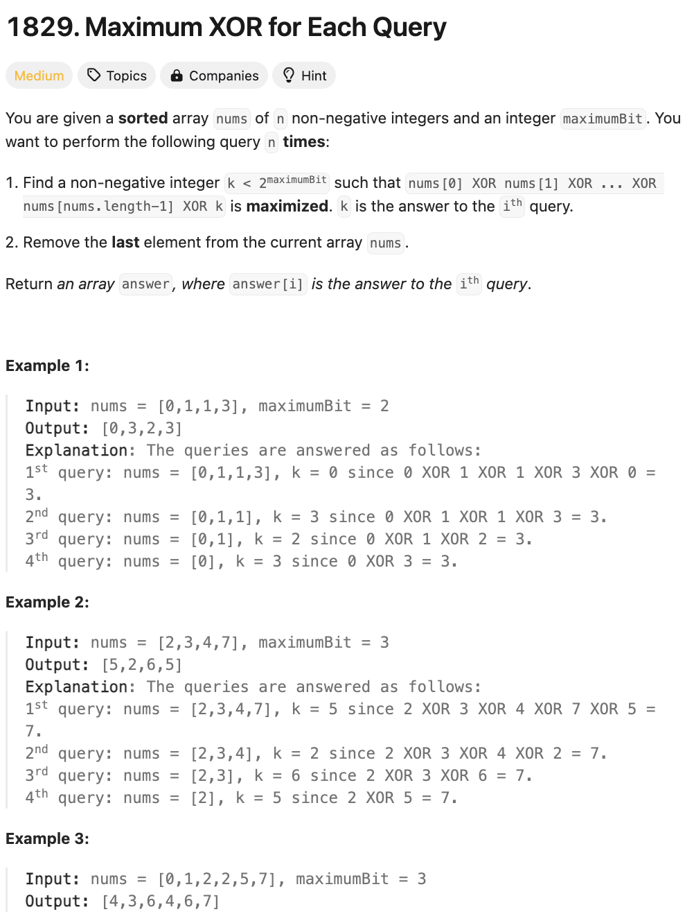

# 문제 설명
정렬된 배열이 주어진다. 이때, 다음 쿼리를 n번 수행했을 때, answer[i]가 i번째 쿼리에 답인 배열 answer를 반환하라.

- 쿼리는 다음과 같다.
  - `nums[0] XOR nums[1] XOR ... XOR nums[nums.length-1] XOR k`가 최댓값인 k < 2^maxbit인 양의 정수를 찾아라.
  - 현재 배열 nums에서의 마지막 결과를 삭제해라.




## 풀이 및 해설

## 풀이
```python
def getMaximumXor(self, nums: List[int], maximumBit: int) -> List[int]:
    n = len(nums)
    answer = [0] * n
    xor_sum = 0
    max_value =  (1<< maximumBit) - 1

    # calculate initial XOR sum
    for num in nums:
        xor_sum ^= num
    
    # process queries from right to left
    for i in range(n):
        # find k that maximizes XOR
        k = xor_sum ^ max_value
        answer[i] = k

        # remove last element and update XOR sum
        xor_sum ^= nums[n - 1- i]

    return answer
```
- 초기 XOR 합을 계산한다.
- 오른쪽에서 왼쪽으로 쿼리를 처리한다.
  - XOR을 최대화하는 k를 찾는다.
  - 마지막 요소를 제거하고 XOR 합을 업데이트한다.
- 결과를 반환한다.

## Complexity Analysis


### 시간 복잡도
- 초기 XOR 합을 계산하는 데 O(n)이 소요된다.

### 공간 복잡도
- answer 배열을 저장하는 데 O(n)이 소요된다.

## Constraint Analysis
```
Constraints:
nums.length == n
1 <= n <= 10^5
1 <= maximumBit <= 20
0 <= nums[i] < 2^maximumBit
nums​​​ is sorted in ascending order.
```

# References
- [1829. Maximum XOR for Each Query](https://leetcode.com/problems/maximum-xor-for-each-query/)