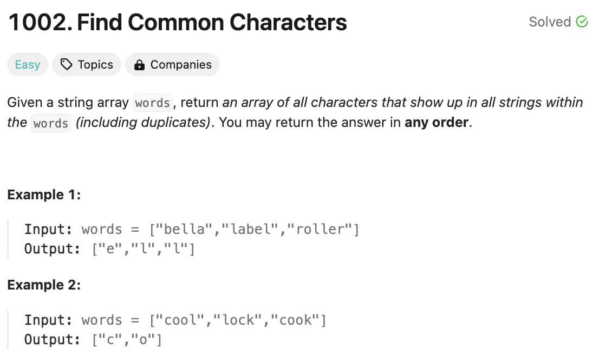

# 문제 설명
주어진 문자열 배열에서 공통된 문자를 찾아 반환하는 문제다. 2024-06-05 문제다.



## 풀이 및 해설

## 풀이
```python
def commonChars(self, words: List[str]) -> List[str]:
    if not words:
        return []

    common_chars = list(words[0])

    for word in words[1:]:
        temp = []
        word_chars = list(word)

        for char in common_chars:
            if char in word_chars:
                temp.append(char)
                word_chars.remove(char)
        
        common_chars = temp
    
    return list(common_chars)
```
- 단어 문자열 words가 비어있으면 []를 반환한다.
- words[0]의 문자열을 common_chars에 저장한다.
- 그 다음 단어부터 순회한다.
  - temp에 빈 리스트를 할당한다.
  - word의 문자열을 word_chars에 저장한다.
  - common_chars의 문자열을 순회한다.
    - 만약 char가 word_chars에 있다면 temp에 추가하고 word_chars에서 제거한다.
  - common_chars에 temp를 할당한다.
- common_chars를 반환한다.

## Complexity Analysis


### 시간 복잡도
- O(N)이다.
- N은 words의 길이다.

### 공간 복잡도
- O(N)이다.
- N은 words의 길이다.

## Constraint Analysis
```
Constraints:
1 <= words.length <= 100
1 <= words[i].length <= 100
words[i] consists of lowercase English letters.
```

# References
- [1002. Find Common Characters](https://leetcode.com/problems/find-common-characters/)