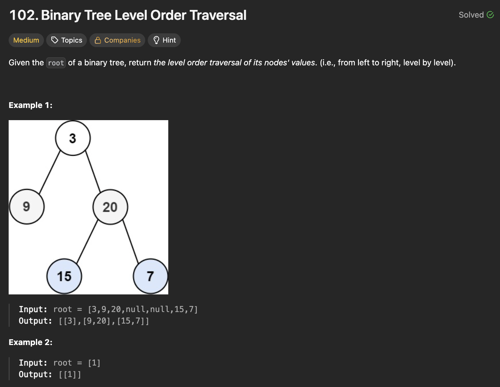
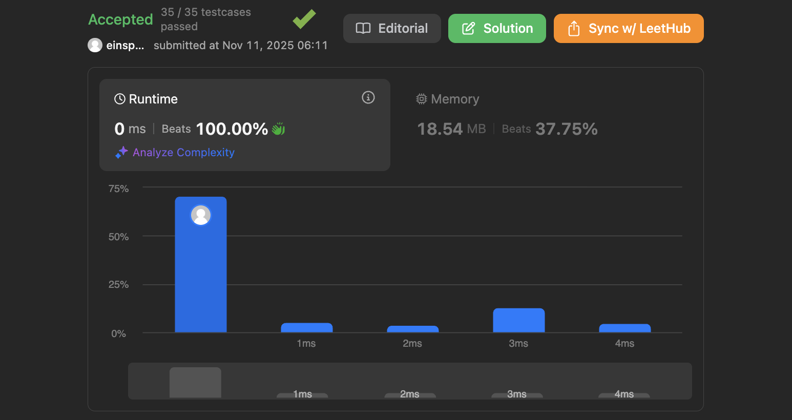

## 문제 설명
이진 트리를 레벨 순서로 순회하는 문제다.



## 풀이 및 해설
오늘은 빼빼로 데이다. 해당 문제를 풀려면 간단하게 BFS를 사용하면 된다. 큐를 사용해서 현재 레벨의 노드들을 모두 방문하고, 그 다음 레벨의 노드들을 큐에 추가하는 방식으로 진행한다.

```python
# Definition for a binary tree node.
# class TreeNode:
#     def __init__(self, val=0, left=None, right=None):
#         self.val = val
#         self.left = left
#         self.right = right
class Solution:
    def levelOrder(self, root: Optional[TreeNode]) -> List[List[int]]:
        if not root:
            return []
        
        queue = deque([root])
        res = []

        while queue:
            level_size = len(queue)
            curr_level = []

            for _ in range(level_size):
                node = queue.popleft()
                curr_level.append(node.val)


                if node.left:
                    queue.append(node.left)
                if node.right:
                    queue.append(node.right)
            
            res.append(curr_level)

        return res
```


### 시간복잡도
`O(N)` ; N은 트리의 노드 개수

### 공간복잡도
`O(N)` ; 큐에 저장되는 노드의 최대 개수는 트리의 최대 너비에 비례



## Constraint Analysis
```
Constraints:
The number of nodes in the tree is in the range [0, 2000].
-1000 <= Node.val <= 1000
```

# References
- [LeetCode 102. Binary Tree Level Order Traversal](https://leetcode.com/problems/binary-tree-level-order-traversal/)

