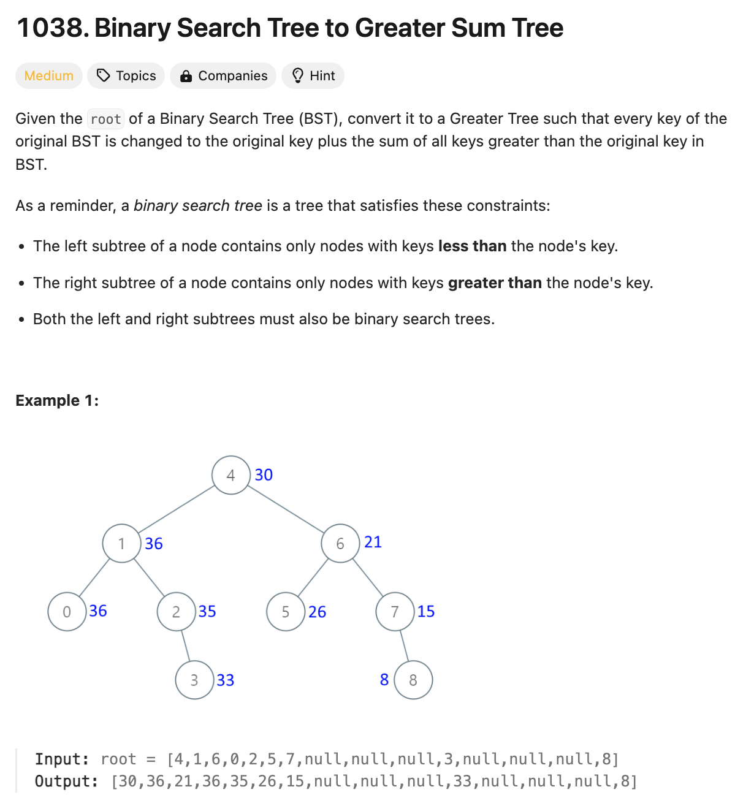
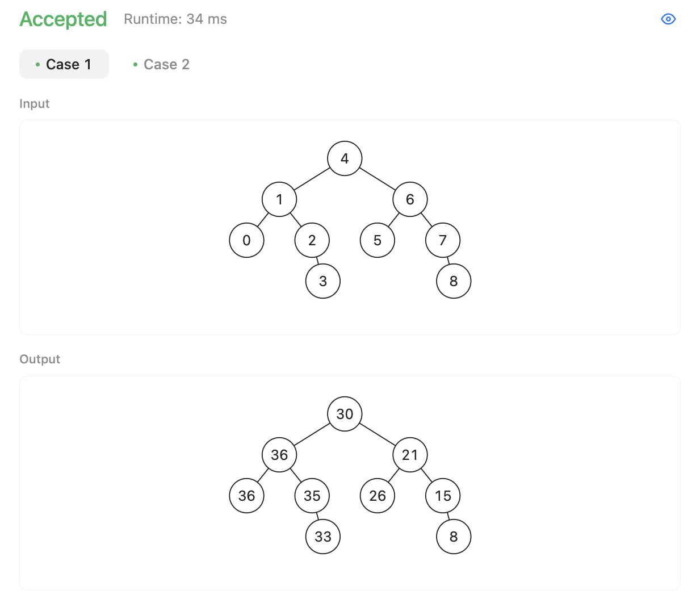
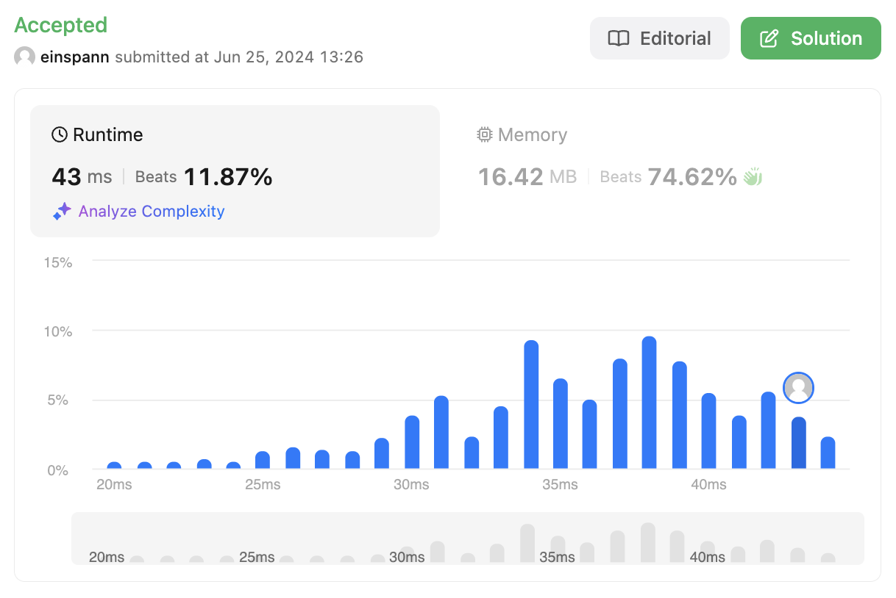

# 문제 설명
이 문제는 BST에서 각 노드의 값을 현재 노드의 값보다 큰 값들과의 합을 구하는 문제다.



오랜만에 트리 문제다. 일단 Binary Search Tree는 왼쪽에 있는 값들은 모두 지금의 노드보다 작은 숫자들이며, 오른쪽은 다 큰 숫자들이라, 자식들이 있다면 현재 노드의 값에다 오른쪽 노드의 값들의 합을 구하면 될 것 같다. 반면, 자신보다 큰 자식 노드가 없다면, 자신보다 큰 값들이 있는지 먼저 찾아봐야 할 것 같다.

이 문제를 해결하기 위해서는 직관적으로 가장 큰 값부터 시작해서 왼쪽으로 가는게 유리할 것 같고, Sum of a Binary Search Tree를 구하는 문제와 비슷한 방식으로 풀 수 있을 것 같다.

## 풀이 및 해설


### 핵심 개념 3개:
1. Reverse In-Order Traversal 
이게 아까 말했던 오른쪽에서 왼쪽 순서로 가야 큰 값을 먼저 살핀다.
2. Cummulative Sum
지금까지 탐색한 값들의 합을 저장하고, 현재 노드의 값을 대채한다.
3. 현재 노드 값의 대체
현재 노드의 값을 현재까지의 합으로 대체한다.


## 풀이
```python
class Solution:
    def bstToGst(self, root: TreeNode) -> TreeNode:
        cummulative_sum = [0] # initialize cummulative sum list

        def reverseInOrder(node: TreeNode):
            if not node:
                return
            
            # Traverse right subtree first
            reverseInOrder(node.right)

            # Update cummulative sum
            cummulative_sum[0] += node.val

            # Update current node value
            node.val = cummulative_sum[0]

            # Traverse left subtree
            reverseInOrder(node.left)
        
        # Start reverse in order traversal
        reverseInOrder(root)
        return root
```

- 먼저, cummulative sum을 저장할 리스트를 초기화한다.
- reverseInOrder 함수를 정의한다.
- reverseInOrder 함수는 node를 받아서, node가 None이 아닐 때까지 오른쪽 서브트리를 먼저 탐색한다.
- 그리고, cummulative sum을 업데이트하고, 현재 노드의 값을 업데이트한다.
- 마지막으로, 왼쪽 서브트리를 탐색한다.
- 마지막으로, reverseInOrder 함수를 실행하고, root를 반환한다.

테스트 케이스는 모두 통과한다.


## Complexity Analysis


### 시간 복잡도
노드 방문을 한 번씩만 하기 때문에 O(N)이다.
각 노드를 정확히 한 번 방문하므로, 전체 시간 복잡도는 O(N)이다.

### 공간 복잡도
O(H); H는 트리의 높이로, 재귀 호출 스택의 최대 깊이이다.


## Constraint Analysis
```
Constraints:

The number of nodes in the tree is in the range [1, 100].
0 <= Node.val <= 100
All the values in the tree are unique.
```

노드의 수가 최대 100개로 매우 작기 때문에 O(N) 복잡도의 알고리즘은 충분히 빠르게 실행될 수 있다.

현재 프로그램이 느린 이유는 재귀 호출로 인해 호출 스택이 깊어지면서, 특히 트리의 높이가 커질 때 스택 프레임 관리에 시간이 더 소요되기 때문이다. 또한, 불필요하게 cummulative_sum을 리스트로 사용하여 간접적인 접근을 하는 것도 성능을 저하시킬 수 있다. 이 때문에 작은 트리에서도 재귀 깊이와 리스트 접근이 누적되어 느리게 작동할 수 있다.

# References
- [LeetCode](https://leetcode.com/problems/binary-search-tree-to-greater-sum-tree)