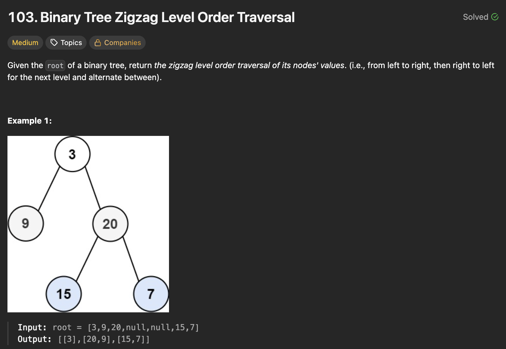
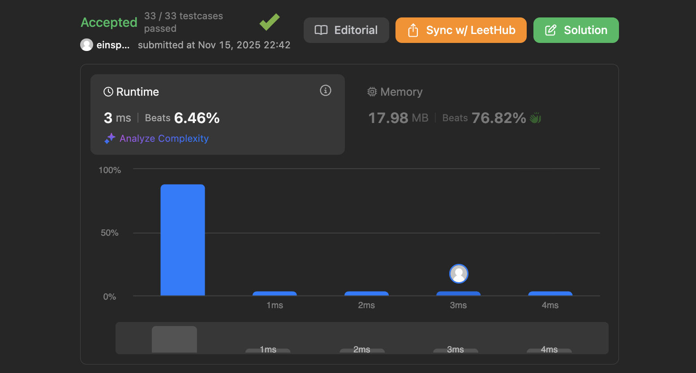
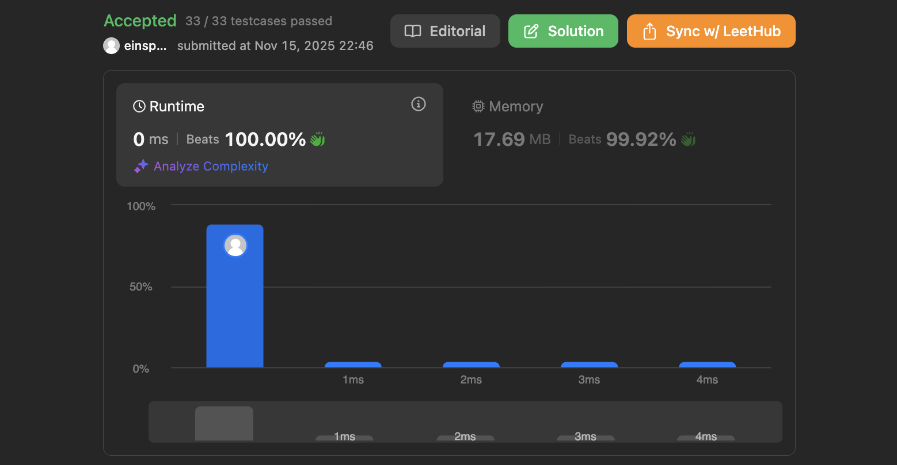

## 문제 설명
이진 트리를 지그재그 레벨 순서로 순회하는 문제다.




## 풀이 및 해설
이번 문제도 딱 보면 층마다 무언가를 하려고 하기 때문에 BFS로 접근해야 한다. 딱 보면 왼쪽에서 오른쪽이냐, 반대냐이기 때문에 방향에 대한 플래그 변수를 주면 될 것 같다. 나는 각 층에 대하여 해당 플래그에 따라 반대로 된 리스트를 추가하는 방식을 사용했다.

```python
# Definition for a binary tree node.
# class TreeNode:
#     def __init__(self, val=0, left=None, right=None):
#         self.val = val
#         self.left = left
#         self.right = right
class Solution:
    def zigzagLevelOrder(self, root: Optional[TreeNode]) -> List[List[int]]:
        if not root:
            return []
        
        queue = deque([root])
        flag = 1
        res = []

        while queue:
            level_size = len(queue)
            floor = []

            if flag:
                flag = 0
            else:
                flag = 1

            for i in range(level_size):
                node = queue.popleft()

                floor.append(node.val)

                if node.left:
                    queue.append(node.left)
                if node.right:
                    queue.append(node.right)

            if not flag:
                res.append(floor)
            else:
                res.append(floor[::-1])
        
        return res
```


### 시간복잡도
`O(N)` ; N은 트리의 노드 개수

### 공간복잡도
`O(N)` ; 큐에 저장되는 노드의 최대 개수는 트리의 최대 너비에 비례




### Improvements

이를 더 빠르게 할거면, 리스트를 반대로 돌리는 것이 아니라, append할 때 appendleft를 사용해서 반대로 넣는 방법도 있다. 이렇게 하면 리스트를 뒤집는 데 드는 시간이 줄어든다.

```python
# Definition for a binary tree node.
# class TreeNode:
#     def __init__(self, val=0, left=None, right=None):
#         self.val = val
#         self.left = left
#         self.right = right
class Solution:
    def zigzagLevelOrder(self, root: Optional[TreeNode]) -> List[List[int]]:
        if not root:
            return []
        
        queue = deque([root])
        left_to_right = True
        res = []

        while queue:
            level_size = len(queue)
            floor = deque()

            for i in range(level_size):
                node = queue.popleft()
                if left_to_right:
                    floor.append(node.val)
                else:
                    floor.appendleft(node.val)

                if node.left:
                    queue.append(node.left)
                if node.right:
                    queue.append(node.right)

            res.append(list(floor))
            left_to_right = not left_to_right
        
        return res
```



## Constraint Analysis
```
Constraints:
The number of nodes in the tree is in the range [0, 2000].
-1000 <= Node.val <= 1000
```

# References
- [LeetCode 103. Binary Tree Zigzag Level Order Traversal](https://leetcode.com/problems/binary-tree-zigzag-level-order-traversal/)

