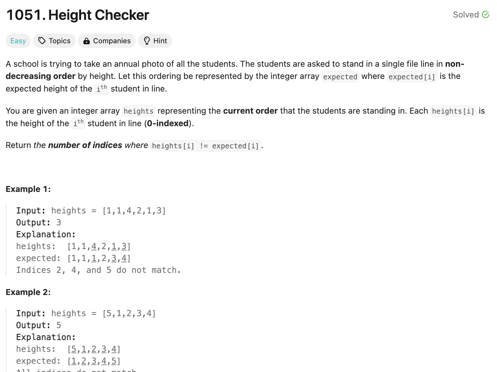

## 문제 설명
주어진 배열에서 순서가 안 맞는 수의 갯수를 확인하는 문제다.




## 풀이 및 해설
시간복잡도 고려안하고 일단 한번 해봤는데 통과했다.


- sorted를 사용해서 배열을 정렬하고 새로운 배열에 넣어놓는다.
- 둘을 비교해서 값이 다를 때마다 count를 하나씩 증가한다.  

## 풀이
```python
class Solution:
    def heightChecker(self, heights: List[int]) -> int:
        ordered_heights = sorted(heights)
        count = 0

        for i in range(len(heights)):
            if ordered_heights[i] != heights[i]:
                count += 1
        
        return count
```

## Complexity Analysis

### Time Complexity
- sorted를 사용해서 O(NlogN)이다.
- for loop를 돌면서 비교하므로 len(heights)만큼 O(N)이다.

### Space Complexity
- O(N) ; N은 nums 배열의 길이

## Constraint Analysis
```
Constraints:

1 <= heights.length <= 100
1 <= heights[i] <= 100
```

- 시간복잡도는 O(100). 하나의 operation은 10^-6이 걸린다 생각하면 100 * 10^-6 = 0.0001초이다.
- 공간복잡도는 O(100).

# References
- [LeetCode](https://leetcode.com/problems/height-checker)
