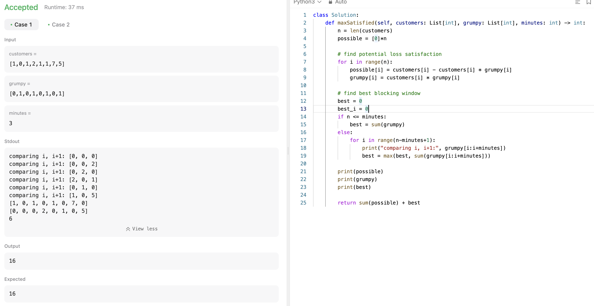

# 문제 설명
n개의 시간대에 대한 고객의 만족도가 주어집니다. 그리고 n개의 시간대에 대한 고객의 만족도를 최대화하기 위해 k개의 연속된 시간대에 대한 고객의 만족도를 최대화하는 방법을 찾는 문제입니다.

주어지는 입력으로는 다음과 같습니다.
- customers: 고객의 만족도 배열
- grumpy: 고객의 불만족 배열
- minutes: 연속된 참을 수 있는 시간대의 개수

이때, grumpy 배열의 값이 1인 경우에는 주인이 까칠해서 고객의 불만족이 있고, 0인 경우에는 고객의 만족도가 있습니다.

minutes는 연속된 시간대의 개수를 의미합니다. 이때, 연속된 시간대의 개수만큼의 시간대에 대한 까칠함을 참아서 고객의 불만족을 최소화하여 고객의 만족도를 최대화하는 방법을 찾는 문제입니다.


## 풀이 및 해설
이 문제를 푸는데에 핵심은 '언제 가장 많은 잠재적인 피해를 보는가?'를 구하는거라고 생각합니다. 이때, 잠재적인 피해를 보는 시간대를 찾아서 그 시간대에 대한 고객의 불만족을 최소화하여 고객의 만족도를 최대화하는 방법을 찾는 것입니다.

따라서 저는 다음과 같은 방법으로 문제를 풀었습니다.


## 풀이
```python
class Solution:
    def maxSatisfied(self, customers: List[int], grumpy: List[int], minutes: int) -> int:
        n = len(customers)
        possible = [0]*n

        # find potential loss satisfaction
        for i in range(n):
            possible[i] = customers[i] - customers[i] * grumpy[i]
            grumpy[i] = customers[i] * grumpy[i]

        # find best blocking window
        best = 0
        best_i = 0
        if n <= minutes:
            best = sum(grumpy)
        else:
            for i in range(n-minutes+1):
                best = max(best, sum(grumpy[i:i+minutes]))

        return sum(possible) + best
```

- 먼저, 잠재적인 피해를 찾기 위해 `possible` 배열을 만들어서 고객의 만족도에서 고객의 불만족을 뺀 값을 저장합니다.
- 그리고, 고객의 불만족을 찾기 위해 `grumpy` 배열에 고객이 불만족해서 못 얻는 값들을 저장합니다.   
(하나의 배열에 저장하는 이유는 공간을 절약하기 위함입니다. 이때, customers 배열은 재사용하지 않는 이유는 grumpy를 계산할 때 customers 배열을 사용하기 때문입니다.)
- 그리고, 연속된 시간대의 개수만큼의 시간대에 대한 고객의 불만족을 최소화하여 고객의 만족도를 최대화하는 방법을 찾기 위해 다음과 같은 방법을 사용합니다.
  - 만약, n이 minutes보다 작거나 같다면, 그냥 모든 시간대에 대한 고객의 불만족을 더하면 됩니다.
  - 그렇지 않다면, n-minutes+1만큼 반복하면서 연속된 시간대에 대한 고객의 불만족을 더하면서 최대값을 찾습니다.
- 마지막으로, 고객의 만족도를 계산하기 위해 `possible` 배열과 `best` 값을 더해서 반환합니다.



## Complexity Analysis


### 시간 복잡도
O(n)의 시간 복잡도를 가집니다. 다른 풀이들보다 확실히 느리긴 하지만 그래도 O(n)이긴 합니다.

- possible 배열을 만드는데 O(n)
- best를 찾는데 O(n*minutes)이 걸립니다.
- sum을 계산하는데 O(n)이 걸립니다.

따라서, O(n*minutes)의 시간 복잡도를 가집니다.

### 공간 복잡도
O(n)의 공간 복잡도를 가집니다. possible 배열을 만드는데 O(n)의 공간이 필요합니다.

## Constraint Analysis
```
Constraints:
n == customers.length == grumpy.length
1 <= minutes <= n <= 2 * 10^4
0 <= customers[i] <= 1000
grumpy[i] is either 0 or 1.
```
일단 그래도 다른 풀이들보다는 느리니까, 최적화 하려면 매번 sum을 구하는 것보다 sliding window를 하는게 더 좋을 것 같습니다.

Running sum을 이용해서 O(n)으로 풀 수 있을 것 같습니다.


확실히 Sliding window를 사용하면 O(n)으로 풀 수 있습니다.

# References
- [1052. Grumpy Bookstore Owner](https://leetcode.com/problems/grumpy-bookstore-owner/)