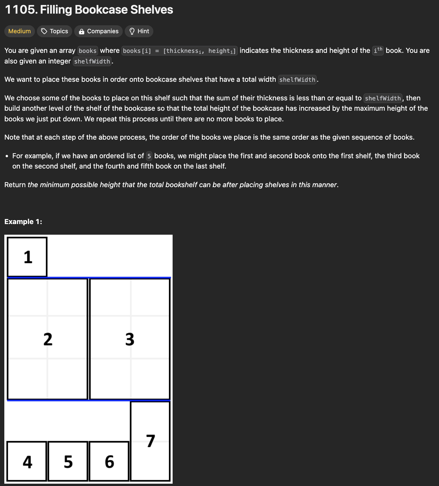
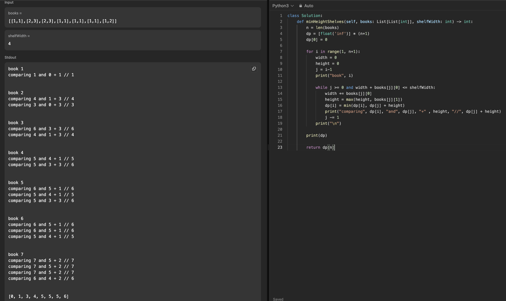

# 문제 설명
책장에 책을 쌓는 문제로, 책의 높이와 책장의 너비가 주어질 때, 책장에 책을 쌓는 최소 높이를 구하는 문제이다.



해당 문제에서 책은 순서대로 쌓아야 하며, 높이를 최소화해야 한다. 이를 최소화하기 위해서는 높이가 큰 책들을 최대한 같은 책장에 쌓아야 한다. 그렇다면, i번째 책이 주어졌을때, 그 이후 i+n번째 책들에 대하여 높이를 계산하여 최소 높이를 구해야 한다.

이를 하기 위해, 다이나믹 프로그래밍을 사용하여 문제를 해결할 수 있을 것 같다.

## 풀이 및 해설 
1) 책들의 길이 n를 선언하고, dp 배열을 inf로 초기화하며, dp[0] = 0으로 초기화한다.
2) for loop으로 1부터 n+1까지 반복한다. 즉, 모든 책들에 대하여 반복한다.
    - width, height를 0으로 선언한다.
    - j는 i-1으로 선언.
    3) while loop을 j가 0보다 크고, width + books[j][0] <= shelfWidth일 때까지 반복한다. 즉, 책장의 너비를 초과하지 않을 때까지 반복한다.
        - width에 books[j][0]을 더하고, height에 max(height, books[j][1])을 저장.
        - dp[i]에 min(dp[i], dp[j] + height)를 저장한다. min을 사용하는 이유는, 이전 책들의 높이와 현재 책들의 높이 중 최소 높이를 저장하기 위함이다.
        - j를 1 감소한다.
4) dp[n]을 반환한다. 즉, 모든 책들에 대하여 최소 높이를 반환한다.




## 풀이
```python
def minHeightShelves(self, books: List[List[int]], shelfWidth: int) -> int:
    n = len(books)
    dp = [float('inf')] * (n+1)
    dp[0] = 0

    for i in range(1, n+1):
        width = 0
        height = 0
        j = i-1

        while j >= 0 and width + books[j][0] <= shelfWidth:
            width += books[j][0]
            height = max(height, books[j][1])
            dp[i] = min(dp[i], dp[j] + height)
            j -= 1
    
    return dp[n]
```

## Complexity Analysis


### 시간 복잡도
- O(n^2) : 모든 책들에 대하여 반복하며, 이전 책들의 높이와 현재 책들의 높이 중 최소 높이를 저장하기 때문에 O(n^2)의 시간 복잡도를 가진다.

### 공간 복잡도
- O(n) : dp 배열을 사용하여 O(n)의 공간 복잡도를 가진다.

## Constraint Analysis
```
Constraints:
1 <= books.length <= 1000
1 <= thicknessi <= shelfWidth <= 1000
1 <= heighti <= 1000
```

# References
- [1105. Filling Bookcase Shelves](https://leetcode.com/problems/filling-bookcase-shelves/)