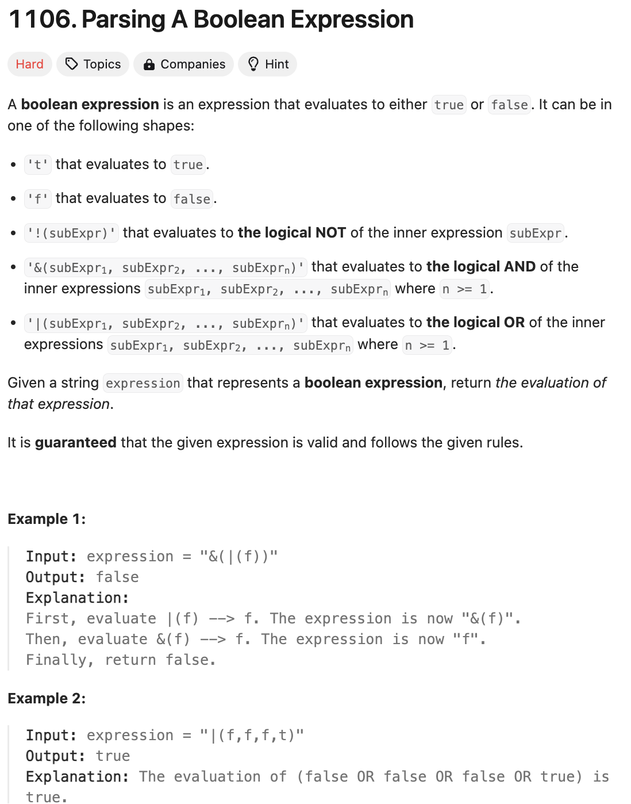

# 문제 설명
이 문제는 주어진 문자열을 파싱하여 boolean 값을 반환하는 문제이다.



## 풀이 및 해설

## 풀이
```python
class Solution:
    def parseBoolExpr(self, expression: str) -> bool:
        def evaluate(expr):
            if not expr:
                return None  # Return None for empty expressions
            
            if expr == 't':
                return True
            if expr == 'f':
                return False
            
            operator = expr[0]
            subexpr = expr[2:-1]  # remove parentheses
            
            if operator == '!':
                return not evaluate(subexpr)
            
            values = []
            current = []
            depth = 0
            
            for char in subexpr:
                if char == '(':
                    depth += 1
                elif char == ')':
                    depth -= 1
                
                if depth == 0 and char == ',':
                    result = evaluate(''.join(current))
                    if result is not None:
                        values.append(result)
                    current = []
                else:
                    current.append(char)
            
            if current:
                result = evaluate(''.join(current))
                if result is not None:
                    values.append(result)
            
            if operator == '&':
                return all(values)
            if operator == '|':
                return any(values)
        
        return evaluate(expression)
```
- `evaluate` 함수는 주어진 문자열을 파싱하여 boolean 값을 반환하는 함수이다.
- `expr`이 비어있으면 `None`을 반환한다.
- `expr`이 `t`이면 `True`를 반환한다.
- `expr`이 `f`이면 `False`를 반환한다.
- `expr`이 `!`이면 `subexpr`을 평가한 결과의 반대값을 반환한다.
- `expr`이 `&`이면 `subexpr`을 평가한 결과의 모든 값이 `True`인지 확인하여 반환한다.
- `expr`이 `|`이면 `subexpr`을 평가한 결과 중 하나라도 `True`인지 확인하여 반환한다.
- `values`는 `subexpr`을 평가한 결과를 저장하는 리스트이다.
- `current`는 현재 평가 중인 문자열을 저장하는 리스트이다.
- `depth`는 괄호의 깊이를 저장하는 변수이다.
- `subexpr`을 순회하면서 괄호의 깊이를 확인하고, `,`를 만나면 `current`를 평가하여 `values`에 추가한다.
- 마지막으로 `operator`에 따라 `values`를 확인하여 결과를 반환한다.
- `evaluate` 함수를 호출하여 결과를 반환한다.

## Complexity Analysis


### 시간 복잡도
- 시간 복잡도는 `O(N)`이다.

### 공간 복잡도
- 공간 복잡도는 `O(N)`이다.

## Constraint Analysis
```
Constraints:
1 <= expression.length <= 2 * 10^4
expression[i] is one following characters: '(', ')', '&', '|', '!', 't', 'f', and ','.
```

# References
- [1106. Parsing A Boolean Expression](https://leetcode.com/problems/parsing-a-boolean-expression/)