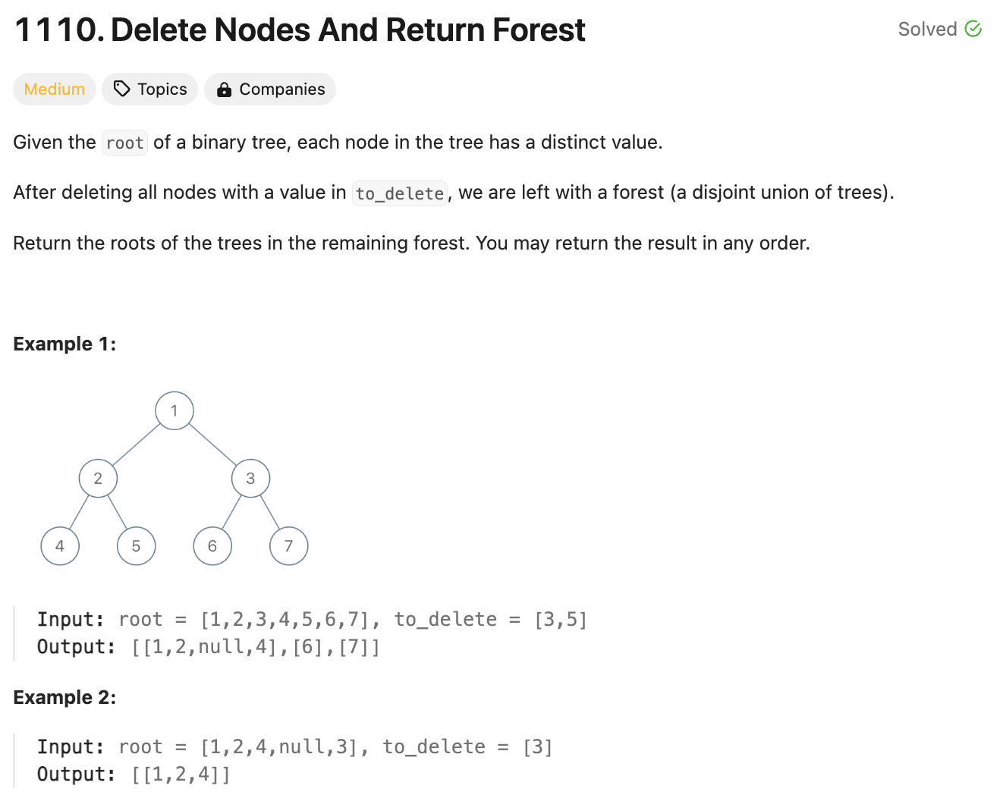

# 문제 설명
하나의 이진 트리에서 몇개의 노드들을 지우면 생기는 여러개의 이진 트리를 반환하는 문제다.



## 풀이 및 해설
- to_delete_set에 to_delete를 저장한다.
- dfs 함수를 정의한다.
    - node가 None이면 None을 반환한다.
    - node.val이 to_delete_set에 있는지 확인한다.
    - is_root가 True이고 is_deleted가 False이면 forest에 node를 추가한다.
    - node.left와 node.right에 대해 dfs를 호출한다.
    - is_deleted가 False이면 node를 반환하고, True이면 None을 반환한다.
- root와 True를 dfs에 전달한다.
- forest를 반환한다.


## 풀이
```python
# Definition for a binary tree node.
# class TreeNode:
#     def __init__(self, val=0, left=None, right=None):
#         self.val = val
#         self.left = left
#         self.right = right
class Solution:
    def delNodes(self, root: Optional[TreeNode], to_delete: List[int]) -> List[TreeNode]:
        def dfs(node, is_root):
            if not node:
                return None
            
            is_deleted = node.val in to_delete_set

            if is_root and not is_deleted:
                forest.append(node)
            
            node.left = dfs(node.left, is_deleted)
            node.right = dfs(node.right, is_deleted)

            return None if is_deleted else node
        
        
        # need to find the children that are cut off by deleting a particular node
        # if that node is a root, we need to add it to the forest

        to_delete_set = set(to_delete)
        forest = []

        dfs(root, True)
        return forest
```


## Complexity Analysis


### 시간 복잡도
- O(N) : 모든 노드를 한번씩 방문한다.

### 공간 복잡도
- O(H) : 재귀 호출 스택에 최대 높이만큼의 공간이 필요하다.
- O(M) : to_delete_set에 최대 M개의 노드를 저장한다.

## Constraint Analysis
```
Constraints:
The number of nodes in the given tree is at most 1000.
Each node has a distinct value between 1 and 1000.
to_delete.length <= 1000
to_delete contains distinct values between 1 and 1000.
```

# References
- [1110. Delete Nodes And Return Forest](https://leetcode.com/problems/delete-nodes-and-return-forest/)