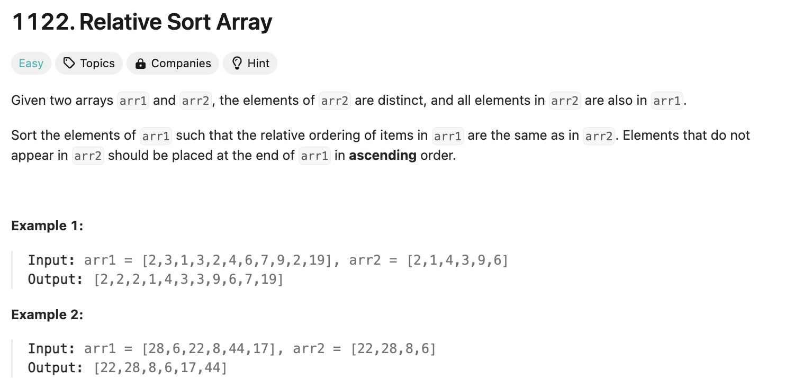
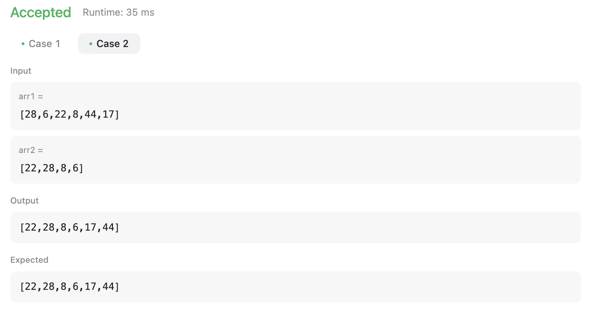
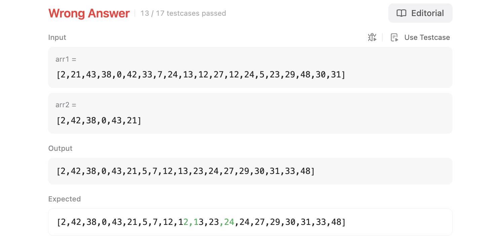
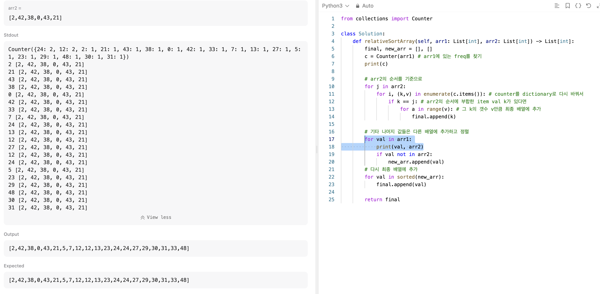
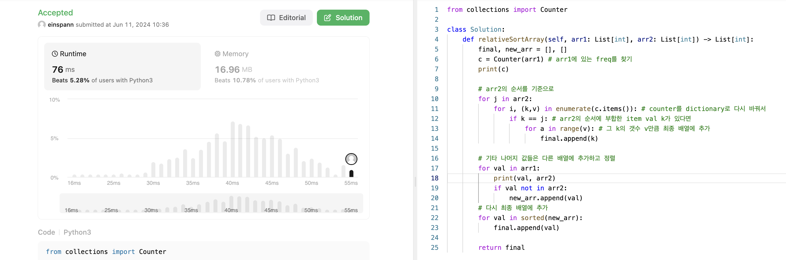
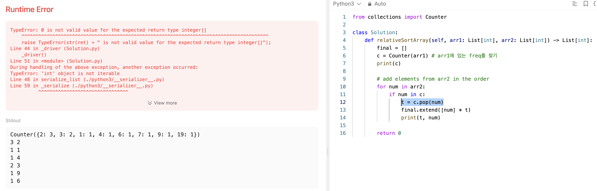

## 문제 설명
두 배열이 주어진다. arr1 배열에서 arr2 배열의 순서대로 정렬하고, 나머지는 오름차순으로 정렬하는 문제다.



## 1차 시도
분명 쉬운 난이도인데 뭔가 방법을 찾기가 어렵고 시간복잡도가 엉망이 된것 같다.
일단은 되게 장황하게 한번 풀어봤는데 테스트케이스는 통과했다. 그런데 시간복잡도가 너무 높거나, 그냥 틀릴 것 같다.

```python
from collections import Counter

class Solution:
    def relativeSortArray(self, arr1: List[int], arr2: List[int]) -> List[int]:
        final, new_arr = [], []
        c = Counter(arr1) # arr1에 있는 freq를 찾기

        # arr2의 순서를 기준으로
        for j in arr2:
            for i, (k,v) in enumerate(c.items()): # counter를 dictionary로 다시 바꿔서
                if k == j: # arr2의 순서에 부합한 item val k가 있다면
                    for a in range(v): # 그 k의 갯수 v만큼 최종 배열에 추가
                        final.append(k)

        # 기타 나머지 값들은 다른 배열에 추가하고 정렬
        for val in c:
            if val not in arr2:
                new_arr.append(val)
        # 다시 최종 배열에 추가
        for val in sorted(new_arr):
            final.append(val)

        return final
```



- arr1에 있는 freq를 찾기
- arr2의 순서를 기준으로
- counter를 dictionary로 다시 바꿔서
- arr2의 순서에 부합한 item val k가 있다면
- 그 k의 갯수 v만큼 최종 배열에 추가

- 기타 나머지 값들은 다른 배열에 추가하고 정렬
- 다시 최종 배열에 추가

### 시간복잡도
`O(m×n^2)` ; m은 arr2의 길이, n은 arr1의 길이


### 틀린 이유


```
arr1 = [2,21,43,38,0,42,33,7,24,13,12,27,12,24,5,23,29,48,30,31]  
arr2 = [2,42,38,0,43,21]

output = [2,42,38,0,43,21,5,7,12,13,23,24,27,29,30,31,33,48]  
expected = [2,42,38,0,43,21,5,7,12,12,13,23,24,24,27,29,30,31,33,48]
```

보면 24와 12가 하나씩 누락됐다. 왜 그럴까?



보니까 해당하지 않는 값들에 대하여 한번씩만 들어가고 있었다. 이를 수정하니, 테스트 케이스는 통과하긴 했는데, 아무래도 아직도 시간복잡도는 상당히 높다.

### 제출시도:
 

놀랍게도 통과했다. 시간복잡도가 너무 높아서 더 깎아보겠다.

## 2차 시도
일단 Nested for loop이 가장 문제다.


pop을 하니까 이게 결국에 freq를 반환한다. 그래서 [new]*freq를 하면, freq만큼 new가 반복된다. 이렇게 하면 번거롭게 for loop을 다시 안 돌려도 된다.

이미 있는 값들은 다 pop 당했으니 remaining = sorted(c.elements())을 하면, 기존에 남았던 값들만 정렬해서 반환한다.

여기서 마지막으로 final.extend(remaining)을 하면, 기존에 정렬된 값들과 남은 값들을 합쳐서 반환한다.

이렇게 하면 다음과 같이 조금은 빨라진다.  


## 풀이
```python
from collections import Counter

class Solution:
    def relativeSortArray(self, arr1: List[int], arr2: List[int]) -> List[int]:
        final = []
        c = Counter(arr1) # arr1에 있는 freq를 찾기
        print(c)

        # add elements from arr2 in the order
        for num in arr2:
            if num in c:
                t = c.pop(num)
                final.extend([num] * t)

        remaining = sorted(c.elements())
        final.extend(remaining)

        return final
```

## Complexity Analysis

### Time Complexity
- Counter: O(N) ; N은 arr1 배열의 길이
- For loop: O(M) ; M은 arr2 배열의 길이
- Sorting remaining elements: O(KlogK) ; K는 arr1에서 arr2에 없는 요소의 수 (최대 N)

최종적으로 O(NlogN+M)이다.

### Space Complexity
O(N) ; N은 nums 배열의 길이

## Constraint Analysis
```
Constraints:

1 <= arr1.length, arr2.length <= 1000  
0 <= arr1[i], arr2[i] <= 1000  
All the elements of arr2 are distinct.  
Each arr2[i] is in arr1.  
```


# Update 2024-06-13: HashMap
이것보다 더 빠른 방법이 있을것 같아서 다시 한번 풀어보았다. HashMap을 사용하면 아마 빨라질것 같아서 한번 사용해보았다.

```python
class Solution:
    def relativeSortArray(self, arr1: List[int], arr2: List[int]) -> List[int]:
        final = []
        remaining = []
        count_map = {}

        # initialize count map with relative order elements
        for value in arr2:
            count_map[value] = 0

        # count occurrences of elements in target array
        for value in arr1:
            if value in count_map:
                count_map[value] += 1
            else:
                remaining.append(value)
        
        #sort remaining
        remaining.sort()

        # add elements following relative order
        for value in arr2:
            for _ in range(count_map[value]):
                final.append(value)
        
        # add remaining elements
        final.extend(remaining)
        return final
```


훨씬 빨라졌으며, 시간복잡도가 더 빠른지 분석을 해보자.

### Time Complexity
- Initializing count map with elements from arr2: O(M) ; M은 arr2 배열의 길이
- Counting occurrences of elements in arr1: O(N) ; N은 arr1 배열의 길이
- Sorting remaining elements: O(RlogR) ; R은 arr1에서 arr2에 없는 요소의 수 (최대 N)
- Adding elements following relative order: O(N) ; N은 arr1 배열의 길이    

최종적으로 O(NlogN+M)이다.

### Space Complexity
- Count map: O(M) ; M은 arr2 배열의 길이
- Remaining list: O(R) ; R은 arr1에서 arr2에 없는 요소의 수
- Final list: O(N) ; N은 arr1 배열의 길이  

최종적으로 O(N)이다.

## 분석
두개의 풀이가 시간복잡도가 같은데, 어째서 두번째 풀이가 더 빠르게 나왔을까? 각 단계에서 실행시간이 더 빠르기 때문이다. 하나씩 비교해보자.

### Counter: O(N) vs HashMap: O(M)
- 첫 번째 구현에서 Counter는 arr1 전체를 한 번 훑어야 하며, 이는 O(N).
- 두 번째 구현에서 count_map 초기화는 arr2에 대해 수행되며, 이는 O(M). 그 후, arr1을 한 번 훑어서 카운트를 증가시키는 것도 O(N). 따라서 이 단계에서는 큰 차이가 없다.

### 요소 추가 및 정렬
- 첫 번째 구현에서는 Counter에서 요소를 하나씩 꺼내면서 final에 추가하고, 남은 요소들을 정렬합니다.  
- 두 번째 구현에서는 count_map에서 카운트를 참조하여 final에 요소를 추가합니다. 남은 요소들은 별도의 리스트에 추가하고 마지막에 한 번만 정렬합니다. 여기서, 두 번째 구현이 Counter의 요소를 한 번씩 꺼내는 것보다 더 효율적입니다.

### 나머지 요소 처리
- 첫 번째 구현에서는 남은 요소들을 sorted로 정렬합니다.
- 두 번째 구현에서도 남은 요소들을 정렬하지만, 이미 arr1에서 arr2에 없는 요소들만 따로 모아서 정렬합니다.

## 결론
두 번째 구현이 더 빠른 이유는 Counter의 요소를 하나씩 꺼내고 확장하는 과정이 첫 번째 구현보다 덜 비효율적이기 때문이다. Counter의 요소를 한 번씩 꺼내는 것보다는 Hash Map에서 카운트를 참조하여 직접 리스트에 추가하는 것이 상수 시간 복잡도에서 더 효율적이다. 또한, 남은 요소들을 별도로 정렬하고 추가하는 과정이 더 단순화되어 있다.

# References
- [LeetCode](https://leetcode.com/problems/relative-sort-array)
- [Python - Counter](https://docs.python.org/3/library/collections.html#collections.Counter)
