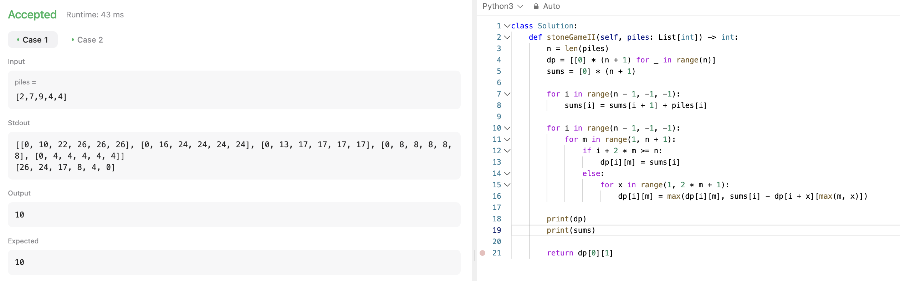

# 문제 설명
두 플레이어가 번갈아가며 돌탑을 선택하여 돌을 가져갈 수 있을 때, Alice가 이길 수 있는 최대 점수를 구하는 문제이다.


입력이 piles = [2, 7, 9, 4, 4]일 때, 다음과 같은 형태로 돌탑이 존재한다. 


## 풀이 및 해설


## 풀이
```python
class Solution:
    def stoneGameII(self, piles: List[int]) -> int:
        n = len(piles)
        dp = [[0] * (n + 1) for _ in range(n)]
        sums = [0] * (n + 1)

        for i in range(n - 1, -1, -1):
            sums[i] = sums[i + 1] + piles[i]

        for i in range(n - 1, -1, -1):
            for m in range(1, n + 1):
                if i + 2 * m >= n:
                    dp[i][m] = sums[i]
                else:
                    for x in range(1, 2 * m + 1):
                        dp[i][m] = max(dp[i][m], sums[i] - dp[i + x][max(m, x)])

        return dp[0][1]
```
- `dp[i][m]`은 `piles[i:]`에서 최대 m개의 돌을 가져갈 때, Alice가 이길 수 있는 최대 점수를 의미한다.
- `sums[i]`는 `piles[i:]`의 합을 의미한다.
- `dp[i][m]`은 다음과 같이 구할 수 있다.
  - `i + 2 * m >= n`이면, `dp[i][m] = sums[i]`이다.
  - 그렇지 않으면, `dp[i][m] = max(dp[i][m], sums[i] - dp[i + x][max(m, x)])`이다.
    - `x`는 1부터 2 * m까지이다.
    - `dp[i][m]`은 `sums[i] - dp[i + x][max(m, x)]` 중 최대값을 가진다.
    - `dp[i + x][max(m, x)]`는 `piles[i + x:]`에서 최대 `max(m, x)`개의 돌을 가져갈 때, Bob이 이길 수 있는 최대 점수를 의미한다.
    - `sums[i] - dp[i + x][max(m, x)]`는 Alice가 `piles[i:i + x]`를 가져갈 때, Bob이 `piles[i + x:]`에서 최대 `max(m, x)`개의 돌을 가져갈 때, Alice가 이길 수 있는 최대 점수를 의미한다.
    - 따라서, `dp[i][m]`은 `piles[i:]`에서 최대 m개의 돌을 가져갈 때, Alice가 이길 수 있는 최대 점수를 의미한다.
    - `dp[0][1]`은 `piles`에서 최대 1개의 돌을 가져갈 때, Alice가 이길 수 있는 최대 점수를 의미한다.
    - 따라서, `dp[0][1]`을 반환한다.

## Complexity Analysis


### 시간 복잡도
- `dp[i][m]`을 구하는 시간 복잡도는 `O(n^2)`이다.
- 따라서, 전체 시간 복잡도는 `O(n^2)`이다.

### 공간 복잡도
- `dp`와 `sums`의 공간 복잡도는 `O(n^2)`이다.
- 따라서, 전체 공간 복잡도는 `O(n^2)`이다.

## Constraint Analysis
```
Constraints:
1 <= piles.length <= 100
1 <= piles[i] <= 10^4
```

# References
- [1140. Stone Game II](https://leetcode.com/problems/stone-game-ii/)