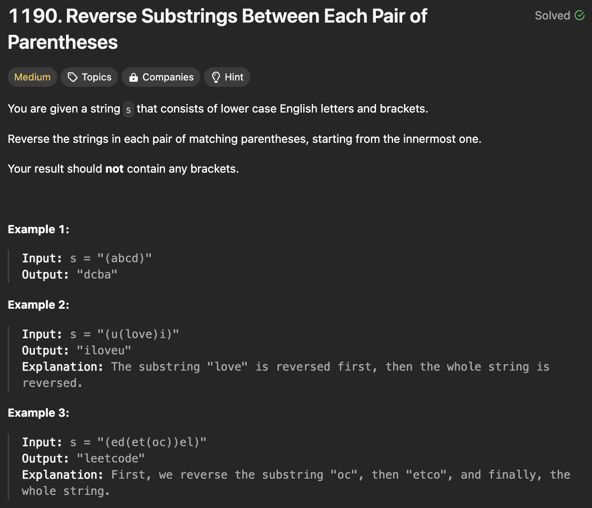
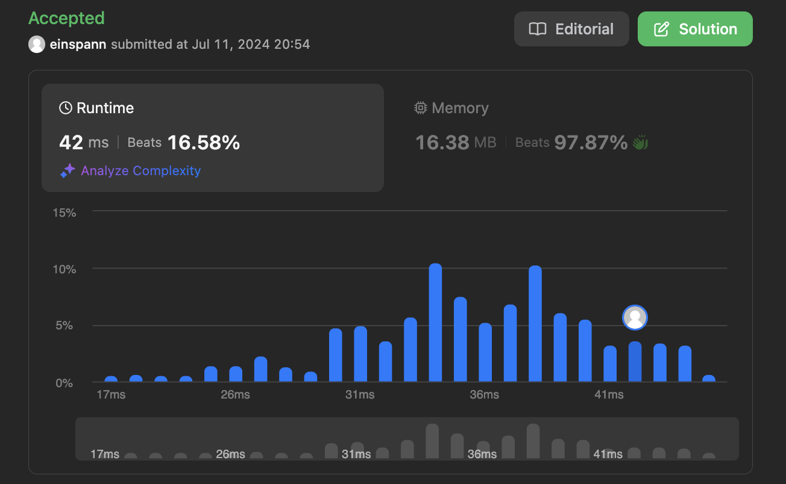

# 문제 설명
괄호 안의 문장들을 순서대로 뒤집는 문제이다.



## 1차 시도
1차 시도로는 뭔가 하나씩 단어의 깊이를 찾아서 배열에 저장을 하려 했으나, 바로 처리하는게 더 효율적이다.

```python
class Solution:
    def reverseParentheses(self, s: str) -> str:
        depth = 0
        # list of words with their () depth
        words = []
        for c in s:
            if c == '(':
                depth += 1
                # continue to read string
            elif c == ')':
                depth -= 1
                # break reading string and push it into a new list
                # appending the string itself and the depth
        

        for word, d in words:
            # only reverse the word if the depth (d%2)==0    
```

## 풀이 및 해설


## 풀이
```python
class Solution:
	def reverseParentheses(self, s: str) -> str:
		stack = ['']
		for char in s:
			if char == '(':
				stack.append('')
			elif char == ')':
				word = stack.pop()[::-1]
				stack[-1] += word
			else:
				stack[-1] += char

		return stack[0]
```
- stack을 이용해서 괄호 안의 문자열을 뒤집는다.
- 괄호가 열리면 새로운 문자열을 추가하고, 닫히면 뒤집어서 추가한다.
- 괄호 기호가 아니라면 현재 문자열에 추가한다.
- 마지막에 stack의 첫번째 문자열을 반환한다.

## Complexity Analysis


### 시간 복잡도
- 문자열의 길이만큼 loop를 돌기 때문에 O(n)이다.

### 공간 복잡도
- stack을 사용하므로 O(n)이다.

## Constraint Analysis
```
Constraints:
1 <= s.length <= 2000
s only contains lower case English characters and parentheses.
It is guaranteed that all parentheses are balanced.
```

# References
- [Leet](https://leetcode.com/problems/reverse-substrings-between-each-pair-of-parentheses/)