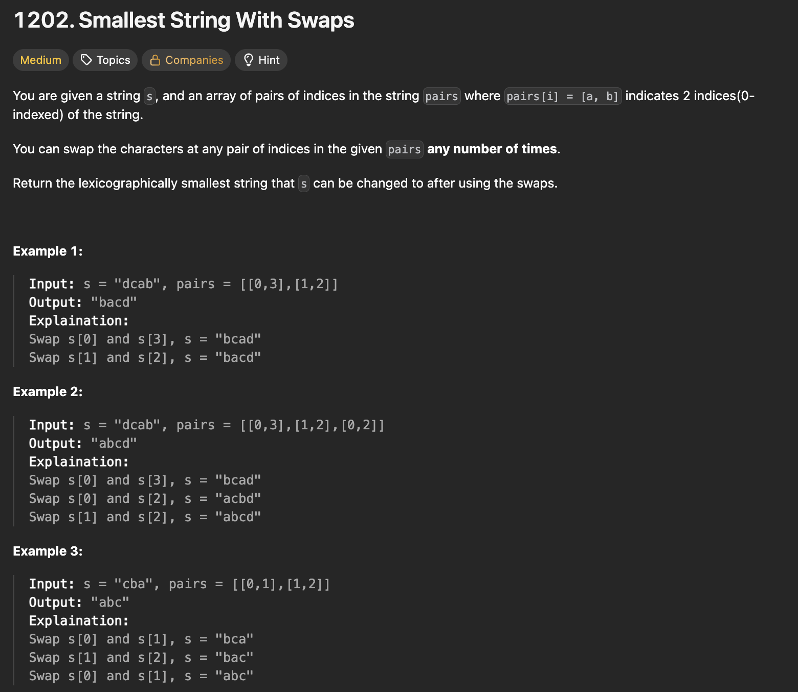
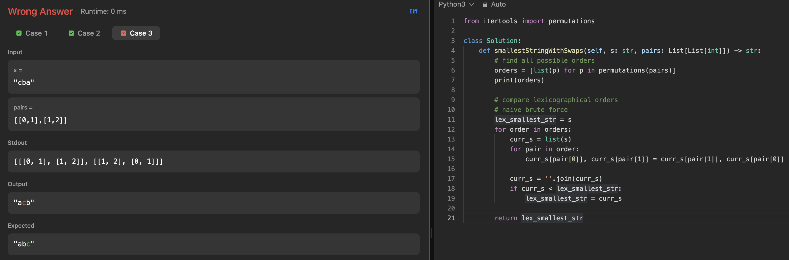
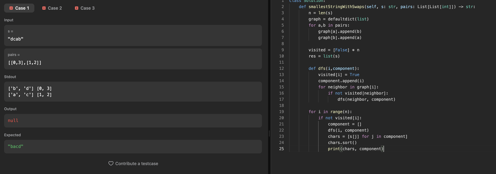
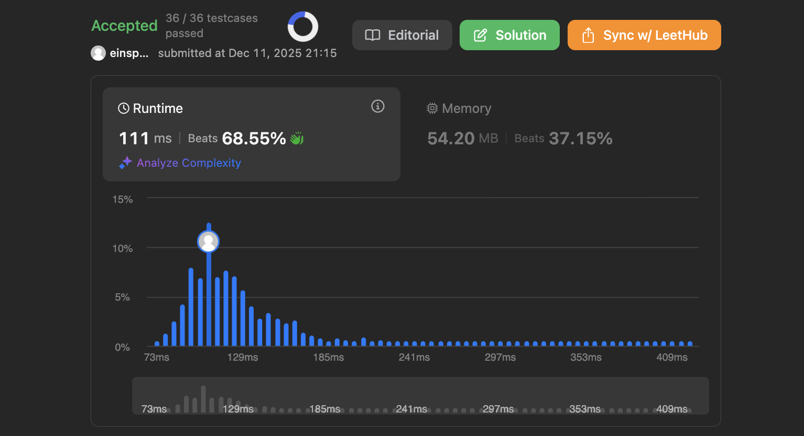

# 문제 설명
이 문제는 주어진 문자열과 인덱스 쌍들을 이용하여, 인덱스 쌍에 해당하는 문자들을 서로 교환할 수 있을 때, 사전순으로 가장 작은 문자열을 만드는 문제입니다.



## 풀이 및 해설
처음 이 문제를 접근할 때는 다음과 같이 풀어보려고 했습니다.  
1. 모든 순서 조합을 찾아보고
2. 하나씩 문자열을 교환해본 후 가장 작은 문자열을 찾는 방식입니다.

그러나 이런 방식에는 크게 두개 문제가 있었습니다. 일단, 첫번째 단계에서 하나의 순서 조합을 한번 이상 사용할 수 있는 문제가 있었으며, 두번째로는 두번째 단계가 너무 오래 걸릴 것으로 예상되는 점이었습니다.

## 시도 1
```python
from itertools import permutations

class Solution:
    def smallestStringWithSwaps(self, s: str, pairs: List[List[int]]) -> str:
        # find all possible orders
        orders = [list(p) for p in permutations(pairs)]
        print(orders)

        # compare lexicographical orders
        # naive brute force
        lex_smallest_str = s
        for order in orders:
            curr_s = list(s)
            for pair in order:
                curr_s[pair[0]], curr_s[pair[1]] = curr_s[pair[1]], curr_s[pair[0]]
            
            curr_s = ''.join(curr_s)
            if curr_s < lex_smallest_str:
                lex_smallest_str = curr_s
        
        return lex_smallest_str
```


역시 예상대로 하나 이상의 순서 조합을 사용할 경우 정확한 답을 구할 수 없습니다.  

## 시도 2
그래프로 표현하면 풀리는 문제다. 신기하게 DFS로 서로 이어져 있는 노드들을 찾고, 이렇게 했을 경우 서로 순회하는 노드들 간의 가장 작은 문자열을 각각 찾아서 해당 위치에 넣어주면 됩니다.



```python
class Solution:
    def smallestStringWithSwaps(self, s: str, pairs: List[List[int]]) -> str:
        n = len(s)
        graph = defaultdict(list)
        for a,b in pairs:
            graph[a].append(b)
            graph[b].append(a)
        
        visited = [False] * n
        res = list(s)

        def dfs(i,component):
            visited[i] = True
            component.append(i)
            for neighbor in graph[i]:
                if not visited[neighbor]:
                    dfs(neighbor, component)

        for i in range(n):
            if not visited[i]:
                component = []
                dfs(i, component)
                chars = [s[j] for j in component]
                chars.sort()
                component.sort()
                
                for idx,char in zip(component, chars):
                    res[idx] = char
        
        return ''.join(res)
```


## Complexity Analysis


### 시간 복잡도
- O(N + M log M) : N은 문자열의 길이, M은 각 폴더의 최대 길이

### 공간 복잡도
- O(N + M) : N은 문자열의 길이,

## Constraint Analysis
```
Constraints:
1 <= s.length <= 10^5
0 <= pairs.length <= 10^5
0 <= pairs[i][0], pairs[i][1] < s.length
s only contains lower case English letters.
```

# References
- [1202. Smallest String With Swaps - LeetCode](https://leetcode.com/problems/smallest-string-with-swaps/)