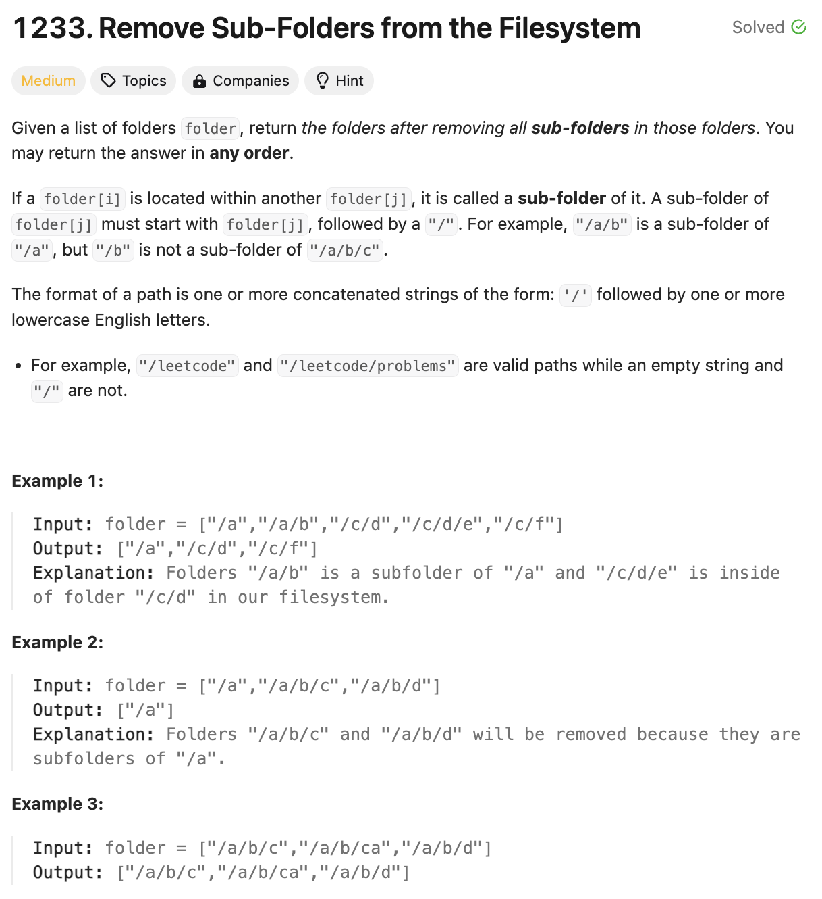
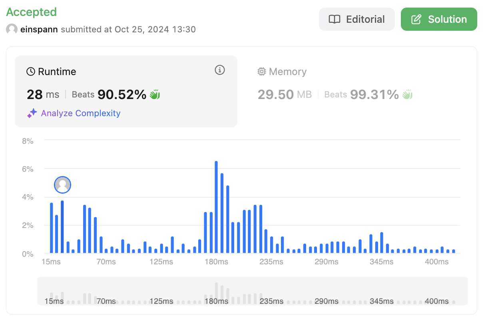

# 문제 설명
이 문제는 여러 폴더 경로가 주어지고, 이 중 서브 폴더가 아닌 폴더만을 반환하는 문제이다.



## 풀이 및 해설
해당 문제를 풀기 위해서는 일단 모든 경로를 정렬을 한번 진행한다.
이렇게 하게 되면 폴더들은 다음과 같이 정렬이 된다:

`["/a","/a/b","/c/d","/c/d/e","/c/f"]`

이때, 통과한 폴더들을 저장하는 배열을 하나 만들어놓고, 이 중 마지막 배열의 하위 폴더가 아닌 폴더만을 저장하면 된다.

즉, '/a/b'는 '/a'의 하위 폴더이므로 저장하지 않고, '/c/d/e'는 '/c/d'의 하위 폴더이므로 저장하지 않는다.

## 풀이
```python
class Solution:
    def removeSubfolders(self, folder: List[str]) -> List[str]:
        folder.sort()

        result = [folder[0]]

        for path in folder[1:]:
            if not path.startswith(result[-1] + '/'):
                result.append(path)
        
        return result
```
- `folder.sort()`를 통해 폴더들을 정렬한다.
- `result` 배열에 첫번째 폴더를 넣어놓는다.
- `for`문을 통해 폴더들을 순회하면서, `result` 배열의 마지막 폴더가 현재 폴더의 상위 폴더가 아닌 경우에만 `result` 배열에 추가한다.
- `result` 배열을 반환한다.

## Complexity Analysis


### 시간 복잡도
- O(Nlogn + NM) : N은 폴더의 개수, M은 폴더의 최대 길이
  - O(Nlogn) : 폴더들을 정렬하는데 소요되는 시간
  - O(NM) : 폴더들을 순회하면서, 상위 폴더인지 확인하는데 소요되는 시간

### 공간 복잡도
- O(N) : 폴더들을 저장하는데 소요되는 공간
- O(M) : 폴더의 최대 길이

각 폴더는 평균적으로 길이 M이다.

## Constraint Analysis
```
Constraints:
1 <= folder.length <= 4 * 10^4
2 <= folder[i].length <= 100
folder[i] contains only lowercase letters and '/'.
folder[i] always starts with the character '/'.
Each folder name is unique.
```

# References
- [1233. Remove Sub-Folders from the Filesystem](https://leetcode.com/problems/remove-sub-folders-from-the-filesystem/)