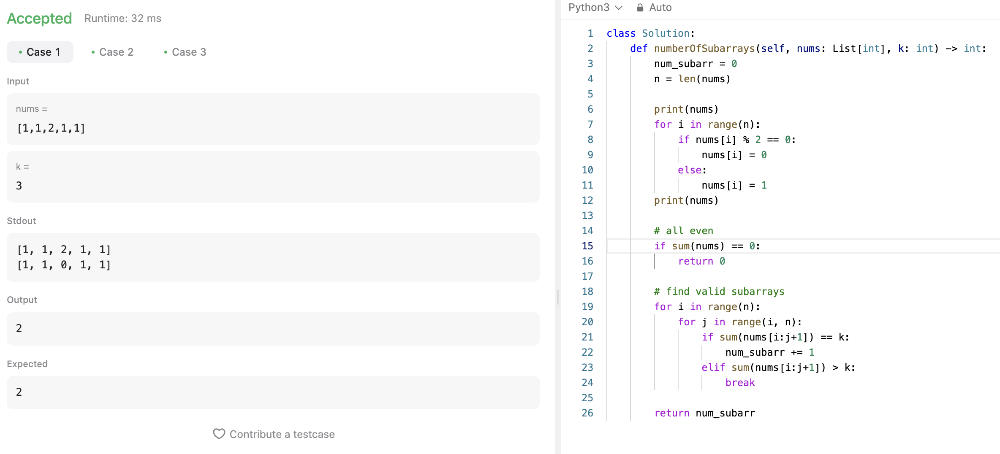

# 문제 설명
주어진 배열에서 홀수의 개수가 k개인 연속된 부분 배열의 개수를 구하는 문제다.


## 시도 1
이 문제를 풀기 위해서는 subarray를 구하고, 해당 subarray에 홀수의 개수가 k개라면 count를 증가시켜 봤다. 그러나, 시간초과가 발생했다. 아무래도 O(n^3)의 시간복잡도가 문제인 것 같다.




## 풀이
for loop 두개에다 sum까지 쓰면 O(n^3)이 되어 시간초과가 발생한다. 따라서, for loop를 한번만 사용하여 문제를 해결해야 한다.

이를 해결하기 위해, defaultdict를 사용하여 홀수의 개수를 저장하고, 해당 개수가 k개가 되는 경우를 찾아야 한다. 이렇게 하면, O(n)의 시간복잡도로 문제를 해결할 수 있다.

```python
class Solution:
    def numberOfSubarrays(self, nums: List[int], k: int) -> int:
        count = defaultdict(int)
        count[0] = 1
        curr_sum = 0
        result = 0

        for num in nums:
            curr_sum += num % 2 # increment sum by 1 for odd nums
            
            # if we've seen the value for (curr_sum-k), add its count to result
            result += count[curr_sum-k]

            # increment the count for the current count
            count[curr_sum] += 1
        
        return result
```

- defaultdict를 사용하여 홀수의 개수 count를 저장한다.
- count[0] = 1로 초기화한다. 처음부터 끝까지 홀수의 개수가 k개인 경우를 고려하기 위함이다.
- curr_sum을 0으로 초기화한다.
- result를 0으로 초기화한다.
- nums를 순회하면서, curr_sum에 num % 2를 더한다. 이는 홀수인 경우 1을 더하는 것이다.
- result에 count[curr_sum-k]를 더한다. 이는 현재 홀수의 개수에서 k를 뺀 값이 이미 나왔다면, 그 값을 더해주는 것이다.
- count[curr_sum]을 1 증가시킨다.
- result를 반환한다.

## Complexity Analysis


### 시간 복잡도
O(n) ; nums를 한번 순회하면서 count를 증가시키기 때문에 O(n)이다.

### 공간 복잡도
O(n) ; defaultdict를 사용하여 count를 저장하기 때문에 O(n)이다.

## Constraint Analysis
```
Constraints:
1 <= nums.length <= 50000
1 <= nums[i] <= 10^5
1 <= k <= nums.length
```

# References
- [1248. Count Number of Nice Subarrays](https://leetcode.com/problems/count-number-of-nice-subarrays/)