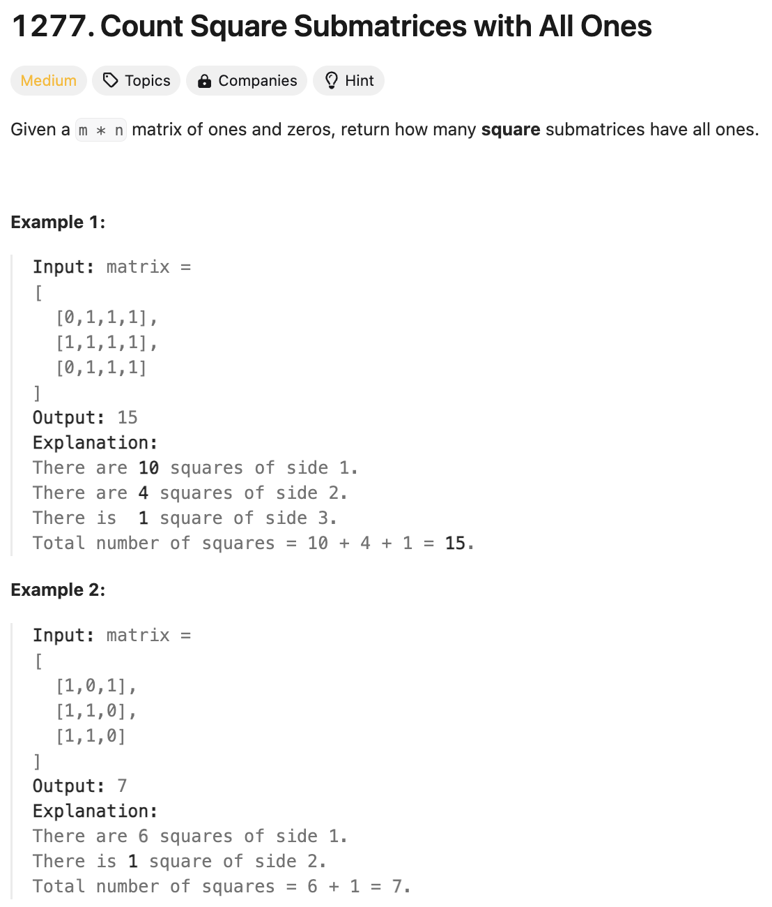

# 문제 설명
0과 1로 이루어진 행렬이 주어진다. 이 행렬에서 1로 이루어진 정사각형의 개수를 구하라.



## 풀이 및 해설

## 풀이
```python
def countSquares(self, matrix: List[List[int]]) -> int:
    if not matrix or not matrix[0]:
        return 0
    
    m,n = len(matrix), len(matrix[0])
    dp = [[0] * (n+1) for _ in range(m+1)]
    count = 0

    for i in range(1,m+1):
        for j in range(1, n+1):
            if matrix[i-1][j-1]==1:
                dp[i][j] = min(dp[i-1][j], dp[i][j-1], dp[i-1][j-1]) + 1

                count += dp[i][j]
    
    return count
```
- matrix가 존재하는지 확인한다
- matrix의 크기를 m,n에 저장한다
- dp를 m+1,n+1로 생성한다
- count를 0으로 초기화한다
- 1부터 m+1까지 반복한다
    - 1부터 n+1까지 반복한다
        - matrix[i-1][j-1]이 1이면
            - dp[i][j]는 dp[i-1][j], dp[i][j-1], dp[i-1][j-1] 중 가장 작은 값에 1을 더한 값이다
            - count에 dp[i][j]를 더한다
- dp[i][j]를 반환한다

## Complexity Analysis


### 시간 복잡도
- O(m*n) ; m은 행의 길이, n은 열의 길이

### 공간 복잡도
- O(m*n) ; m은 행의 길이, n은 열의 길이

## Constraint Analysis
```
Constraints:
1 <= arr.length <= 300
1 <= arr[0].length <= 300
0 <= arr[i][j] <= 1
```

# References
- [1277. Count Square Submatrices with All Ones](https://leetcode.com/problems/count-square-submatrices-with-all-ones/)