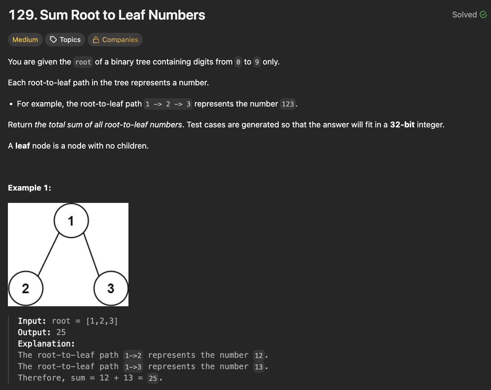
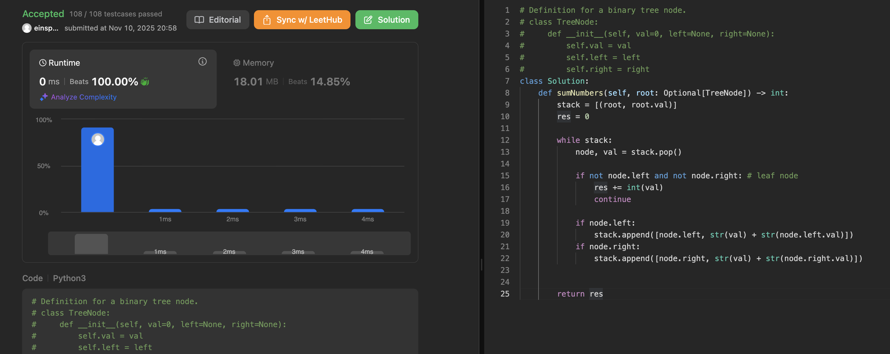

# 문제 설명
이 문제는 이진 트리가 주어지면 루트부터 모든 리프 노드까지의 경로가 나타내는 숫자의 합을 구하는 문제다. 1월 이후로 인턴에 집중하다 보니 알고리즘을 회고를 못했는데, 이번 기회에 다시 조금씩 회고를 해보려고 한다. 어쩌다보니 2025년의 두번째 문제풀이 회고글이 11월이나 되어서야 하게 되었다.



## 풀이 및 해설
- stack을 이용하여 DFS를 Inorder Traversal (root-left-right) 방식으로 구하면 된다.

## 풀이
```python
def sumNumbers(self, root: Optional[TreeNode]) -> int:
        stack = [(root, root.val)]
        res = 0

        while stack:
            node, val = stack.pop()

            if not node.left and not node.right: # leaf node
                res += int(val)
                continue

            if node.left:
                stack.append([node.left, str(val) + str(node.left.val)])
            if node.right:
                stack.append([node.right, str(val) + str(node.right.val)])
            
        
        return res
```

## Complexity Analysis


### 시간 복잡도
- O(N)

### 공간 복잡도
- O(N)

## 개선사항
- string concatenation 대신에 수학적 연산을 이용하여 값을 구하는 방법도 있다.
- 예를 들어, 현재 노드의 값이 val이고, 자식 노드의 값이 child_val이라면, 새로운 값은 val * 10 + child_val로 계산할 수 있다.
- 이를 통해 string concatenation에 따른 오버헤드를 줄일 수 있다.

```python
class Solution:
    def sumNumbers(self, root: Optional[TreeNode]) -> int:
        if not root:
            return 0
        stack = [(root, root.val)]
        res = 0
        while stack:
            node, val = stack.pop()
            if not node.left and not node.right:
                res += val
            if node.right:
                stack.append((node.right, val * 10 + node.right.val))
            if node.left:
                stack.append((node.left, val * 10 + node.left.val))
        return res
```

## Constraint Analysis
```
Constraints:
The number of nodes in the tree is in the range [1, 1000].
0 <= Node.val <= 9
The depth of the tree will not exceed 10.
```

# References
- [LeetCode - 129. Sum Root to Leaf Numbers](https://leetcode.com/problems/sum-root-to-leaf-numbers/description/?envType=study-plan-v2&envId=top-interview-150)