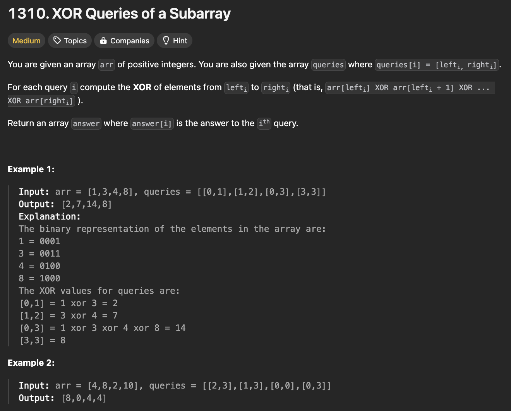
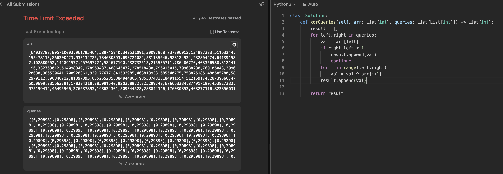
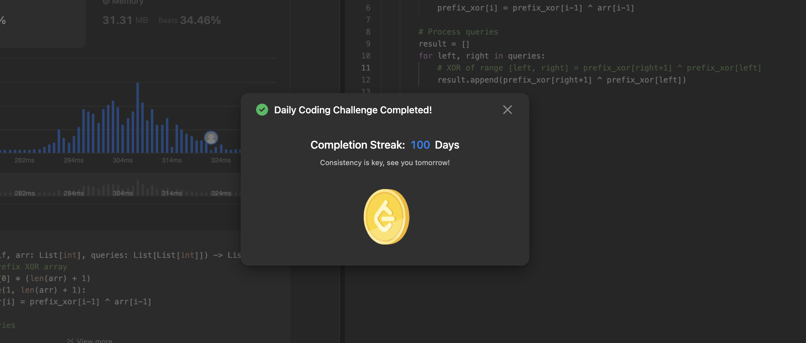
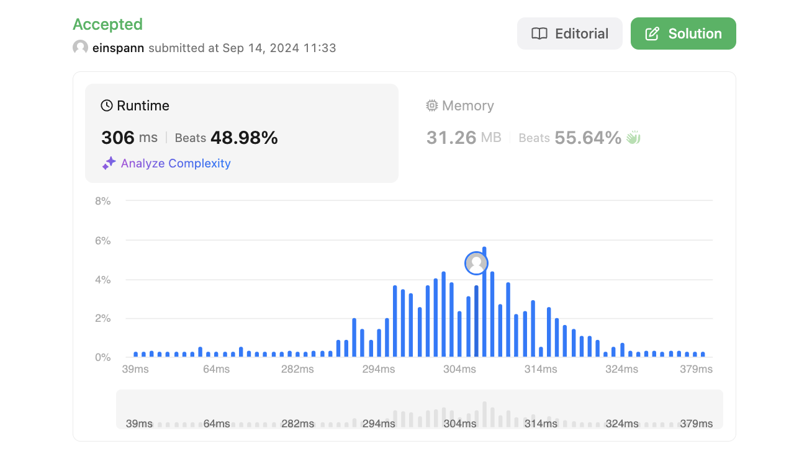

# 문제 설명
주어진 배열 arr과 배열의 부분합을 나타내는 queries가 주어진다. 각 쿼리는 배열의 부분합을 나타내는 두 인덱스로 이루어져 있다. 각 쿼리에 대해 배열의 부분합을 구하고 그 결과를 반환하는 문제이다.




## 풀이 및 해설


## 첫 시도
```python
class Solution:
    def xorQueries(self, arr: List[int], queries: List[List[int]]) -> List[int]:
        result = []
        for left,right in queries:
            val = arr[left]
            if right-left < 1:
                result.append(val)
                continue
            for i in range(left,right):
                val = val ^ arr[i+1]
            result.append(val)
        
        return result
```




## 풀이
```python
class Solution:
    def xorQueries(self, arr: List[int], queries: List[List[int]]) -> List[int]:
        # Calculate prefix XOR array
        prefix_xor = [0] * (len(arr) + 1)
        for i in range(1, len(arr) + 1):
            prefix_xor[i] = prefix_xor[i-1] ^ arr[i-1]
        
        # Process queries
        result = []
        for left, right in queries:
            # XOR of range [left, right] = prefix_xor[right+1] ^ prefix_xor[left]
            result.append(prefix_xor[right+1] ^ prefix_xor[left])
        
        return result
```

## Complexity Analysis


### 시간 복잡도
O(N + Q) where N is the length of the input array arr and Q is the number of queries.

### 공간 복잡도
O(N) where N is the length of the input array arr.

## Constraint Analysis
```
Constraints:
1 <= arr.length, queries.length <= 3 * 10^4
1 <= arr[i] <= 10^9
queries[i].length == 2
0 <= lefti <= righti < arr.length
```





# References
- [1310. XOR Queries of a Subarray](https://leetcode.com/problems/xor-queries-of-a-subarray/)