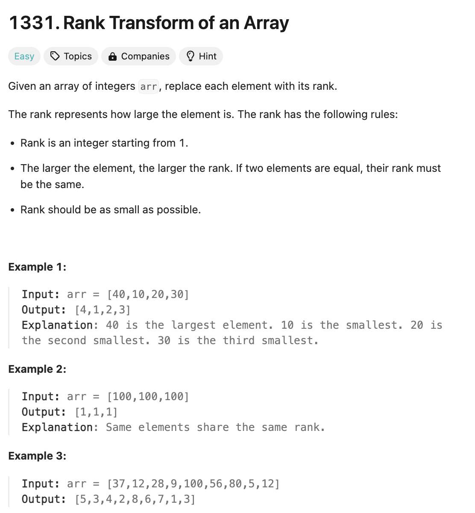
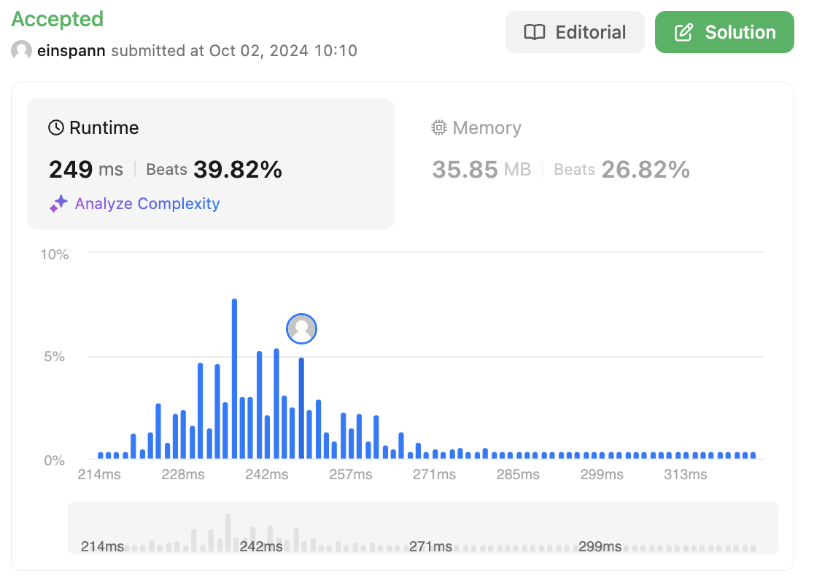

# 문제 설명
주어진 배열의 각 원소에 대해 순위를 매기는 문제이다.



## 풀이 및 해설
해당 문제는 주어진 배열의 각 원소에 대해 순위를 매기는 문제이다. 이를 위해 다음과 같은 방법을 사용할 수 있다.

1. 주어진 배열을 복사하여 정렬한다.
2. 해시맵을 이용하여 각 원소에 대한 순위를 매긴다.
3. 순위를 매긴 해시맵을 이용하여 각 원소에 대한 순위를 반환한다.
4. 반환된 순위를 리턴한다.

## 풀이
```python
class Solution:
    def arrayRankTransform(self, arr: List[int]) -> List[int]:
        # sorted copy set
        sorted_set = sorted(set(arr))

        # dictionary for ranks
        ranks = {}

        # assign ranks to values
        for rank,val in enumerate(sorted_set, start=1):
            ranks[val] = rank
        
        # match
        return [ranks[rank] for rank in arr]
```

## Complexity Analysis


### 시간 복잡도
- 복사된 배열을 정렬하는 데 O(NlogN)이 소요된다.
- 해시맵을 이용하여 각 원소에 대한 순위를 매기는 데 O(N)이 소요된다.
- 각 원소에 대한 순위를 반환하는 데 O(N)이 소요된다.

따라서 총 시간 복잡도는 O(NlogN)이다.

### 공간 복잡도
- 복사된 배열을 정렬하는 데 O(N)이 소요된다.
- 해시맵을 이용하여 각 원소에 대한 순위를 매기는 데 O(N)이 소요된다.
- 각 원소에 대한 순위를 반환하는 데 O(N)이 소요된다.

따라서 총 공간 복잡도는 O(N)이다.

## Constraint Analysis
```
Constraints:
1 <= arr.length <= 10^5
-10^9 <= arr[i] <= 10^9
```

# References
- [1331. Rank Transform of an Array](https://leetcode.com/problems/rank-transform-of-an-array/)