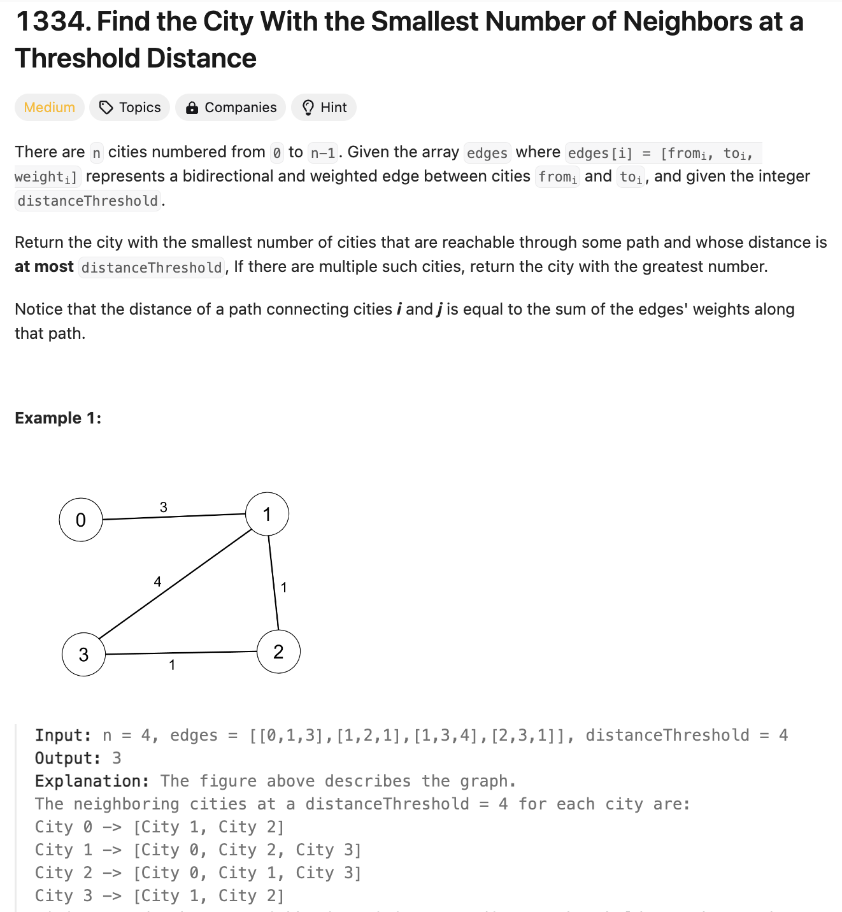
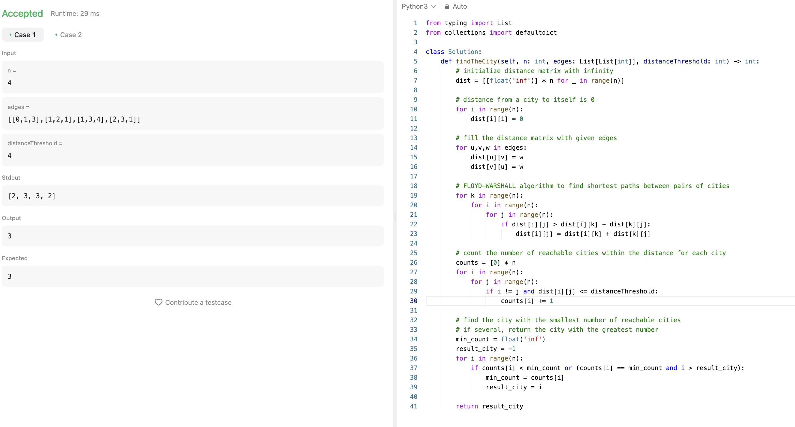
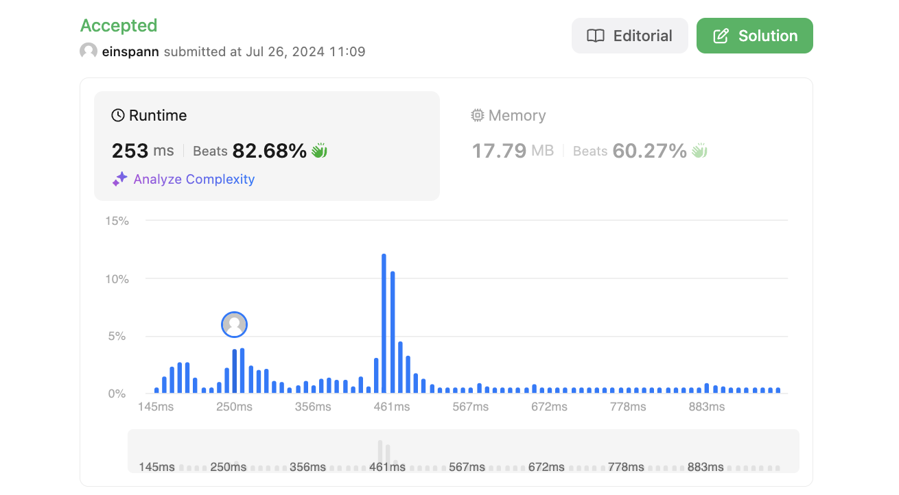

# 문제 설명
그래프에서 특정 거리 이내의 이웃이 가장 적은 도시를 찾는 문제다.




## 시도 1
처음에는 트리를 만들고 해당 트리에 인접한 노드들 중 거리가 threshold 이하인 노드들을 찾아내는 방식으로 접근했다. 그러나, 이 방식은 바로 옆에 있는 노드들만을 찾아내는 방식이기 때문에, 더 멀리 있는 노드들을 찾아내지 못한다.

```python
def findTheCity(self, n: int, edges: List[List[int]], distanceThreshold: int) -> int:
        # build the tree
        nodes = defaultdict(list)
        for edge in edges:
            nodes[edge[0]].append((edge[1], edge[2]))
            nodes[edge[1]].append((edge[0], edge[2]))
        print(nodes)
        
        # for all cities, find how many neighboring cities it has within the threshold
        counts = [0] * len(nodes)
        for node in nodes:
            for neigh in nodes[node]:
                if neigh[1] < distanceThreshold:
                    counts[node] += 1
        
        print(counts)
```

## 풀이 및 해설
해당 문제를 풀기 위해서는 Floyd-Warshall 알고리즘을 사용해야 한다. Floyd-Warshall 알고리즘은 모든 노드 사이의 최단 거리를 구하는 알고리즘이다. 이 알고리즘을 사용하면 모든 노드 사이의 거리를 구할 수 있기 때문에, 특정 거리 이내의 이웃이 가장 적은 도시를 찾을 수 있다.




## 풀이
```python
def findTheCity(self, n: int, edges: List[List[int]], distanceThreshold: int) -> int:
        # initialize distance matrix with infinity
        dist = [[float('inf')] * n for _ in range(n)]

        # distance from a city to itself is 0
        for i in range(n):
            dist[i][i] = 0

        # fill the distance matrix with given edges
        for u,v,w in edges:
            dist[u][v] = w
            dist[v][u] = w

        # FLOYD-WARSHALL algorithm to find shortest paths between pairs of cities
        for k in range(n):
            for i in range(n):
                for j in range(n):
                    if dist[i][j] > dist[i][k] + dist[k][j]:
                        dist[i][j] = dist[i][k] + dist[k][j]

        # count the number of reachable cities within the distance for each city
        counts = [0] * n
        for i in range(n):
            for j in range(n):
                if i != j and dist[i][j] <= distanceThreshold:
                    counts[i] += 1

        # find the city with the smallest number of reachable cities
        # if several, return the city with the greatest number
        min_count = float('inf')
        result_city = -1
        for i in range(n):
            if counts[i] < min_count or (counts[i] == min_count and i > result_city):
                min_count = counts[i]
                result_city = i

        return result_city
```
- 거리 행렬을 초기화한다. 거리 행렬은 모든 노드 사이의 거리를 저장하는 행렬이다.
- 거리 행렬에서 자기 자신으로 가는 거리는 0으로 초기화한다.
- 주어진 엣지들로 거리 행렬을 채운다.
- Floyd-Warshall 알고리즘을 사용해 모든 노드 사이의 최단 거리를 구한다.
- 각 도시마다 특정 거리 이내의 이웃 도시의 수를 센다.
- 가장 이웃이 적은 도시를 찾는다.
- 이웃이 적은 도시가 여러 개라면, 이웃이 가장 적은 도시 중 가장 큰 도시를 반환한다.
- 결과를 반환한다.

## Complexity Analysis


### 시간 복잡도
- 거리 행렬을 초기화하는 데 O(n^2)의 시간이 걸린다.
- 거리 행렬을 채우는 데 O(n)의 시간이 걸린다.
- Floyd-Warshall 알고리즘을 사용해 거리 행렬을 채우는 데 O(n^3)의 시간이 걸린다.
- 각 도시마다 이웃 도시의 수를 세는 데 O(n^2)의 시간이 걸린다.
- 가장 이웃이 적은 도시를 찾는 데 O(n)의 시간이 걸린다.
- 따라서 총 시간 복잡도는 O(n^3)이다.

### 공간 복잡도
- 거리 행렬을 저장하는 데 O(n^2)의 공간이 필요하다.
- counts 배열을 저장하는 데 O(n)의 공간이 필요하다.
- 따라서 총 공간 복잡도는 O(n^2)이다.

## Constraint Analysis
```
Constraints:
2 <= n <= 100
1 <= edges.length <= n * (n - 1) / 2
edges[i].length == 3
0 <= fromi < toi < n
1 <= weighti, distanceThreshold <= 10^4
All pairs (fromi, toi) are distinct.
```

# References
- [LeetCode 1334. Find the City With the Smallest Number of Neighbors at a Threshold Distance](https://leetcode.com/problems/find-the-city-with-the-smallest-number-of-neighbors-at-a-threshold-distance/)
- [Floyd-Warshall Algorithm - Wikipedia](https://en.wikipedia.org/wiki/Floyd%E2%80%93Warshall_algorithm)
- [Floyd-Warshall Algorithm - GeeksforGeeks](https://www.geeksforgeeks.org/floyd-warshall-algorithm-dp-16/)
- [Floyd-Warshall Algorithm - Youtube](https://www.youtube.com/watch?v=4OQeCuLYj-4)