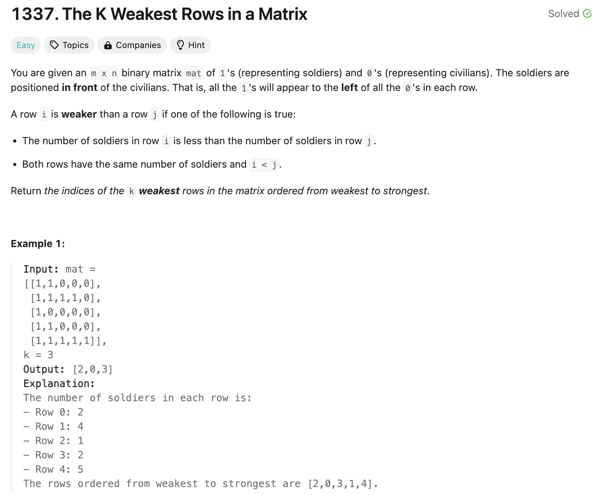
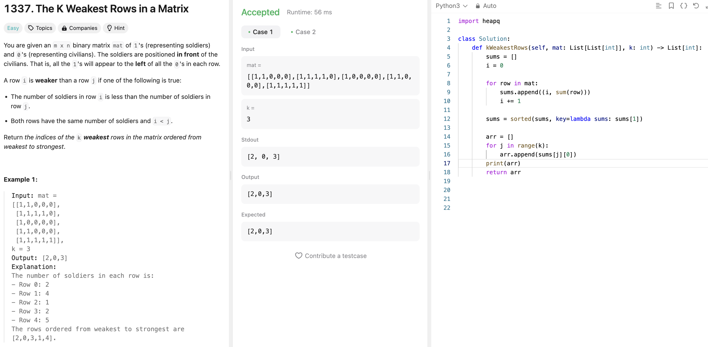
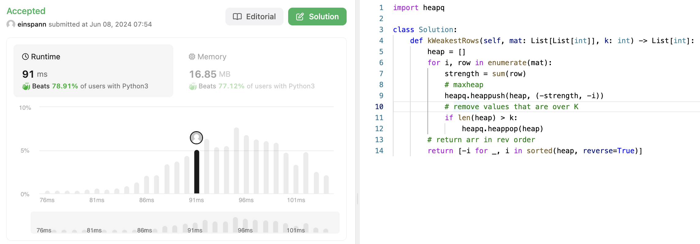
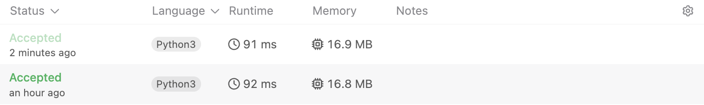

## 문제 설명
여러 행렬이 주어졌을 때, 각 행의 1의 갯수를 기준으로 가장 약한 행 K개를 찾는 문제다.



## 1차 시도 - 정렬 (해결)

각 행의 1의 갯수를 더해서 하나의 리스트로 만들었다. 그리고 이 리스트를 정렬해서 가장 작은 K개의 행을 찾았다. 이렇게 해도 풀리긴 한다. 그러나, 이 문제를 어떻게 하면 heap을 이용해서 풀 수 있을지 생각해보자.

## 2차 시도 - Heap Queue
Heap을 사용해서 K 크기의 heap queue를 만들고, 가장 작은 행들의 합을 유지시키면 된다. 이렇게 하면 행렬이 엄청 커져도 빠르게 풀 수 있다.



## 풀이 및 해설
생각보다 속도는 두개 모두 똑같다.




## 풀이
```python
import heapq

class Solution:
    def kWeakestRows(self, mat: List[List[int]], k: int) -> List[int]:
        heap = []
        for i, row in enumerate(mat):
            strength = sum(row)
            # maxheap
            heapq.heappush(heap, (-strength, -i))
            # remove values that are over K
            if len(heap) > k:
                heapq.heappop(heap)
        # return arr in rev order
        return [-i for _, i in sorted(heap, reverse=True)]
```

## Complexity Analysis


### Time Complexity
[정렬 시간복잡도]
- for loop: O(M) ; M is the number of rows
    - sum: O(N) ; N is the number of elements in a row
    - append: O(1) ; append to array
- sort: O(MlogM) ; M elements
- output array
    - for loop: O(K) ; K is the number of weakest rows  

전체: O(MN + MlogM + K) = O(MN + MlogM)

[힙 시간복잡도]
- heap:
    - for loop: O(M) ; M is the number of rows
    - sum: O(N) ; N is the number of elements in a row
    - heappush: O(logK) ; K is the size of heap
    - heappop: O(logK) ; K is the size of heap
- extracting weakest rows
    - sorting heap: O(KlogK) ; K is the number of weakest rows
    - create output array: O(K) ; K is the number of weakest rows
    
전체: O(m×n+mlogk+klogk)=O(MN + MlogM)

### Space Complexity
[정렬 공간복잡도]  
- O(m)+O(m)+O(k)=O(m+k)

[힙 공간복잡도]
- O(k)

따라서, 시간복잡도는 똑같은데, 공간복잡도는 heap이 더 효율적이다.

## Constraint Analysis
```
Constraints:

m == mat.length
n == mat[i].length
2 <= n, m <= 100
1 <= k <= m
matrix[i][j] is either 0 or 1.
```

- 시간복잡도는 O(100*100 + 100log100) = O(10000 + 200) = O(10200)이다.
- 공간복잡도는 O(100).

# References
- [LeetCode](https://leetcode.com/problems/the-k-weakest-rows-in-a-matrix/)
- [Python Docs - Sorting](https://docs.python.org/3/howto/sorting.html)
- [Python Docs - Heap Queue](https://docs.python.org/3/library/heapq.html)
