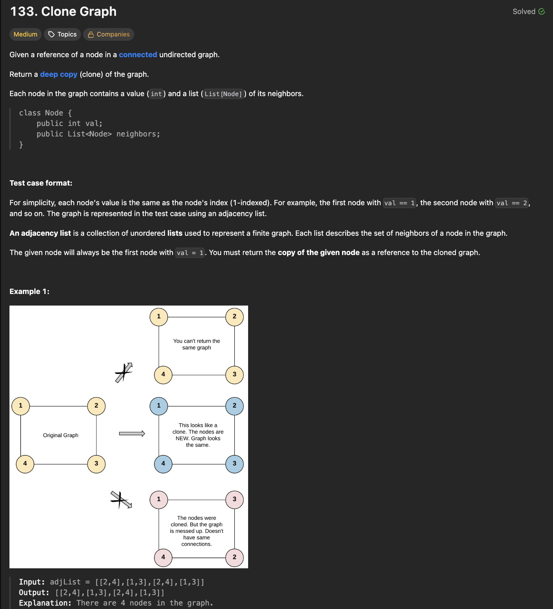
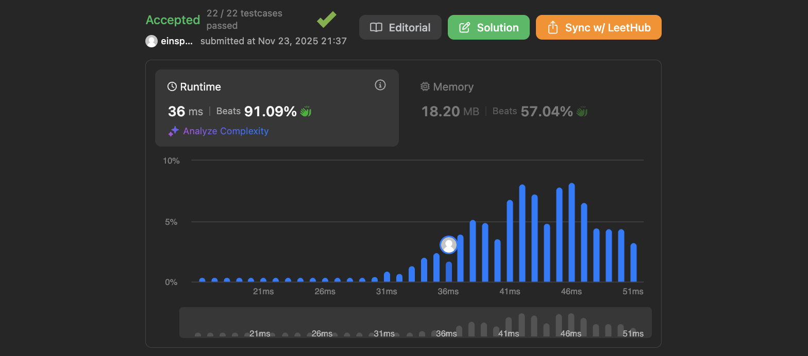

# 문제 설명
이 문제는 무방향 그래프가 주어지면 해당 그래프의 깊은 복사본을 만드는 문제다. 같은 그래프를 반환하면 안되고, 각 노드와 간선이 동일한 새로운 그래프를 만들어야 한다. 



## 풀이 및 해설
DFS를 이용하여 그래프를 순회하면서 각 노드를 복사하고, 복사된 노드들을 연결해주면 된다.  

- 딕셔너리를 사용하여 원본 노드와 복사된 노드 간의 매핑을 저장한다.
- DFS를 재귀적으로 호출하여 각 노드를 방문하고, 복사된 노드를 생성한다.
- 이미 방문한 노드는 매핑에서 찾아서 반환한다.
- 각 노드의 이웃 노드들을 재귀적으로 복사하여 연결한다.
- 최종적으로 복사된 그래프의 시작 노드를 반환한다.

## 풀이
```python
"""
# Definition for a Node.
class Node:
    def __init__(self, val = 0, neighbors = None):
        self.val = val
        self.neighbors = neighbors if neighbors is not None else []
"""

from typing import Optional
class Solution:
    def cloneGraph(self, node: Optional['Node']) -> Optional['Node']:
        if not node:
            return None
        
        old_to_new = {}

        def dfs(node):
            if node in old_to_new:
                return old_to_new[node]
            
            copy = Node(node.val)
            old_to_new[node] = copy
            for neighbor in node.neighbors:
                copy.neighbors.append(dfs(neighbor))
            return copy
        
        return dfs(node)
```

## Complexity Analysis


### 시간 복잡도
- O(N + M) , N은 노드의 수, M은 간선의 수

### 공간 복잡도
- O(N)

## Constraint Analysis
```
Constraints:
The number of nodes in the graph is in the range [0, 100].
1 <= Node.val <= 100
Node.val is unique for each node.
There are no repeated edges and no self-loops in the graph.
The Graph is connected and all nodes can be visited starting from the given node.
```

# References
- [LeetCode - 133. Clone Graph](https://leetcode.com/problems/clone-graph/)