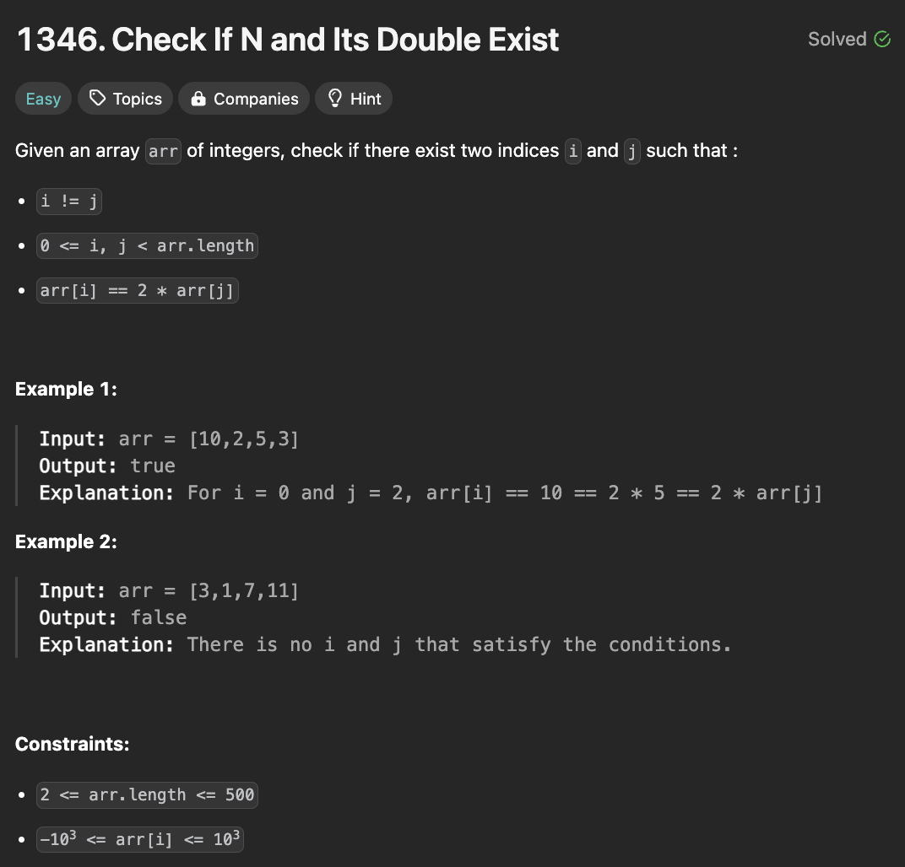

# 문제 설명
arr 배열이 주어진다. 이때 다음 조건을 만족하는지 확인하는 문제이다.
- i != j
- 0 <= i, j < arr.length
- arr[i] == 2 * arr[j]



## 풀이 및 해설


## 풀이
```python
class Solution:
    def checkIfExist(self, arr: List[int]) -> bool:
        n = len(arr)
        
        for i in range(n):
            for j in range(n):
                if 0 <= i and j < n and i != j and arr[i] == 2*arr[j]:
                    return True
        
        return False
```

## Complexity Analysis


### 시간 복잡도
- O(N^2) ; 이중 for문을 사용하여 모든 경우를 확인한다.

### 공간 복잡도
- O(1) ; 추가적인 공간을 사용하지 않는다.


## 개선
생각해보니 set을 쓰면 O(N)으로 줄일 수 있을 것 같다.

```python
class Solution:
    def checkIfExist(self, arr: List[int]) -> bool:
        n = len(arr)
        seen = set()
        
        for num in arr:
            if 2*num in seen or (num%2==0 and num//2 in seen):
                return True
            seen.add(num)
        
        return False
```


## Constraint Analysis
```
Constraints:
2 <= arr.length <= 500
-10^3 <= arr[i] <= 10^3
```

# References
- [1346. Check If N and Its Double Exist](https://leetcode.com/problems/check-if-n-and-its-double-exist/)