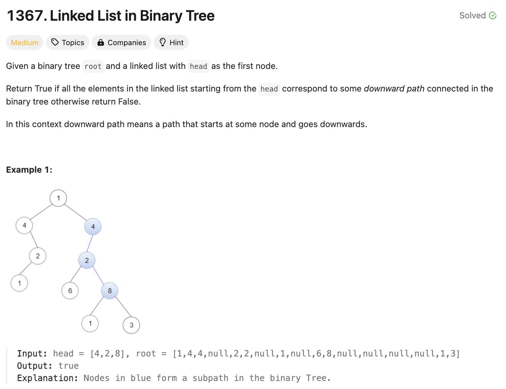
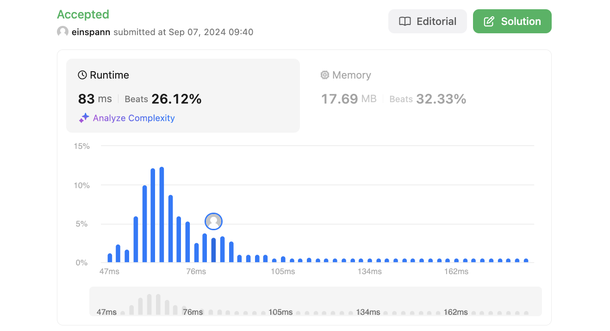

# 문제 설명
이진트리가 주어졌을 때, 주어진 링크드 리스트가 이진트리의 서브트리인지 확인하는 문제다.



## 풀이 및 해설

## 풀이
```python
# Definition for singly-linked list.
# class ListNode:
#     def __init__(self, val=0, next=None):
#         self.val = val
#         self.next = next
# Definition for a binary tree node.
# class TreeNode:
#     def __init__(self, val=0, left=None, right=None):
#         self.val = val
#         self.left = left
#         self.right = right
class Solution:
    def isSubPath(self, head: Optional[ListNode], root: Optional[TreeNode]) -> bool:
        def dfs(node, curr):
            if not curr:
                return True
            if not node:
                return False
            return node.val == curr.val and (dfs(node.left, curr.next) or dfs(node.right, curr.next))

        if not head:
            return True
        if not root:
            return False
        return dfs(root, head) or self.isSubPath(head, root.left) or self.isSubPath(head, root.right)
```
- def dfs:
    - 현재 노드와 현재 링크드 리스트의 값을 비교하고, 왼쪽 노드와 오른쪽 노드를 재귀적으로 호출한다.
    - 만약 현재 노드가 None이라면 True를 반환한다.
    - 만약 현재 링크드 리스트가 None이라면 True를 반환한다.
- def isSubPath:
    - 만약 링크드 리스트가 None이라면 True를 반환한다.
    - 만약 이진트리가 None이라면 False를 반환한다.
    - dfs를 호출하고, 만약 True가 반환되면 True를 반환한다.

## Complexity Analysis


### 시간 복잡도
O(NM)이다. N은 이진트리의 노드의 개수, M은 링크드 리스트의 노드의 개수이다.

### 공간 복잡도
O(N)이다. 재귀 호출에 따른 스택의 크기이다.

## Constraint Analysis
```
Constraints:
The number of nodes in the tree will be in the range [1, 2500].
The number of nodes in the list will be in the range [1, 100].
1 <= Node.val <= 100 for each node in the linked list and binary tree.
```

# References
- [1367. Linked List in Binary Tree](https://leetcode.com/problems/linked-list-in-binary-tree/)