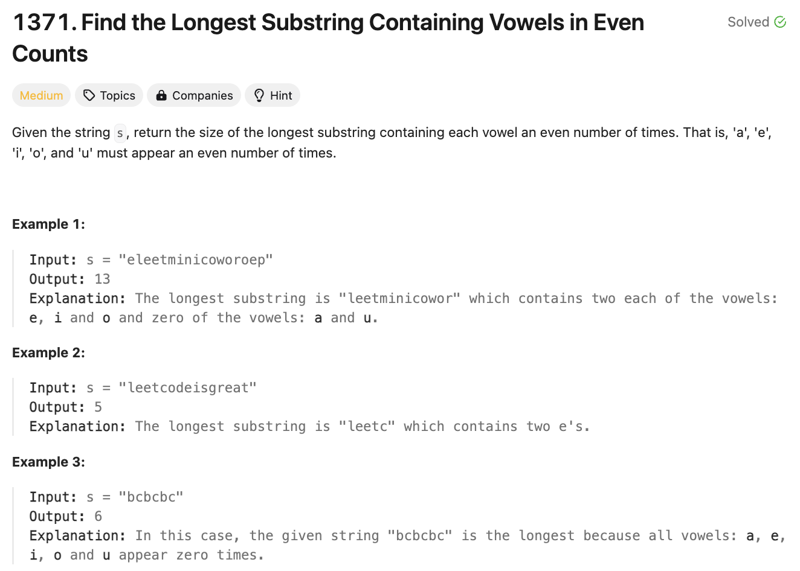
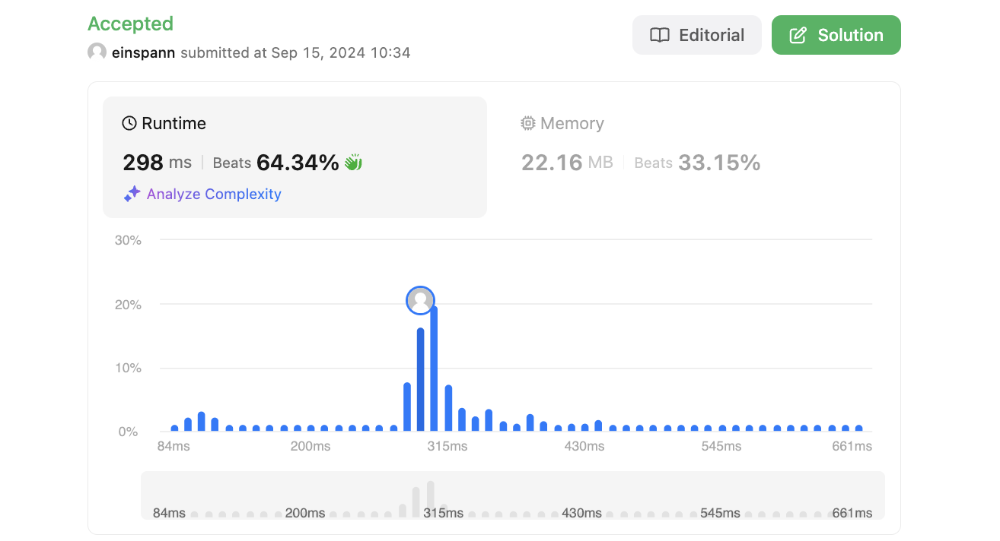

# 문제 설명
모음 aeiou가 포함된 문자열 s가 주어질 때, 모음이 짝수개인 가장 긴 부분 문자열의 길이를 반환하라.



## 풀이 및 해설
이 문제를 봤을 때, sliding window로 풀면 될것 같았지만, condition을 어떻게 걸어줘야 할지 몰랐다.

예를 들어, 다음과 같은 경우다.

```python
class Solution:
    def findTheLongestSubstring(self, s: str) -> int:
        vowels = 'aeiou'
        vowel_count [0] * 5
        left = 0
        window = {}

        # 슬라이딩 윈도우로 하나씩 이동한다.
        for right in range(len(s)):
            window[s[right]] = window.get(s[right],0) + 1

            # 이때, 여기서 모음이 짝수개인지 확인해야 한다. 
            # 그러나 다음 문자가 당장 짝수가 아니더라도, 나중에 짝수가 될 수 있지 않나? 
            #그러면 일단은 추가는 해야 하는데 이걸 어떻게 처리하지?
```

찾아보니까 이걸 해결하기 위해 Bitmasking을 사용할 수 있다.  
Bitmask는 0과 1로 이루어진 이진수로, 각 비트가 특정한 의미를 가지고 있는 것이다. 여기서는 모음이 짝수개인지 홀수개인지를 나타내는 것으로 사용할 수 있다.   
즉, 5개의 모음을 각각 0,1,2,3,4로 표현하고, 각각의 모음이 짝수개인지 홀수개인지를 나타내는 것이다.   
- a: 00001
- e: 00010
- i: 00100
- o: 01000
- u: 10000

이어서 seen이라는 dictionary를 사용해서, 각각의 bitmask를 저장하고, 만약 같은 bitmask가 나오면, 그 사이의 길이를 계산해서 가장 긴 것을 반환하면 된다.  
이미 한번 본 bitmask가 나온다는 것은 그 사이의 모음의 개수가 짝수개라는 것이다. 즉, 지금 위치 i와 첫 발견 위치 seen[state]만 빼면 된다.  
최초로 나온 bitmask는 0이다. 그러므로, seen[0] = -1로 초기화한다.  

```python
if state in seen:
    max_length = max(max_length, i - seen[state])
else:
    seen[state] = i
```

## 풀이
```python
def findTheLongestSubstring(self, s: str) -> int:
    vowels = 'aeiou'
    state = 0
    seen = {0: -1}
    max_length = 0

    for i, c in enumerate(s):
        if c in vowels:
            state ^= 1 << vowels.index(c)
        
        if state in seen:
            max_length = max(max_length, i - seen[state])
        else:
            seen[state] = i
    
    return max_length
```

## Complexity Analysis


### 시간 복잡도
- O(N) : 문자열 s의 길이만큼 반복한다.

### 공간 복잡도
- O(N) : seen dictionary에 문자열 s의 길이만큼 저장한다.

## Constraint Analysis
```
Constraints:
1 <= s.length <= 5 x 10^5
s contains only lowercase English letters.
```

# References
- [1371. Find the Longest Substring Containing Vowels in Even Counts](https://leetcode.com/problems/find-the-longest-substring-containing-vowels-in-even-counts/)
- [[GeeksforGeeks] Logical XOR](https://www.geeksforgeeks.org/get-the-logical-xor-of-two-variables-in-python/)