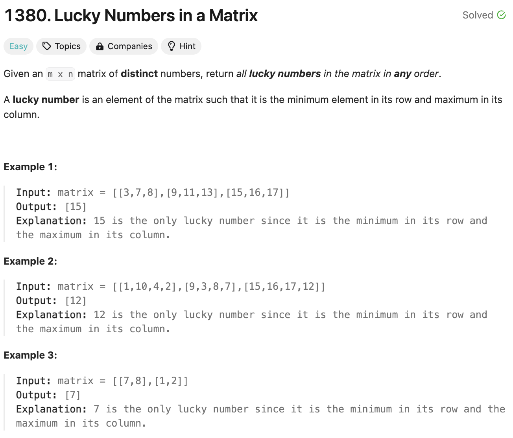

# 문제 설명

2차원 배열에서 행에서 가장 작은 값이고 열에서 가장 큰 값을 찾는 문제이다.



## 풀이 및 해설

## 풀이
```python
def luckyNumbers (self, matrix: List[List[int]]) -> List[int]:
    lucky = []
    for i in range(len(matrix)):
        row_min = min(matrix[i])
        col_index = matrix[i].index(row_min)
        is_lucky = True
        for row in matrix:
            if row[col_index] > row_min:
                is_lucky = False
                break
        
        if is_lucky:
            lucky.append(row_min)
    
    return lucky
```
- 2차원 배열을 순회하면서 각 행에서 가장 작은 값을 찾는다.
- 해당 값의 인덱스를 찾아서 열에서 가장 큰 값인지 확인한다.
- 만약 가장 큰 값이 아니라면 해당 값은 Lucky Number가 아니다.
- 모든 행을 순회하면서 Lucky Number인 경우 lucky 배열에 추가한다.
- lucky 배열을 반환한다.

## Complexity Analysis


### 시간 복잡도
- 행의 길이를 n, 열의 길이를 m이라고 할 때, O(nm)의 시간 복잡도를 가진다.

### 공간 복잡도
- O(1)의 공간 복잡도를 가진다.

## Constraint Analysis
```
Constraints:
m == mat.length
n == mat[i].length
1 <= n, m <= 50
1 <= matrix[i][j] <= 10^5.
All elements in the matrix are distinct.
```

# References
- [1380. Lucky Numbers in a Matrix](https://leetcode.com/problems/lucky-numbers-in-a-matrix/)