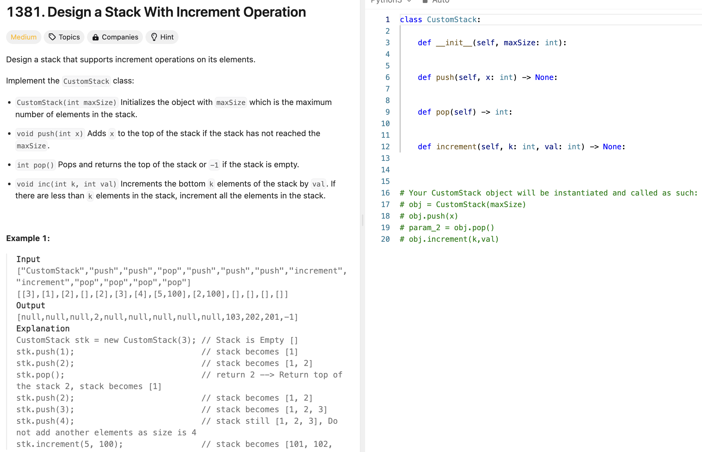
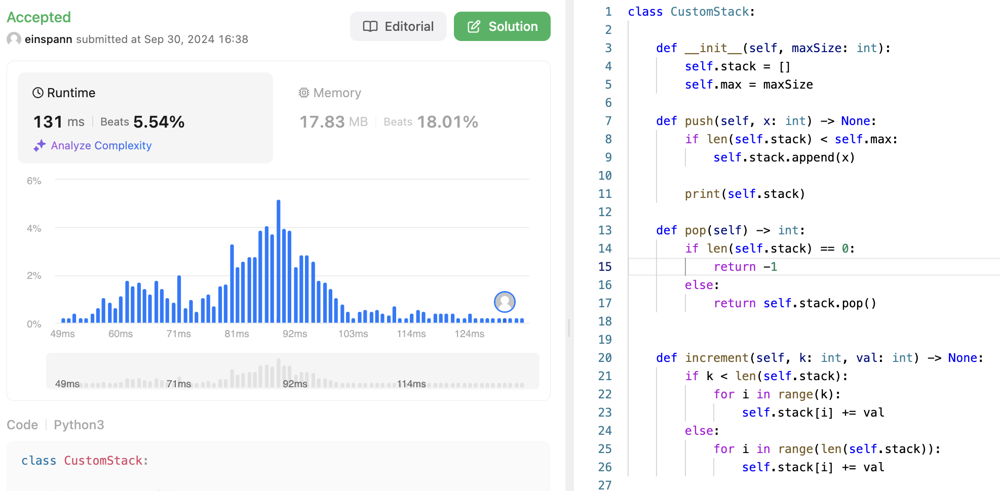
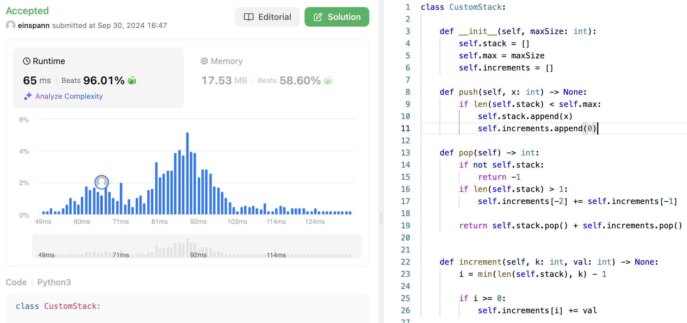

# 문제 설명
increment 함수는 스택의 처음 k개의 요소에 val을 더한다. 만약 스택의 크기가 k보다 작다면, 스택의 모든 요소에 val을 더한다. 이외에도 stack의 init, push, pop 함수를 구현해야 한다.



# 시도 1

## 풀이 및 해설

## 풀이
```python
class CustomStack:

    def __init__(self, maxSize: int):
        self.stack = []
        self.max = maxSize

    def push(self, x: int) -> None:
        if len(self.stack) < self.max:
            self.stack.append(x)
        
        print(self.stack)

    def pop(self) -> int:
        if len(self.stack) == 0:
            return -1
        else:
            return self.stack.pop()


    def increment(self, k: int, val: int) -> None:
        if k < len(self.stack):
            for i in range(k):
                self.stack[i] += val
        else:
            for i in range(len(self.stack)):
                self.stack[i] += val
```

## Complexity Analysis


풀긴 했는데 너무 느리다. 아 print() 하나를 안 지워서 아마 더 느린것 같다.

# 시도 2
그래도 한번 더 빠르게 풀어본다면 다음과 같다.

## 풀이 및 해설

## 풀이
```python
class CustomStack:

    def __init__(self, maxSize: int):
        self.stack = []
        self.max = maxSize
        self.increments = []

    def push(self, x: int) -> None:
        if len(self.stack) < self.max:
            self.stack.append(x)
            self.increments.append(0)

    def pop(self) -> int:
        if not self.stack:
            return -1
        if len(self.stack) > 1:
            self.increments[-2] += self.increments[-1]
        
        return self.stack.pop() + self.increments.pop()


    def increment(self, k: int, val: int) -> None:
        i = min(len(self.stack), k) - 1
        
        if i >= 0:
            self.increments[i] += val
```
- 이전에는 increment()는 O(K)의 시간복잡도를 가졌지만, 이번에는 O(1)의 시간복잡도를 가진다.
- 숫자를 더하는 행위는 pop할때만 함으로서, increment()는 stack에 값을 추가하는 행위만 한다.
- lazy update를 통해 increment()의 시간복잡도를 줄였다.

## Complexity Analysis


### 시간 복잡도
- push(): O(1)
- pop(): O(1)
- increment(): O(1)

- increment()는 최대 k번만 실행되므로 O(K)가 아닌 O(1)이다.

### 공간 복잡도
- O(N)

## Constraint Analysis
```
Constraints:
1 <= maxSize, x, k <= 1000
0 <= val <= 100
At most 1000 calls will be made to each method of increment, push and pop each separately.
```

# References
- [1381. Design a Stack With Increment Operation](https://leetcode.com/problems/design-a-stack-with-increment-operation/)