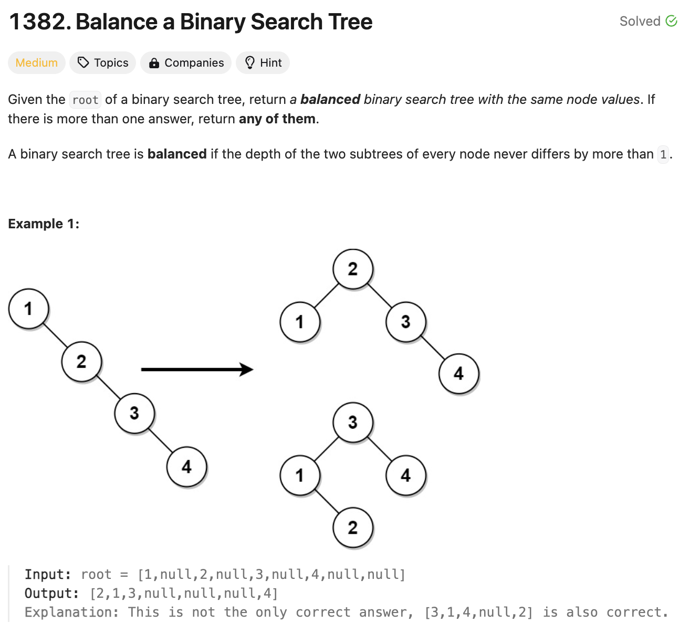

# 문제 설명

이 문제는 이진 탐색 트리가 주어졌을 때, 이진 탐색 트리를 균형 이진 탐색 트리로 변환하는 문제이다.

## 풀이 및 해설
크게는 두 단계로 나누어 풀 수 있다.
1. 이진 탐색 트리를 중위 순회하여 정렬된 배열을 만든다.
2. 정렬된 배열을 이용하여 균형 이진 탐색 트리를 만든다.

중위 순회를 하기 위해서는 재귀적으로 순회를 해야 한다.
- 왼쪽 자식 노드를 방문한다.
- 현재 노드를 방문한다. 이때, 현재 노드의 값을 배열에 추가한다.
- 오른쪽 자식 노드를 방문한다.
- 이를 재귀적으로 반복한다.

이어서, 배열을 이용하여 균형 이진 탐색 트리를 만들어야 한다.
- 배열의 중간 값을 루트로 하여 노드를 만든다.
- 배열의 왼쪽 부분을 왼쪽 서브트리로 만든다.
- 배열의 오른쪽 부분을 오른쪽 서브트리로 만든다.
- 이를 재귀적으로 반복한다.

## 풀이
```python
def balanceBST(self, root: TreeNode) -> TreeNode:
        arr = []
        # Create a Sorted Array using inOrderTraversal
        def inOrderTraversal(root, arr):
            if root:
                inOrderTraversal(root.left, arr)
                arr.append(root.val)
                inOrderTraversal(root.right, arr)
        inOrderTraversal(root, arr)

        # Construct Balanced Tree from Sorted Array
        if not arr:
            return None

        def helper(left, right):
            if left > right:
                return None
            
            mid = (left+right)//2
            root = TreeNode(arr[mid])
            root.left = helper(left, mid-1)
            root.right = helper(mid+1, right)

            return root
        
        return helper(0, len(arr) - 1)
```

## Complexity Analysis


### 시간 복잡도

전체 알고리즘의 시간 복잡도는 O(n); 여기서 n은 트리의 노드 수.  

- 중위 순회(inOrderTraversal): O(n)  
모든 노드를 한 번씩 방문하므로 O(n) 시간이 소요.
- 균형 이진 탐색 트리 구축(helper 함수): O(n)  
배열의 모든 요소를 한 번씩 처리하므로 O(n) 시간이 소요.  

각 노드 생성 및 연결은 상수 시간 연산.
따라서 전체 시간 복잡도는 O(n) + O(n) = O(n)


### 공간 복잡도
공간 복잡도는 O(n).

정렬된 배열(arr): O(n)  
모든 노드 값을 저장하므로 O(n) 공간이 필요.  
- 재귀 호출 스택: O(log n)  
균형 잡힌 트리를 구축하는 과정에서 재귀 깊이는 log n을 넘지 않는다.  
- 새로운 트리 노드: O(n)  
새로운 균형 잡힌 트리를 구축하므로 O(n) 공간이 필요.  

따라서 전체 공간 복잡도는 O(n) + O(log n) + O(n) = O(n).

## Constraint Analysis
```
Constraints:
The number of nodes in the tree is in the range [1, 10^4].  
1 <= Node.val <= 10^5
```

# References
- [1382. Balance a Binary Search Tree](https://leetcode.com/problems/balance-a-binary-search-tree/)