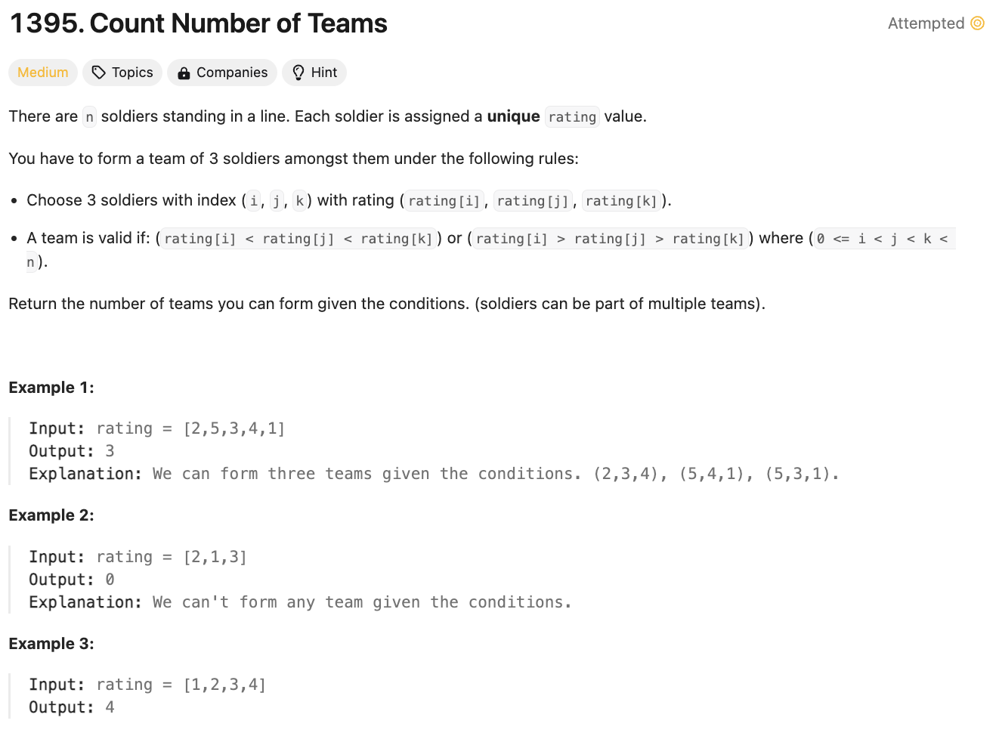
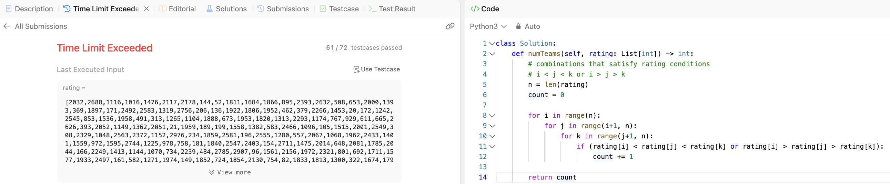
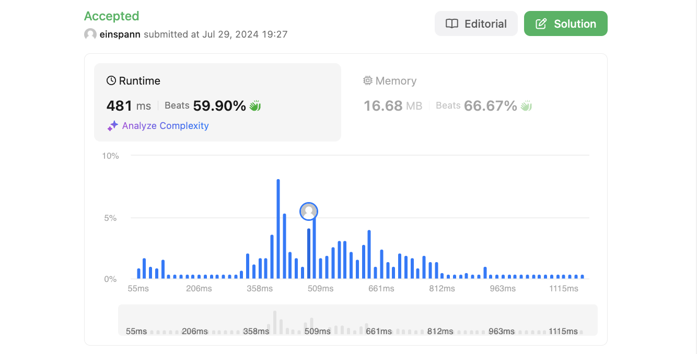

# 문제 설명
주어진 배열에서 팀을 만들 수 있는 경우의 수를 찾는 문제다.



## 1차 시도
```python
def numTeams(self, rating: List[int]) -> int:
        # combinations that satisfy rating conditions
        # i < j < k or i > j > k
        n = len(rating)
        count = 0

        for i in range(n):
            for j in range(i+1, n):
                for k in range(j+1, n):
                    if (rating[i] < rating[j] < rating[k] or rating[i] > rating[j] > rating[k]):
                        count += 1
        
        return count
```
- 시간 복잡도: O(N^3)
- 공간 복잡도: O(1)
- 결과: Time Limit Exceeded

i, j, k를 모두 순회하면서 조건을 만족하는 경우를 찾는다. 그러나 이 방법은 시간 복잡도가 O(N^3)으로 매우 비효율적이다.



## 풀이 및 해설

## 풀이
```python
def numTeams(self, rating: List[int]) -> int:
    n = len(rating)
    count = 0

    for j in range(n):
        left_less = left_greater = right_less = right_greater = 0

        for i in range(j):
            if rating[i] < rating[j]:
                left_less += 1
            elif rating[i] > rating[j]:
                left_greater += 1
        
        for k in range(j+1, n):
            if rating[k] < rating[j]:
                right_less += 1
            elif rating[k] > rating[j]:
                right_greater += 1
        
        count += left_less * right_greater + left_greater * right_less
    
    return count
```
- i, j, k를 모두 순회하지 않고 j를 기준으로 왼쪽과 오른쪽을 나누어 조건을 만족하는 경우를 찾는다.
- 왼쪽에서 작은 수와 큰 수의 개수를 세고, 오른쪽에서 작은 수와 큰 수의 개수를 센다.
- 왼쪽에서 작은 수와 오른쪽에서 큰 수의 곱과 왼쪽에서 큰 수와 오른쪽에서 작은 수의 곱을 더한다.
- 이를 j를 기준으로 반복하면서 count를 증가시킨다.
- 최종적으로 count를 반환한다.

## Complexity Analysis


### 시간 복잡도
- O(N^2); N은 rating의 길이

### 공간 복잡도
- O(1); 상수만큼의 공간 사용

## Constraint Analysis
```
Constraints:
n == rating.length
3 <= n <= 1000
1 <= rating[i] <= 10^5
All the integers in rating are unique.
```

# References
- [1395. Count Number of Teams](https://leetcode.com/problems/count-number-of-teams/)