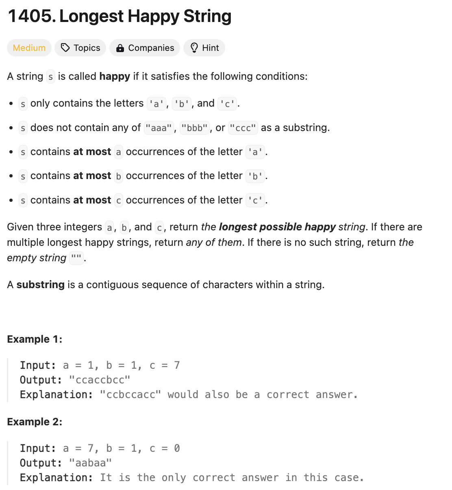

# 문제 설명
해당 문제는 다음과 같습니다.

하나의 문장은 다음 조건을 만족하면 'happy'하다고 합니다.
- 문장은 a, b, c 세 문자로 이루어져 있습니다.
- 문장은 'aaa', 'bbb', 'ccc'와 같은 문자열을 포함하지 않습니다.
- s는 최대 a개의 'a'가 포함된다.
- s는 최대 b개의 'b'가 포함된다.
- s는 최대 c개의 'c'가 포함된다.

문자 a, b, c의 개수가 주어질 때, 가장 긴 'happy' 문자열을 만드는 문제입니다.



## 풀이 및 해설


## 풀이
```python
def longestDiverseString(self, a: int, b: int, c: int) -> str:
    result = []
    counts = [a,b,c]
    letters = ['a', 'b', 'c']

    while True:
        idx = sorted(range(3), key=lambda x: counts[x], reverse=True)

        i = idx[0]
        if counts[i] == 0:
            break

        if len(result) >= 2 and result[-2]==result[-1]==letters[i]:
            i = idx[1]
            if counts[i] == 0:
                break
        
        result.append(letters[i])
        counts[i] -= 1
    
    return ''.join(result)
```
- a, b, c의 개수를 counts에 저장하고, 문자를 letters에 저장합니다.
- counts를 기준으로 정렬한 idx를 만들어서 가장 많은 문자를 선택합니다.
- 만약, result의 마지막 두 문자가 같은 문자라면, 두번째로 많은 문자를 선택합니다.
- 선택한 문자를 result에 추가하고, counts를 1 감소시킵니다.
- result를 반환합니다.

## Complexity Analysis


### 시간 복잡도
- O(a+b+c) : a, b, c의 개수만큼 반복합니다.

### 공간 복잡도
- O(1) : 상수만큼의 공간을 사용합니다.

## Constraint Analysis
```
Constraints:
0 <= a, b, c <= 100
a + b + c > 0
```

# References
- [1405. Longest Happy String](https://leetcode.com/problems/longest-happy-string/)