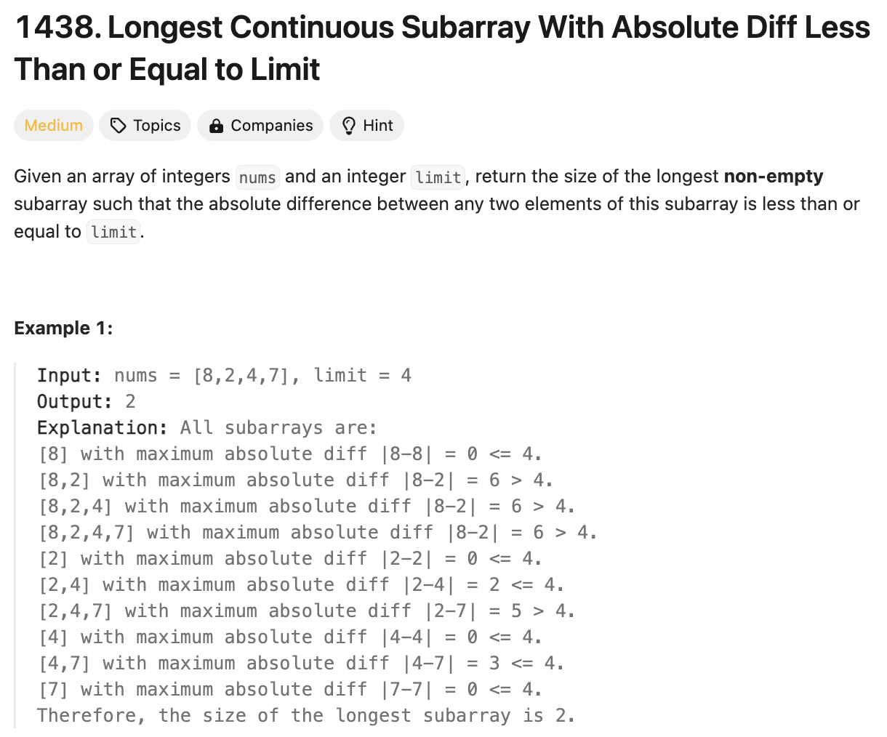
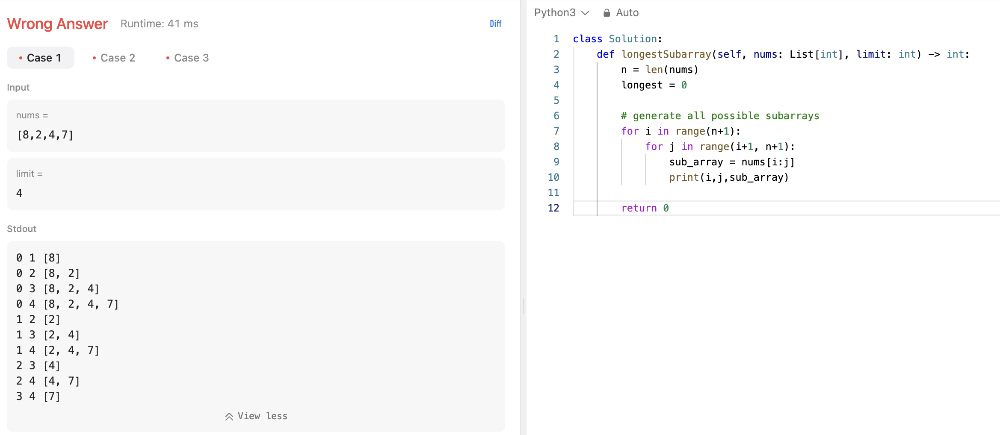
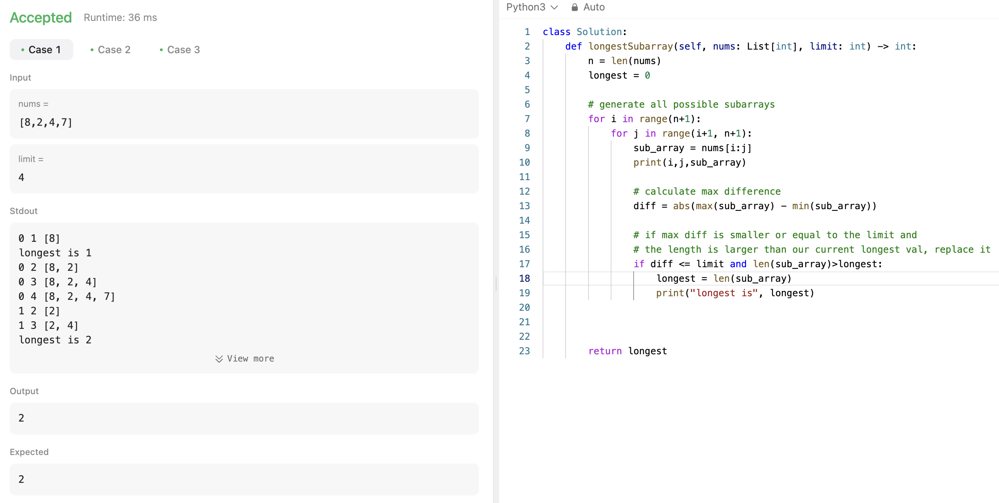
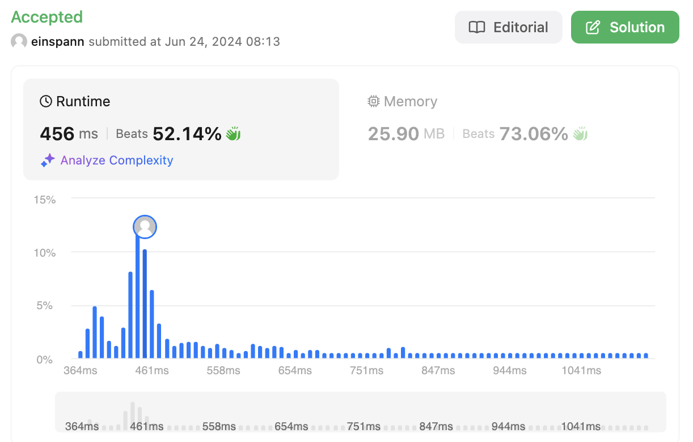

# 문제 설명
하나의 배열에서 여러 숫자가 들어있다. 이때, 배열의 subarray 중에서 최대값과 최소값의 차이가 `limit`보다 작은 subarray의 최대길이를 구하라.




## 풀이 및 해설
아이디어로는 일단 최대 길이를 구해야 하기 때문에 모든 subarray를 한번 순회하면서, 지금까지 있었던 가장 큰 subarray의 길이를 저장해두고, 이보다 더 큰 subarray가 나오면 갱신해주면 된 것 같다. 느낌상 한번의 순회는 불가피하고, 그게 최선인 것 같다.




예시 문제들의 모든 subarray를 순회하면서 각각의 subarray의 최대값과 최소값의 차이가 `limit`보다 작은지 확인을 한 뒤, 해당 값이 지금까지 이전에 나온 subarray의 최대길이보다 길다면 갱신해주면 된다. 그러나, for loop을 두개나 사용하고 있어서, 빠르지는 않을거고 더 좋은 구현방법을 생각해봐야 한다.



## 개선사항
### Double for loop
일단 모든 subarray들을 구하기 위해 나는 double for loop을 사용했으나, 이렇게 하면 무조건 시간초과가 뜰 가능성이 있으므로, 다른 방법을 생각해봐야 한다. 일단 Sliding Window를 구현해야 한다.

### Sliding Window
이걸 하기 위해 double ended queue를 사용하기로 했다. 일단, left, right 변수들 하나씩 정의하고, 해당 window 안에 있는 최대값 max deque 하나랑, 최소값 min deque를 하나씩 정의했다. 

이때, 지금 순회한 right까지 가장 작은 값과 큰 값들은 deque의 맨 오른쪽에 들어가게 되며, 새로 순회한 값이 deque의 마지막 값보다 크다면, 그 값보다 작은 값들은 필요가 없기 때문에 하나씩 없애면 된다.

이어서, 마지막에 left와 right의 값 차이가 limit보다 크다면, 현재로서는 해가 되지 않기 때문에 left를 한칸 오른쪽으로 전개하고, 그에 따른 deque값들도 없애면 된다. 이렇게 했을 시, 시간 복잡도는 O(n)이 된다.


## 풀이
```python
class Solution:
    def longestSubarray(self, nums: List[int], limit: int) -> int:
        # Deques to maintain indices of max and min values in the current window
        max_deque = deque()
        min_deque = deque()
        
        left = 0  # Initialize left pointer
        longest = 0  # Initialize the length of the longest valid subarray
        
        for right in range(len(nums)):
            # Maintain the max_deque for max value
            while max_deque and nums[max_deque[-1]] <= nums[right]:
                max_deque.pop()
            max_deque.append(right)
            
            # Maintain the min_deque for min value
            while min_deque and nums[min_deque[-1]] >= nums[right]:
                min_deque.pop()
            min_deque.append(right)

            # Check the current window
            # If the largest difference is larger than the limit, 
            # we need to shorten the window to the right by increasing 'left'
            while nums[max_deque[0]] - nums[min_deque[0]] > limit:
                left += 1
                if max_deque[0] < left:
                    max_deque.popleft()
                if min_deque[0] < left:
                    min_deque.popleft()

            # Update the longest valid subarray length
            longest = max(longest, right - left + 1)
            

        return longest
```

## Complexity Analysis

### 시간 복잡도

기존에는 2개의 for loop과, slicing을 사용하여 최악의 경우에 N만큼 걸리기 때문에 최대 O(N^3)이 걸릴 수 있었으므로, 성능이 최악이었다.

이를 개선하기 위해 deque를 사용했더니, O(N)으로 개선되었다.

일단 for loop이 한 번 실행되며, 그 안에 deque를 유지하기 위해 여러 while loop이 있지만, 이는 O(1)이기 때문에, 결국 O(N)이 된다. O(1)이 되는 이유는 deque를 무조건 한번만 순회하기 때문이다.

### 공간 복잡도
O(N)이다. deque를 사용하기 때문에, N만큼의 공간이 필요하다.

## Constraint Analysis
```
Constraints:

1 <= nums.length <= 10^5
1 <= nums[i] <= 10^9
0 <= limit <= 10^9

```

# References
- [LeetCode 1438. Longest Continuous Subarray With Absolute Diff Less Than or Equal to Limit](https://leetcode.com/problems/longest-continuous-subarray-with-absolute-diff-less-than-or-equal-to-limit/)
- [Python Deque](https://docs.python.org/3/library/collections.html#collections.deque)