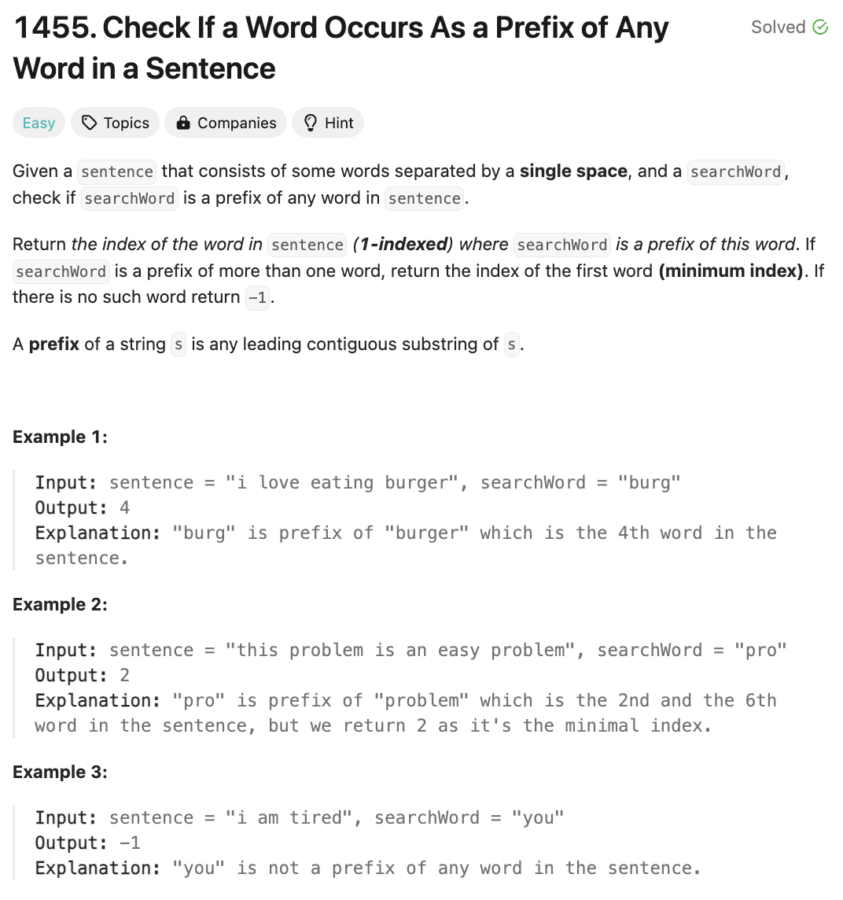

# 문제 설명
이 문제는 searchWord가 주어졌을 때 words의 prefix로 존재하는지 확인하는 문제이다.



## 풀이 및 해설

## 풀이
```python
class Solution:
    def isPrefixOfWord(self, sentence: str, searchWord: str) -> int:
        words = sentence.split()

        for word in words:
            for i in range(len(word)):
                if word[0:i+1] == searchWord:
                    return words.index(word) + 1
        
        return -1
```


## Complexity Analysis


### 시간 복잡도
- O(N): N은 sentence의 길이이다.
- O(M): M은 words의 개수이다.
- O(K): N은 가장 긴 word의 길이이다.
- O(L): K는 searchWord의 길이이다.

- outer loop: O(M)
- inner loop: O(N)
- slicing: O(K)
- words.index(): O(M)

- O(N + M * K * (K + L + M)) = O(M * K^2 + M^2)

### 공간 복잡도
- O(N): N은 sentence의 길이이다.

## 개선
```python
class Solution:
    def isPrefixOfWord(self, sentence: str, searchWord: str) -> int:
        words = sentence.split()
        for index, word in enumerate(words, 1):
            if word.startswith(searchWord):
                return index
        return -1
```
- `startswith()`를 사용하여 개선한다.
- `enumerate()`를 사용하여 index를 사용한다.
- slicing을 사용하지 않아 시간 복잡도를 개선한다.

## Constraint Analysis
```
Constraints:
1 <= sentence.length <= 100
1 <= searchWord.length <= 10
sentence consists of lowercase English letters and spaces.
searchWord consists of lowercase English letters.
```

# References
- [1455. Check If a Word Occurs As a Prefix of Any Word in a Sentence](https://leetcode.com/problems/check-if-a-word-occurs-as-a-prefix-of-any-word-in-a-sentence/description/?envType=daily-question&envId=2024-12-02)