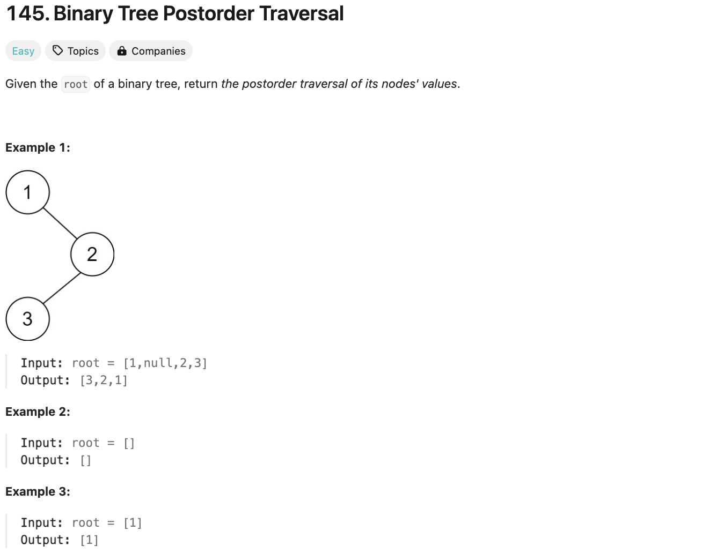
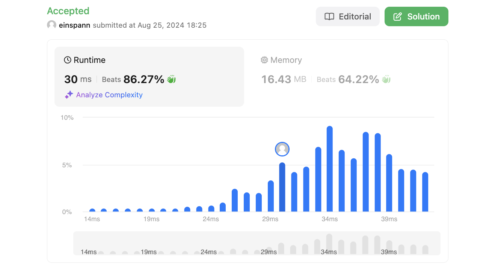

# 문제 설명
Postorder 순회 방식으로 이진 트리를 순회하는 문제이다.




## 풀이 및 해설

## 풀이
```python
def postorderTraversal(self, root: Optional[TreeNode]) -> List[int]:
        result = []        
        def traverse(node):
            if node is None:
                return
            traverse(node.left)
            traverse(node.right)
            result.append(node.val)
    
        traverse(root)
        return result
```
- 빈 배열을 초기화 시킨다.
- traverse 함수를 선언한다.
    - node가 존재하지 않으면 return 한다.
    - node.left를 traverse 함수에 넣는다.
    - node.right를 traverse 함수에 넣는다.
    - node.val를 배열에 append 한다.
- traverse 함수를 실행한다.

## Complexity Analysis


### 시간 복잡도
- traverse 함수를 호출하면서 모든 노드를 순회하므로 시간 복잡도는 O(N)이다.

### 공간 복잡도
- 재귀 호출을 하면서 추가적인 공간이 필요하므로 공간 복잡도는 O(N)이다.

## Constraint Analysis
```
Constraints:
The number of the nodes in the tree is in the range [0, 100].
-100 <= Node.val <= 100
```

# References
- [145. Binary Tree Postorder Traversal](https://leetcode.com/problems/binary-tree-postorder-traversal/)