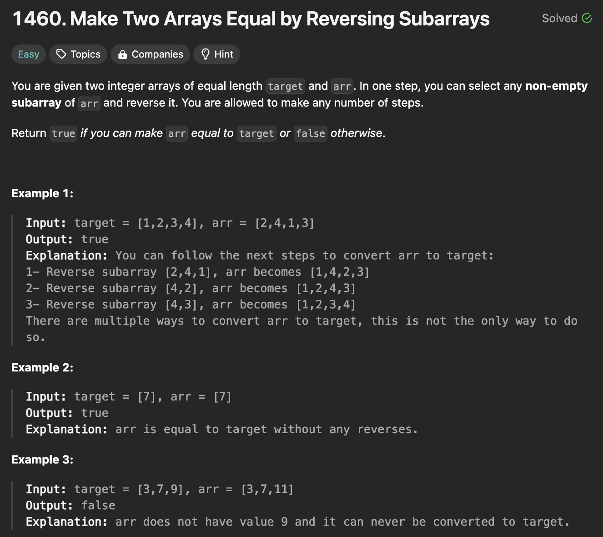
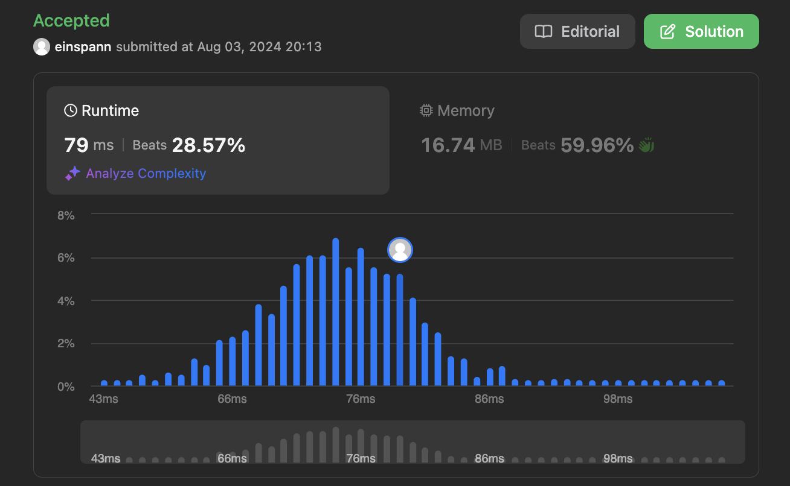
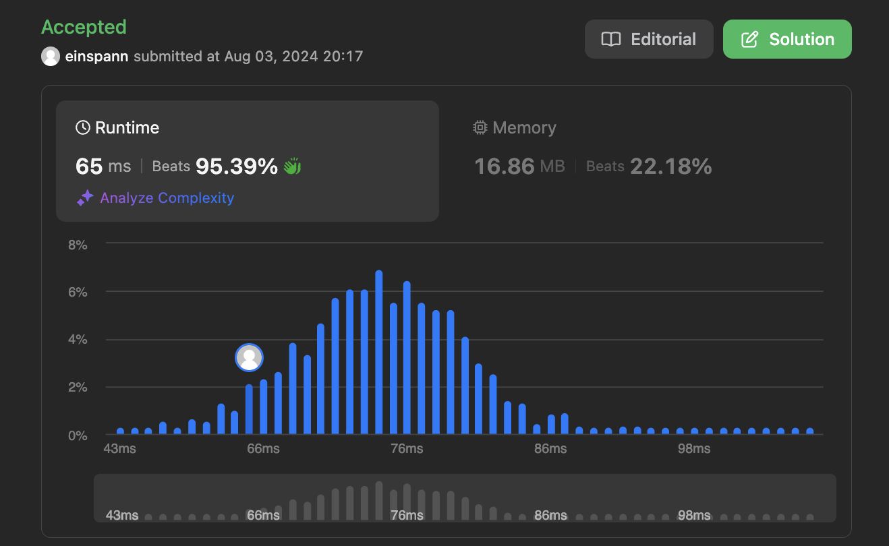

# 문제 설명
두개의 배열이 주어졌을 때, 두 배열의 순서를 바꾸어 같은 배열이 되는지 확인하는 문제이다.



## 풀이 및 해설

## 풀이
```python
def canBeEqual(self, target: List[int], arr: List[int]) -> bool:
        t_dic = defaultdict(int)
        a_dic = defaultdict(int)

        if len(target) != len(arr):
            return false
        
        # count occurences of characters in both lists
        for i in range(len(target)):
            t_dic[target[i]] += 1
            a_dic[arr[i]] += 1
        
        # compare occurences and return False if mismatch
        for i in t_dic:
            if t_dic[i] != a_dic[i]:
                return False

        # all match
        return True
```
- defaultdict를 사용하여 두개의 배열을 비교한다.
- 두개의 배열의 길이가 다르면 False를 반환한다.
- 두개의 배열을 비교하여 같은지 확인한다.
- 같으면 True를 반환한다.


## Complexity Analysis



### 시간 복잡도
- O(n); n은 배열의 길이

### 공간 복잡도
- O(n); n은 배열의 길이


# 개선된 풀이
```python
from collections import Counter

class Solution:
    def canBeEqual(self, target: List[int], arr: List[int]) -> bool:
        # check for varying lengths
        if len(target) != len(arr):
            return false

        # compare occurences and return False if mismatch
        return Counter(target) == Counter(arr)
```


Counter를 사용해서 풀어보니 더 간단하고, 빠르게 풀 수 있었다.

## Constraint Analysis
```
Constraints:
target.length == arr.length
1 <= target.length <= 1000
1 <= target[i] <= 1000
1 <= arr[i] <= 1000
```

# References
- [1460. Make Two Arrays Equal by Reversing Subarrays](https://leetcode.com/problems/make-two-arrays-equal-by-reversing-sub-arrays/)
- [Defaultdict](https://www.geeksforgeeks.org/defaultdict-in-python/)
