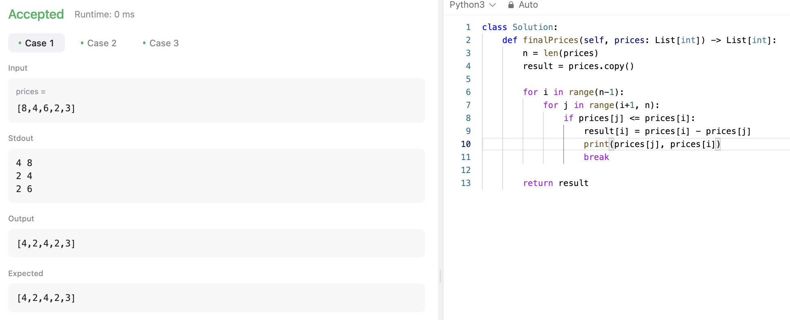

# 문제 설명
주어진 배열에서 각 요소에 대해, 해당 요소보다 큰 인덱스 값 중 가장 작은 값이면서 값이 지금 요소보다 작은 값을 찾아서 뺀 값을 반환하는 문제이다.


## 풀이 및 해설


## 풀이
```python
class Solution:
    def finalPrices(self, prices: List[int]) -> List[int]:
        n = len(prices)
        result = prices.copy()

        for i in range(n-1):
            for j in range(i+1, n):
                if prices[j] <= prices[i]:
                    result[i] = prices[i] - prices[j]
                    break
                
        return result
```

## Complexity Analysis


### 시간 복잡도
- O(n^2)

### 공간 복잡도
- O(n)

## Constraint Analysis
```
Constraints:
1 <= prices.length <= 500
1 <= prices[i] <= 1000
```

# References
- [1475. Final Prices With a Special Discount in a Shop](https://leetcode.com/problems/final-prices-with-a-special-discount-in-a-shop/)