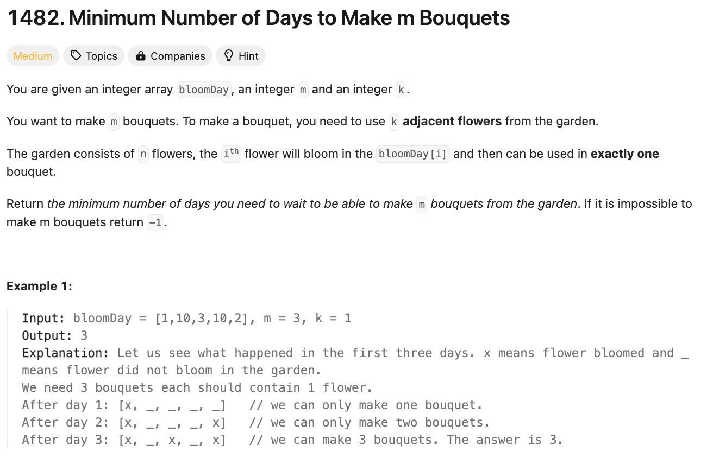

# 문제 설명
꽃이 피는데 필요한 일수가 주어졌을 때, 연달아 있는 m개의 꽃다발을 만들기 위한 최소 일수를 찾는 문제다.




## 풀이 및 해설
처음에 이 문제를 잘못 이해해서 조금 애먹었다. 연달아 있다는게 인덱스 기준이 아니라, 만개하는데 필요한 날짜의 차이가 1보다 작은걸 adjacent로 이해해서 헷갈렸다.

그걸 깨닫고 보니, 이 문제는 이진 탐색을 이용해서 풀 수 있을 것 같았다.

## 풀이
```python
def minDays(self, bloomDay: List[int], m: int, k: int) -> int:
        if len(bloomDay) < m*k:
            return -1
        
        def can_make_bouquets(day):
            bouquets = 0
            adjacent_flowers = 0
            for bloom in bloomDay:
                if bloom <= day:
                    adjacent_flowers += 1
                    if adjacent_flowers == k:
                        bouquets += 1
                        adjacent_flowers = 0
                else:
                    adjacent_flowers = 0
            
            return bouquets >= m
        
        left, right = min(bloomDay), max(bloomDay)
        while left < right:
            mid = (left+right) // 2
            if can_make_bouquets(mid):
                right = mid
            else:
                left = mid+1
            
        
        return left
```
- 애초에 필요한 꽃의 수가 필요한 꽃다발의 수 m*k보다 작으면 -1을 반환한다.
- can_make_bouquets 함수는 day일 때 꽃다발을 만들 수 있는지 확인하는 함수다.
    - bouquets는 꽃다발의 수를 나타내고, adjacent_flowers는 연달아 있는 꽃의 수를 나타낸다.
    - bloomDay를 돌면서 day보다 작으면 adjacent_flowers를 증가시키고, k와 같아지면 bouquets를 증가시킨다.
    - bloomDay가 day보다 크면 adjacent_flowers를 0으로 초기화한다.
    - bouquets가 m보다 크거나 같으면 True를 반환한다.
- left와 right를 bloomDay의 최소값과 최대값으로 초기화하고, 이진 탐색을 이용해서 day를 찾는다.
    - can_make_bouquets(mid)가 True이면 right를 mid로 이동하고, 아니면 left를 mid+1로 이동한다.
- 최종적으로 left를 반환한다.

## Complexity Analysis


### 시간 복잡도
- 시간 복잡도: O(nlogn)
    - can_make_bouquets 함수는 O(n)의 시간 복잡도를 가진다.
    - 이진 탐색을 이용하면 O(logn)의 시간 복잡도를 가진다.

### 공간 복잡도
- 공간 복잡도: O(1)

## Constraint Analysis
```
Constraints:
bloomDay.length == n
1 <= n <= 10^5
1 <= bloomDay[i] <= 10^9
1 <= m <= 10^6
1 <= k <= n
```

### 추가 주석
2024-06-19일자 데일리 문제지만 시간 역행 쿠폰으로 풀었다.

# References
- [LeetCode](https://leetcode.com/problems/minimum-number-of-days-to-make-m-bouquets/)