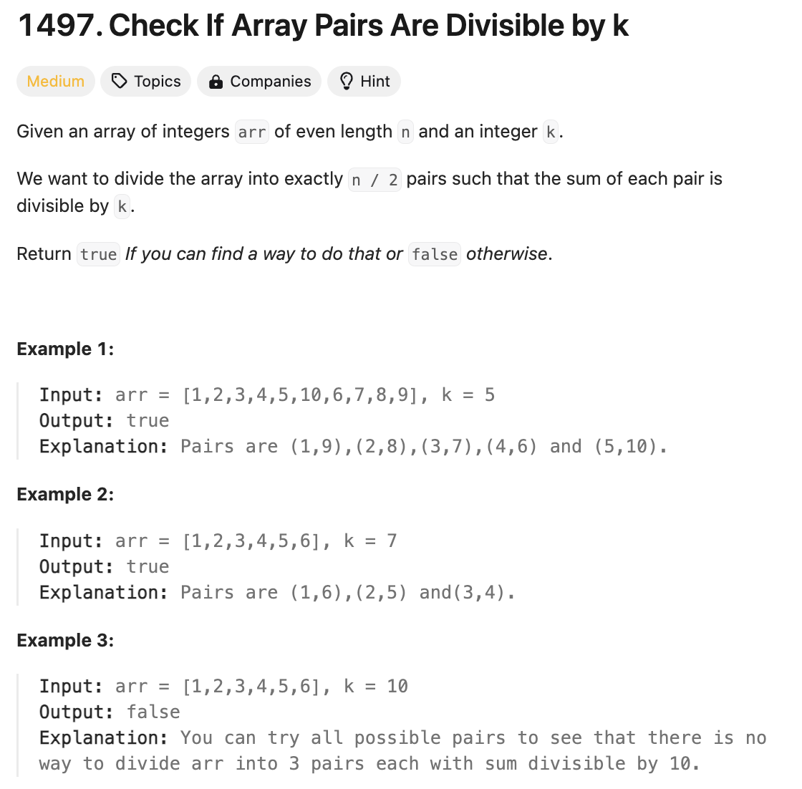

# 문제 설명
이 문제는 n개의 정수로 이루어진 배열 arr과 정수 k가 주어진다. 이때, 배열 arr을 n/2개의 쌍으로 나누었을 때, 각 쌍의 합이 k로 나누어 떨어지는지 확인하는 문제이다.




## 풀이 및 해설
이 문제를 풀기 위해서는 다음과 같이 풀면 된다.
1. 배열 arr의 각 원소를 k로 나눈 나머지를 구한다.
2. 나머지를 key로 하고, 나머지의 개수를 value로 하는 딕셔너리를 만든다.
3. 딕셔너리의 key를 순회하면서 다음을 확인한다.
    1. key가 0인 경우, value가 짝수인지 확인한다.   
   (본인과 짝이 되는 경우. 예: 4 % 4 = 0, 8 % 4 = 0)
    2. key가 k/2인 경우, value가 짝수인지 확인한다.
   (본인과 짝이 되는 경우. 예: 6 % 3 = 0, k=6)
    3. key가 나머지인 경우, value가 k-나머지인 key의 value와 같은지 확인한다.

### 예시
    Input: arr = [1,2,3,4,5,10,6,7,8,9], k = 5  
    Output: true  
    Explanation: Pairs are (1,9),(2,8),(3,7),(4,6) and (5,10).  

**나머지 계산**  

1 % 5 = 1  
2 % 5 = 2  
3 % 5 = 3  
4 % 5 = 4  
5 % 5 = 0  
10 % 5 = 0  
6 % 5 = 1  
7 % 5 = 2  
8 % 5 = 3  
9 % 5 = 4  

**합 계산**

(1,9) : 1%5 = 1, 9%5 = 4, and 1+4 = 5  
(2,8) : 2%5 = 2, 8%5 = 3, and 2+3 = 5  
(3,7) : 3%5 = 3, 7%5 = 2, and 3+2 = 5  
(4,6) : 4%5 = 4, 6%5 = 1, and 4+1 = 5  
(5,10) : 5%5 = 0, 10%5 = 0, and 0+0 = 0 (divisible by 5)  

## 풀이
```python
class Solution:
    def canArrange(self, arr: List[int], k: int) -> bool:
        n = len(arr)
        
        # find remainders counts of all values in array
        remainders = {}
        for i in range(n):
            rem = arr[i] % k
            remainders[rem] = remainders.get(rem, 0) + 1
        
        # check if remainder counts have even matches
        for r in remainders:
            if r == 0:
                if remainders[r] % 2 != 0:
                    return False
            elif r * 2 == k:
                if remainders[r] % 2 != 0:
                    return False
            elif remainders[r] != remainders.get(k-r, 0):
                return False
        
        return True
```

## Complexity Analysis


### 시간 복잡도
- 시간 복잡도: O(n) ; n은 배열 arr의 길이

### 공간 복잡도
- 공간 복잡도: O(n) ; n은 배열 arr의 길이

## Constraint Analysis
```
Constraints:
arr.length == n
1 <= n <= 10^5
n is even.
-109 <= arr[i] <= 10^9
1 <= k <= 10^5
```

# References
- [1497. Check If Array Pairs Are Divisible by k](https://leetcode.com/problems/check-if-array-pairs-are-divisible-by-k/)