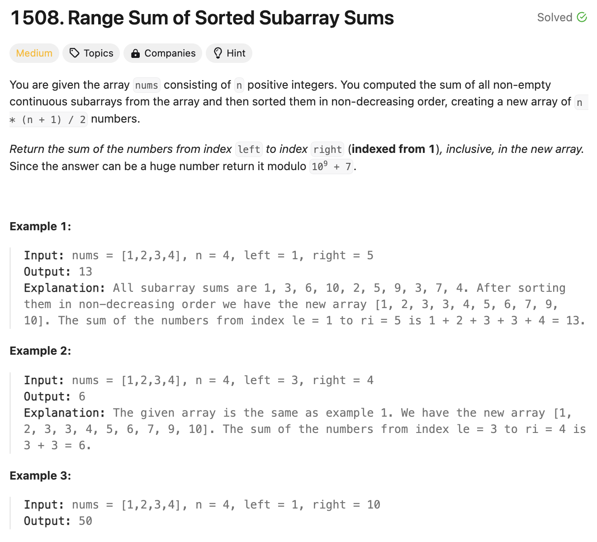

# 문제 설명
배열이 주어졌을 때, 배열의 부분합을 정렬하여 주어진 범위의 합을 구하는 문제이다.



## 풀이 및 해설


## 풀이
```python
def rangeSum(self, nums: List[int], n: int, left: int, right: int) -> int:
        # create new array with sums of subarrays
        sums = []
        for i in range(len(nums)):
            for j in range(i+1, len(nums)+1):
                sums.append(sum(nums[i:j]))
        
        sums.sort()
        return sum(sums[left-1:right]) % 1000000007
```
- 부분합을 구한 후 정렬하여 주어진 범위의 합을 구한다.
- 결과값을 1000000007로 나눈 나머지를 반환한다.

## Complexity Analysis


통과한게 신기할 정도다. 개선사항을 찾아보자.

### 시간 복잡도
- O(n^3logn); n은 배열의 길이
- 부분합을 구하는데 O(n^2)이 걸리고, 정렬하는데 O(nlogn)이 걸린다.

### 공간 복잡도
- O(n^2); n은 배열의 길이

## Constraint Analysis
```
Constraints:
n == nums.length
1 <= nums.length <= 1000
1 <= nums[i] <= 100
1 <= left <= right <= n * (n + 1) / 2
```

# 개선사항
heapq를 사용하여 정렬을 하면 시간복잡도를 줄일 수 있다.
sort를 사용하면 O(nlogn)이 걸리지만, heapq를 사용하면 O(nlogk)가 걸린다.

따라서, 원래는 O(n^3logn)이 걸리는데, heapq를 사용하면 O(n^2logn)이 걸린다.


# References
- [1508 - Leetcode](https://leetcode.com/problems/range-sum-of-sorted-subarray-sums/)
- [Modulo 1000000007 - GeeksforGeeks](https://www.geeksforgeeks.org/modulo-1097-1000000007/)
