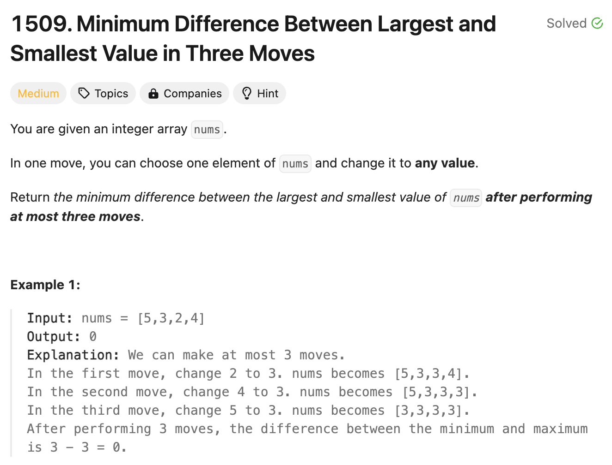

# 문제 설명
배열이 주어졌을 때, 3개의 숫자를 바꿨을 때 얻을 수 있는 최소한의 차이를 구하는 문제다.



## 풀이 및 해설

## 풀이
```python
class Solution:
    def minDifference(self, nums: List[int]) -> int:
        # find three largest values
        # find three smallest values
        # sort the list
        nums.sort()
        # what are the possibilities?
        # A: removing the largest 3 minimizes the diff
        # B: removing the smallest 3 minimizes the diff
        # C: some combination minimizes the diff
        # 2 smallest, 1 largest
        # 1 smallest, 2 largest
        min_diff = 100000000000000
        l = len(nums)

        if l < 5:
            return 0 # can change 3/4 so return 0
        else:
            for i in range(4): # can change 3/n where n>=5
                if nums[-4+i] - nums[i] < min_diff:
                    min_diff = nums[-4+i] - nums[i]
            return min_diff
```

- 배열을 정렬한다.
- 배열의 길이가 5보다 작으면 0을 반환한다. 
    - 최대 4개의 갯수가 있다는건데, 그런 경우에 대해서 [1,2,3,4], [1,1,1,1]으로 변경이 가능하기 때문에 차이가 언제든지 0이 된다.
- 그렇지 않으면, 4번 반복하면서 가장 큰 값에서 가장 작은 값을 뺀 값이 가장 작은 차이가 되는 경우를 찾는다.
    - 이미 한번 정렬을 했기 때문에, 가장 큰 값으로부터 4개의 숫자와 첫번째 숫자 (제일 작은 수)의 차이를 하나씩 순차적으로 비교해보면 된다.
    - 예를 들어, [0, 1, 5, 10, 14]에 대해서 다음과 같다:
    - 1 - 0 = 1 에서 가장 큰 숫자 3개를 제거할 경우, 가장 큰 숫자와 작은 숫자의 차이.
    - 5 - 1 = 4 에서는 가장 큰 숫자 2개와 작은 숫자 1개를 제거할 경우.
    - 10 - 5 = 5
    - 14 - 10 = 4
    - 이때, 1이 가장 작은 차이가 된다.


## Complexity Analysis


### 시간 복잡도
- sort() : O(nlogn)
- for loop : O(1)

### 공간 복잡도
- O(1) : variables

## Constraint Analysis
```
Constraints:
1 <= nums.length <= 10^5
-109 <= nums[i] <= 10^9
```

여담으로, print(nums)를 제거하는걸 까먹었더니, 시간복잡도가 엄청나게 느려졌다.

# References
- [1509. Minimum Difference Between Largest and Smallest Value in Three Moves](https://leetcode.com/problems/minimum-difference-between-largest-and-smallest-value-in-three-moves/)