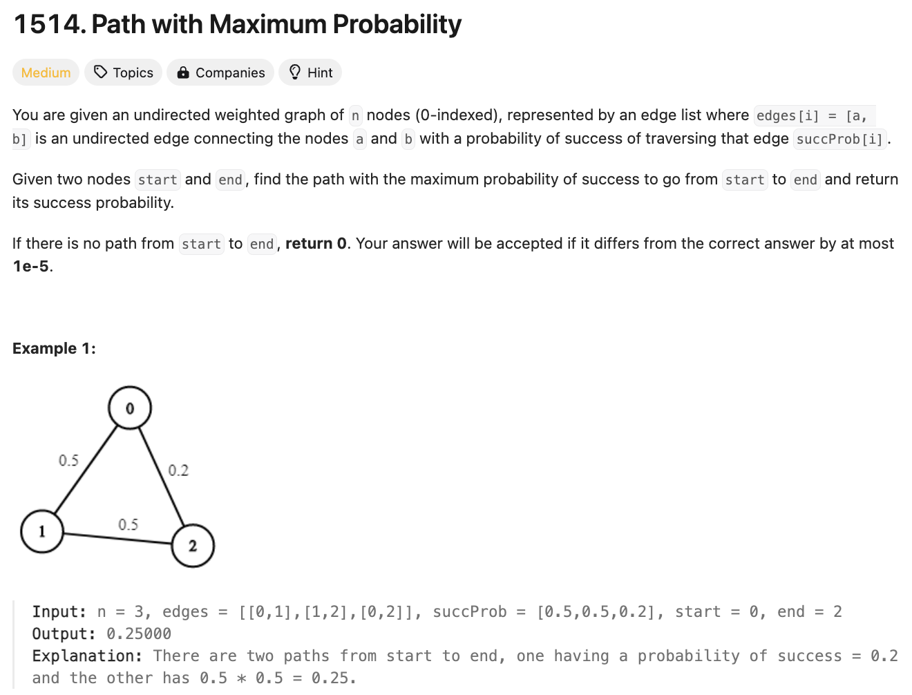

# 문제 설명
edge는 성공확률으로 이루어진 그래프가 주어졌을 때, 시작접에서 끝 지점까지 가는데 가장 높은 확률로 갈 수 있는 경로를 찾는 문제다.



## 풀이 및 해설

1. adjacency list를 만든다.
2. priority queue(heapq)를 만든다.
3. 모든 노드의 확률을 0으로 초기화한다. 단, 시작점은 1로 초기화한다.
4. 다익스트라 알고리즘을 사용하여 가장 적은 거리 대신 가장 높은 확률을 찾는다.

## 풀이
```python
def maxProbability(self, n: int, edges: List[List[int]], succProb: List[float], start_node: int, end_node: int) -> float:
        # create adjacency list
        graph = [[] for _ in range(n)]
        for (a,b), prob in zip(edges, succProb):
            graph[a].append((b, prob))
            graph[b].append((a, prob))
        
        # initialize probabilities
        probabilities = [0] * n
        probabilities[start_node] = 1

        # pq to store (probability, node)
        pq = [(-1, start_node)]

        while pq:
            prob, node = heapq.heappop(pq)
            prob = -prob

            if node == end_node:
                return prob

            if prob < probabilities[node]:
                continue
            
            for neighbor, edge_prob in graph[node]:
                new_prob = prob * edge_prob
                if new_prob > probabilities[neighbor]:
                    probabilities[neighbor] = new_prob
                    heapq.heappush(pq, (-new_prob, neighbor))
        
        return 0
```

## Complexity Analysis


### 시간 복잡도
- O(ElogV) ; E는 edge의 개수, V는 vertex의 개수

### 공간 복잡도
- O(V) ; V는 vertex의 개수

## Constraint Analysis
```
Constraints:
2 <= n <= 10^4
0 <= start, end < n
start != end
0 <= a, b < n
a != b
0 <= succProb.length == edges.length <= 2*10^4
0 <= succProb[i] <= 1
There is at most one edge between every two nodes.
```

# References
- [1514. Path with Maximum Probability](https://leetcode.com/problems/path-with-maximum-probability/)