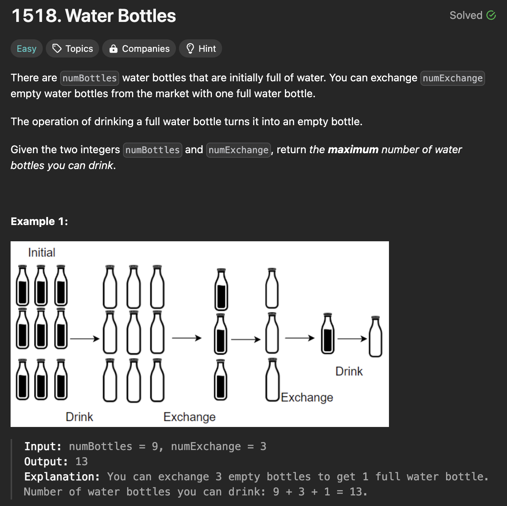
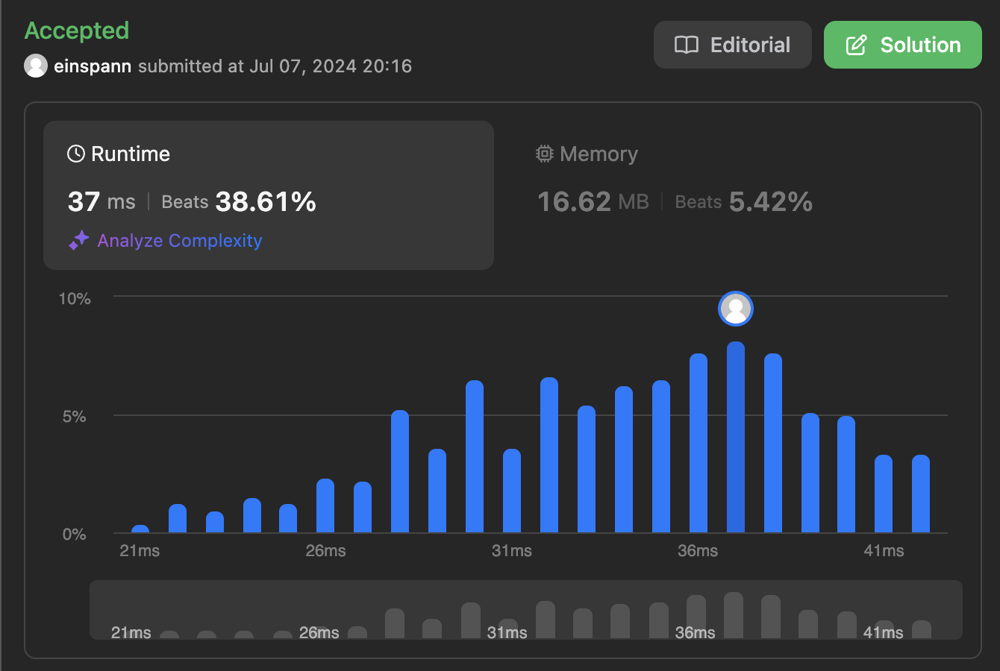

# 문제 설명
빈 병을 반납해서 다시 채울 수 있다면, 최대 몇개의 물병을 마실 수 있는지 구하는 문제이다.



## 풀이 및 해설
해당 문제는 계속 물을 마시면서 빈 병을 반납해서 다시 채울 수 있다면, 최대 몇개의 물병을 마실 수 있는지 구하는 문제이다.

지금 당장 새로운 물병을 바꾸기 위해 빈병이 부족할 수 있지만, 다 채워진 병이 충분히 있다면, 이들이 곧 빈 병이 될것이며, 이게 다 합쳐졌을때 새로운 물병으로 바꿀 수 있기 때문에 두개를 더한 값보다 변환에 필요한 값이 큰지 비교해보면 된다.

## 풀이
```python
class Solution:
    def numWaterBottles(self, numBottles: int, numExchange: int) -> int:
        drank = 0
        emptyBottles = 0
        fullBottles = numBottles

        while fullBottles + emptyBottles >= numExchange:
            # consume
            drank += fullBottles
            emptyBottles += fullBottles
            fullBottles = 0

            fullBottles = emptyBottles // numExchange
            emptyBottles = emptyBottles % numExchange
        
        drank += fullBottles
        
        return drank
```
- 물병을 마시는 횟수를 저장할 `drank` 변수를 선언한다.
- 빈 병의 수를 저장할 `emptyBottles` 변수를 선언한다.
- 채워진 병의 수를 저장할 `fullBottles` 변수를 선언한다.
- `fullBottles`와 `emptyBottles`의 합이 `numExchange`보다 크거나 같을때까지 반복한다.
  - `fullBottles`를 `drank`에 더한다.
  - `emptyBottles`를 `fullBottles`에 더한다.
  - `fullBottles`를 `emptyBottles`를 `numExchange`로 나눈 몫으로 설정한다.
  - `emptyBottles`를 `emptyBottles`를 `numExchange`로 나눈 나머지로 설정한다.

## Complexity Analysis


### 시간 복잡도
- `fullBottles`와 `emptyBottles`의 합이 `numExchange`보다 크거나 같을때까지 반복하므로 `O(n)`이다.

### 공간 복잡도
- `drank`, `emptyBottles`, `fullBottles` 변수를 사용하므로 `O(1)`이다.

## Constraint Analysis
```
Constraints:
1 <= numBottles <= 100
2 <= numExchange <= 100
```

# References
- [1518. Water Bottles](https://leetcode.com/problems/water-bottles/)